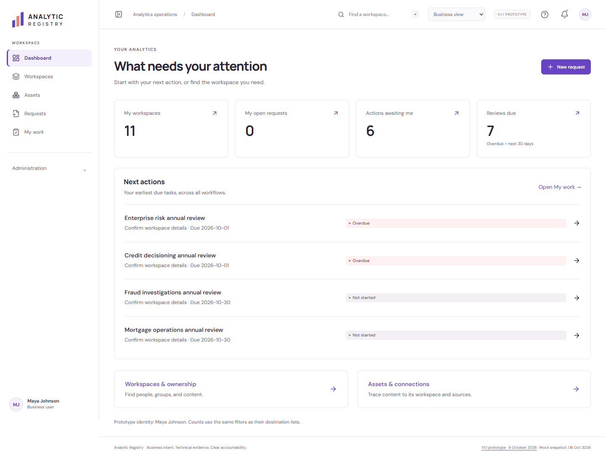

# Analytic Registry — V1.1 prototype

**1.1.0-prototype.1 · 9 October 2026**

The registry combines platform evidence with approved business metadata and assigned follow-up work. This release strengthens that boundary, simplifies the monthly extract, and repairs misleading workflow behavior.

Start with the [principal engineer and product review](analytic-registry/docs/v1.1-product-operating-review.md). The [V1.1 baseline](analytic-registry/docs/v1.1-prototype-baseline.md) records what exists and what remains proposed.

| Artifact | Link |
|---|---|
| Excel extract workbook | [V1.1 workbook](platform-data-collection/v1.1-extract/analytic-registry-v1.1-extract.xlsx) |
| Platform-manager handoff | [Instructions and queries](platform-data-collection/v1.1-extract/source-query-design.md) |
| Per-platform column rules | [Dictionary](platform-data-collection/v1.1-extract/column-dictionary.csv) |
| Monthly identity and reconciliation | [Acceptance rules](platform-data-collection/v1.1-extract/monthly-reconciliation.md) |
| Simplified foundation | [Entity model and diagrams](analytic-registry/docs/v1.1-model-simplification.md) |
| Product and workflow review | [Findings, repairs, and remaining priorities](analytic-registry/docs/v1.1-product-operating-review.md) |
| App source and setup | [Application README](analytic-registry/README.md) |
| Compiled preview | [Download ZIP](downloads/analytic-registry-preview.zip) |
| Complete query pack | [Download ZIP](platform-data-collection/analytic-registry-platform-data-pack.zip) |
| Verification evidence | [Local checks and limitations](analytic-registry/docs/v1.1-verification.md) |
| Release checksums | [V1.1 manifest](V1.1-BASELINE.json), [all artifact hashes](ARTIFACTS.sha256) |

The workbook has 17 sheets, 11 blank input tables, and 72 columns. Nine data tables contain 60 columns; shared delivery context and coverage add 12. Each column has explicit Power BI, Tableau, and Alteryx source and NULL rules.

Tableau uses read-only PostgreSQL queries. Alteryx uses Gallery/Service MongoDB queries. Power BI uses SQL over a supplied metadata export; the registry makes no API call. Actual Alteryx files and installed database execution remain unverified.

## Run

Use Node.js 22 or newer. Keep the application and collection folders together.

```sh
cd analytic-registry
npm ci
npm run dev
```

For the compiled preview, extract the ZIP and serve its contents through a local HTTP server. `review-pack.html` opens the documentation index.

## Check

```sh
cd analytic-registry
npm run check
npm run build
npm run check:release
```

From the repository root:

```sh
node platform-data-collection/v1.1-extract/queries/verify-queries.mjs
python platform-data-collection/v1.1-extract/scripts/verify-workbook.py
```

The browser app uses fictional records, simulated roles, and local storage. There is no working production importer, authenticated backend, automatic provisioning, or live risk evaluation. The Canvas app remains unfinished; no import-tested `.msapp` is included.

The [frozen V1 tag](https://github.com/dlpate2525/analytic-registry/tree/v1.0.0-prototype.1) remains unchanged. Historical V1 manifests and screenshots describe that tag, not the latest artifacts on main.


