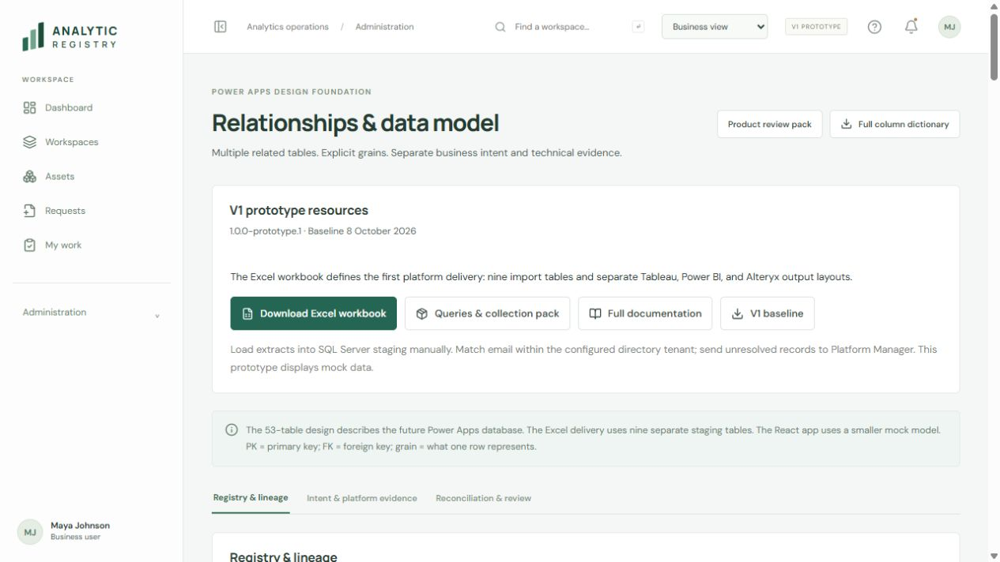

# Analytic Registry - V1 prototype

**Version 1.0.0-prototype.1 · 8 October 2026 · Tag v1.0.0-prototype.1**

This baseline packages the React app, complete documentation, diagrams, Excel extract layouts, platform queries, and review evidence together.

Start with the [V1 baseline](analytic-registry/docs/v1-prototype-baseline.md). It separates implemented prototype behavior from confirmed requirements and deferred work. The [pinned version](https://github.com/dlpate2525/analytic-registry/tree/v1.0.0-prototype.1) preserves this release; main may change later.

## Review and download

| Artifact | Link |
|---|---|
| Excel extract workbook | [Download the V1 workbook](https://github.com/dlpate2525/analytic-registry/raw/refs/tags/v1.0.0-prototype.1/platform-data-collection/v1-extract/analytic-registry-v1-extract.xlsx) |
| Platform manager instructions | [Four-step handoff](platform-data-collection/v1-extract/README.md) |
| Platform queries and mappings | [Collection index](platform-data-collection/README.md), [complete ZIP](platform-data-collection/analytic-registry-platform-data-pack.zip) |
| Compiled app and documentation | [Preview ZIP](downloads/analytic-registry-preview.zip) |
| App source and setup | [Application README](analytic-registry/README.md) |
| Business/product and diagram | [Product document](analytic-registry/docs/business-product.md), [relationship diagram](analytic-registry/docs/workspace-asset-connection.svg) |
| Requirements and decisions | [Requirements](analytic-registry/docs/requirements.md), [decision register](analytic-registry/docs/decision-register.md) |
| Table and column design | [53-table model](analytic-registry/docs/data-model.md), [602-column dictionary](analytic-registry/docs/column-dictionary.csv) |
| Identity design | [Email matching and future integration](analytic-registry/docs/identity-resolution-design.md) |
| Review findings and limits | [Repair backlog](analytic-registry/docs/github-review-and-repair-plan.md), [verification](analytic-registry/docs/verification.md) |
| Release identity and checksums | [Baseline manifest](V1-BASELINE.json), [all artifact digests](ARTIFACTS.sha256), [publication notes](PUBLICATION.md) |

The workbook has **15 sheets**, **nine blank import tables**, **117 import columns**, and three platform output tabs: Tableau_Output, PowerBI_Output, Alteryx_Output. Their 28 sections show exact output layouts and collection limits. They contain no actual platform data.

V1 uses manual SQL Server staging. Match platform email to directory mail within the configured tenant. Preserve native IDs separately and send every unresolved case to Platform Manager. Alteryx uses MongoDB backend queries only. A failed lookup does not establish account inactivity.

## Run the prototype

Use Node.js 22 or newer. Keep both application and collection folders together.

```sh
cd analytic-registry
npm ci
npm run dev
```

Open the printed localhost address. The app links its current workbook, query pack, documentation, and baseline under Administration > Relationships & data model and the help guide.

For the compiled preview, extract the preview ZIP and serve its contents through a local HTTP server. Open review-pack.html for the documentation landing page. No Node build is needed for that bundle.

## Validate the release

Inside analytic-registry:

```sh
npm run check
npm run build
npm run check:release
```

From the repository root, using Node and Python 3:

```sh
node --test platform-data-collection/tests/normalize.test.mjs platform-data-collection/v1-extract/tests/alteryx-backend.test.mjs
python platform-data-collection/verify-delivery.py
```

After editing collection files, rebuild their archive with `python platform-data-collection/build-bundle.py`. App build preparation copies current resources and rewrites local documentation links. Do not edit generated public copies separately.

## Scope

The React app uses fictional data, simulated roles, and local browser storage. SQL loading is manual. No live platform collector, directory integration, production authorization, Power Apps deployment, or automatic registry importer is included.

Known workflow defects remain documented. Classification, manual-PRL alignment, and risk repairs remain deferred. Proposed operating settings retain their proposed status. Baseline acceptance does not certify production readiness.

Older screenshots and the [earlier critique](analytic-registry-seven-critiques.md) preserve design history. The current baseline and implementation take precedence.


