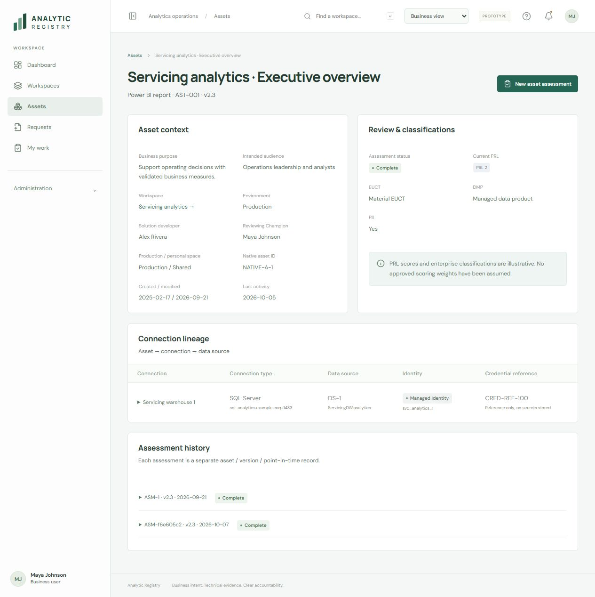

# Analytic Registry

A React and TypeScript prototype for analytics workspace onboarding, asset reviews, access reconciliation, and annual attestation across Power BI/Fabric, Tableau, and Alteryx.

The repository includes the application, product and engineering documents, relationship diagrams, a column dictionary, platform collection adapters, sample outputs, and review screenshots. People, endpoints, IDs, and platform records in the prototype are fictional examples.

## Start here

| Artifact | Location |
|---|---|
| Application source and local setup | [analytic-registry](analytic-registry/README.md) |
| Application review and repair priorities | [Review and five-phase plan](analytic-registry/docs/github-review-and-repair-plan.md), [identity resolution design](analytic-registry/docs/identity-resolution-design.md) |
| Business and product definition | [Business / product document](analytic-registry/docs/business-product.md) |
| Current decisions and remaining operating proposals | [Decision register](analytic-registry/docs/decision-register.md) |
| Functional and nonfunctional requirements | [Requirements](analytic-registry/docs/requirements.md) |
| Relationships and full column definitions | [Data model](analytic-registry/docs/data-model.md), [CSV dictionary](analytic-registry/docs/column-dictionary.csv) |
| Workspace, asset, connection, and source diagram | [Relationship diagram](analytic-registry/docs/workspace-asset-connection.svg) |
| Defects, streamlines, and verification | [Audit](analytic-registry/docs/audit-report.md), [verification](analytic-registry/docs/verification.md) |
| Platform export queries and mapping contract | [Collection pack](platform-data-collection/README.md) |
| Native IDs and safe refresh behavior | [Identity and refresh](platform-data-collection/identity-and-refresh.md) |
| Tableau SQL | [Preflight](platform-data-collection/tableau/preflight.sql), [export](platform-data-collection/tableau/export.sql) |
| Power BI collection | [API pseudocode](platform-data-collection/powerbi/collector-pseudocode.md), [normalizer](platform-data-collection/powerbi/normalize-scan.mjs) |
| Earlier design critique | [Seven critiques](analytic-registry-seven-critiques.md) |
| Publication contents and checks | [Publication notes](PUBLICATION.md) |

## Run the prototype

Use Node.js 22 or newer with npm.

```sh
cd analytic-registry
npm ci
npm run dev
```

Open the localhost URL printed by Vite. To validate and build:

```sh
npm run check
npm run build
npm run preview
```

Run collector checks from the repository root:

```sh
node --test platform-data-collection/tests/normalize.test.mjs
```

## Downloadable artifacts

- [Built prototype preview](downloads/analytic-registry-preview.zip). Extract and serve the contents through a local HTTP server.
- [Platform collection ZIP](platform-data-collection/analytic-registry-platform-data-pack.zip).
- [Standalone product review index](analytic-registry/docs/review-pack.html). Download the docs folder to use the local HTML and its related files.

## Scope and status

This is a local design prototype, not a deployed production control system. It uses browser storage and simulated roles. The repository does not contain credentials, source-system exports from a real installation, or a production importer. Platform collectors require local configuration and verification before live use.

The decision register distinguishes confirmed choices, selected architecture, proposed operating settings, and implementation work. Publication does not approve still-proposed settings or enable jobs, data cleanup, or platform actions.

The PNG files at the application root preserve earlier design iterations. Some show previous navigation or form layouts. The current implementation and requirements take precedence. The latest audit screenshot is shown below.


