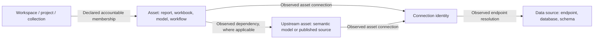
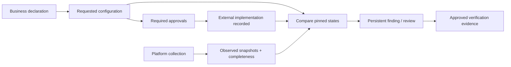

# Analytic Registry — business and product definition

Review date: 7 October 2026. Status: working React prototype and proposed Power Apps design.

## Product purpose

Analytic Registry connects business accountability with technical evidence for Power BI/Fabric, Tableau, and Alteryx. It answers three questions:

1. What does the business intend to use and maintain?
2. What did administrators implement, and what does the platform currently report?
3. Who must act on a difference, missing evidence, or overdue review?

A workspace is the governance anchor. An asset is the unit of content assessment. Connections and source endpoints have their own identities. A request or approval does not prove a platform resource exists.

The React application is a local prototype. It simulates role decisions and saves records in browser storage. It does not deploy resources, send annual notifications, execute remediation, query platform systems, or enforce production authorization.

## People and responsibility

| Participant | Responsibility |
|---|---|
| Business user | Requests, business metadata, directory group creation and membership maintenance |
| Business Owner / Workspace Owner | One accountable person for the workspace; this is one field |
| Champion | Coordinates reviews, confirms annual business intent, and belongs conceptually within RW |
| Developer / asset reviewer | Records the asset release, readiness inputs, classification, and review outcome |
| Application Owner or Platform Owner | Approves Custom configuration and every annual attestation |
| Platform administrator | Reviews technical setup, records external implementation, investigates issues, and verifies delivery |
| Platform Manager, Platform Team, or Platform Owner | Approves the exact evidence used to close a review |
| Collector service | Supplies source identities and observed snapshots; never invents business declarations |

Champion is an accountability role, not a permission level above RW. A valid RW publisher does not bypass a review gate merely by being outside the Champion roster.

## Core relationships

An asset can have zero or one current accountable workspace. Zero preserves an orphan for investigation. Observed physical memberships can include several collections. They do not create several accountable owners.

Assets and connections have a many-to-many relationship. A connection may have no resolved asset. A source endpoint can serve connections from several platforms. Connection controls remain unresolved until the required identity and lineage evidence exists.

Power BI reports commonly depend on semantic models. A model can be in another workspace. Preserve the report-to-model edge before following the model's source connections. Tableau workbooks are the first-pass report grain; individual views remain separate child detail.

The schema uses `ObservedAssetDependency` for intermediate content dependencies. `ObservedAssetConnection` records direct evidence. A derived report-to-connection view must retain the path and must not claim every derived edge was directly observed.

## Stable identity and refresh

| Identity | Purpose |
|---|---|
| `ObjectID` / subtype UUID | Registry-controlled identity; never replaced by a source identifier |
| `PlatformInstanceID` | Tenant or server boundary |
| `NativeScopeKey` | Source uniqueness boundary, such as site; not a movable workspace when native IDs survive moves |
| `NativeObjectType` | Distinguishes report, model, workbook, connection, and other native types |
| `NativeObjectID` | Exact source ID retained as text for refreshes |
| `DisplayName` | Changeable label; never a match key |

Refresh matches the complete native identity tuple. A rename changes the observed name. A move changes membership. Neither changes the registry UUID. A new native ID creates a new identity unless an explicitly approved crosswalk proves continuity. Missing rows in partial extracts do not retire anything.

Teams should deliver native identifiers. The ingestion resolver assigns internal registry IDs. See the [platform collection pack](../../platform-data-collection/README.md) for the source contracts and queries.

## Five information layers

| Layer | Authority | Main records | Update rule |
|---|---|---|---|
| Business declaration | Accountable business user | WorkspaceBusinessVersion, AssetVersion | New version; keep prior owner, LOB, purpose, and classification |
| Requested setup | Submitted business request | WorkspaceRequest, requested ConfigurationVersion, groups, Champions | Preserve submitted intent and its approvals |
| Implemented setup | Platform administrator | Implemented ConfigurationVersion, AdministrativeAction | Record actual external execution separately |
| Observed reality | Platform and directory collectors | ExtractRun, ExtractDataset, observed snapshots | Append evidence with time, source, scope, and completeness |
| Assessment and response | Rule evaluator and authorized reviewers | RuleEvaluation, Finding, review, approval, attestation | Preserve rule version, evidence, decision, and lifecycle |

## Workflows and interface

Five main sections remain visible: Dashboard, Workspaces, Assets, Requests, and My work. Administration stays in a menu. Annual reviews sit within My work. The Business home has four linked numbers; Administrator view retains estate reporting.

| Workflow | Guided topics | Completion condition |
|---|---|---|
| Workspace request | Workspace & people; Data & risk; Setup approach; Groups & access; Review & submit | Required declarations, identities, and groups pass validation; approvals precede delivery |
| Asset assessment | Asset context; References; Readiness inputs; Classifications; Review decision | Valid review record; a completed current-version assessment projects current classifications |
| Administrative review | Understand issue; Decision & ownership; Evidence & approval | Authorized evidence approval, valid verification, and explicit close action |
| Annual review | Review workspace; Confirm details; Response & approval | Champion response plus Application Owner or Platform Owner approval |
| External administration | Collect; Assess; Prepare; Execute; Verify | Administrator-approved work followed by verification evidence |

All processes use fewer than six steps. Workspace and Asset columns appear when the records support those relationships. Unassociated records show missing context rather than fabricated links.

### Workspace requests

Create New captures intent before a native workspace exists. Register Existing selects a discovered unit and adds missing business context. Update Existing loads current metadata while preserving implemented state.

Requests capture PII Yes/No, EUCT Yes/No, and one highest applicable DMP tier. The confirmed order is Tier 1, then Tier 2, then Tier 3. Tier 1 is highest; numeric maximum is not the ranking rule.

Standard requires four distinct group purposes: Champion, RW, R, and Data Sources (`_DS`). DS creates and maintains workspace data connections. The platform team maps this purpose to explicit native capabilities. Group ownership follows the workspace. Business users may select existing groups or request new names. Existing groups need verified native directory identities. New names remain pending prerequisites.

Custom requires a structured reason. Other requires explanation. Alternative groups can be added or removed. A Custom approval does not waive control objectives. Direct-user comparison needs an explicit approved baseline; the prototype reports this missing baseline as Unable to Verify.

One to ten unique Champions are allowed. Inactive identities cannot be assigned. One Champion gives a warning, not a block. Unverified request identities remain visibly unresolved; no extra approval gate was invented.

Submitted requests remain immutable. A correction decision creates a linked draft with a new request ID and fresh approvals. The original remains in history. Delivery records distinguish approval, external implementation, and verification.

### Asset assessment

Review the first production release and material changes to data sources, credentials, access, processing, or audience. Minor presentation changes do not restart review.

The assessment stores release context, references, readiness inputs, classification, review metadata, and outcome. The first release records an approved PRL manually and calculates no score. Readiness inputs remain available. Historical illustrative scores do not become approved PRL values. Source technology and processing mode are different concepts.

A historical release assessment cannot overwrite the current asset's classifications. An in-progress review cannot publish new classifications. The mock still permits completing a review with Changes required; completion records a review decision, not production approval.

### Reviews and annual assurance

Business users can supply their response to assigned business work. Administrator evidence and decisions are protected in the prototype interface. Completed cases are read-only. Changed evidence requires a fresh approval. Closure updates only explicitly linked findings.

Annual packets retain the reviewed workspace, Champions, groups, assets, connections, findings, and changes. A Champion responds. An authorized owner approves. Completion with follow-up is valid when a separate correction review exists. Completion is not a statement that all controls passed.

## Reconciliation and risk

| Situation | Result |
|---|---|
| Requested G2; implemented G1; observed G1 | Pending Implementation |
| Observed permission differs from implemented baseline, with usable evidence | Discrepancy |
| A pending request and unrelated observed drift coexist | Preserve the pending change and the separate discrepancy |
| Missing, stale, incomplete, future-dated, or unsupported evidence | Unable to Verify |
| Implemented and observed agree, and evidence is current and complete | Aligned |
| Human interpretation is needed with usable evidence | Flagged for Review |
| Control does not apply | Not Applicable |

The 11 risk buckets remain: Orphan, Stale, Access Risk, Compliance Gap, Bypassed Gate, Credential Exposure, Performance Risk, Concentration Risk, Coverage / Bus-Factor, Privilege Sprawl, and Low Adoption.

Each finding has a stable lifecycle. Repeated detections update its occurrence history instead of inflating issue counts. Reporting distinguishes finding count, distinct affected workspaces, and distinct affected assets. Missing credentials evidence does not establish credential exposure. One owner alone does not establish inadequate backup coverage.

## Power Apps design and delivery boundaries

Use multiple related tables. One large editable table would repeat workspace attributes for every asset, connection, group, and finding. Repetition creates ambiguous updates and inflated counts.

Use focused views for galleries and transactional commands for multi-row changes. Tables retain their natural grain. Each command validates identity, permissions, workflow state, evidence revision, and concurrency before writing. The [53-table dictionary](data-model.md) defines the target model; the React store is a smaller mock.

The first production slice should establish registry identity, observed asset inventory, native-ID resolution, requests, and review ownership. Add reconciled permissions and automated risk evaluation only after collection completeness and policy thresholds are agreed.

## Current decision baseline

The [decision register](decision-register.md) replaces the earlier open-question list. It preserves the original SQL Server target on the configured SQL Server host, records selected architecture and workflow choices, and separates decisions from delivery proof.

The product owner confirmed Tier 1 as highest, manual approved PRL, DS connection administration, role-eligible self-approval, and six calendar months of business-metadata history. Current records, active approval dependencies, and stable identity mappings remain available for ongoing operations.

Self-approval is allowed only when the same person holds the required role for that decision. Workspace ownership alone does not grant a platform approval role. All evidence and exact-revision checks remain required.

Operating defaults are listed together in the register for acceptance. Platform ID samples, role mappings, infrastructure, and live extraction results still require delivery verification. Chosen settings are not represented as deployed features.
