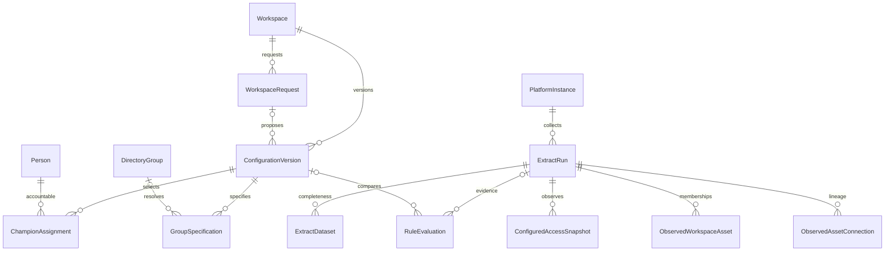
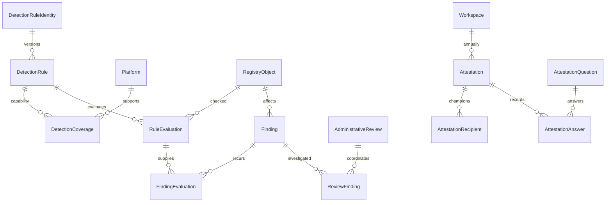

# Analytic Registry data model for Power Apps

Use multiple related tables with explicit grains. Do not use one large editable table. A workspace can have many assets, Champions, access assignments, and findings. Combining these creates repeated rows, inflated counts, and ambiguous updates.

This is a proposed logical SQL Server design for the configured SQL Server host. It is not deployed DDL. The React prototype implements a smaller local mock model. The table dictionary below is the design target, not a claim that all of it is already implemented.

## Reading the design

Grain means what one row represents. PK is a primary key. FK is a foreign key. UUID means SQL Server uniqueidentifier. Date-time columns use UTC datetime2. NULL explicitly marks optional values; unmarked FK columns are required. UNIQUE rules are listed per table.

All tables also include CreatedAt datetime2 NOT NULL. Mutable app records include ModifiedAt datetime2 NOT NULL, ModifiedByPersonID uuid NULL, and RowVersion rowversion. Immutable versions, evaluations, observations, and completed answers use append-only writes. Code columns require checked values or maintained lookup tables. Proposed field lengths require business approval.

## Platform and native identity

Platform is a controlled reference with Power BI / Fabric, Tableau, and Alteryx rows. PlatformInstance adds tenant, site, server, environment, and product version. Alteryx Server 2025.2 is an instance version.

RegistryObject references PlatformInstance. PlatformID is therefore available for every workspace, asset, and connection. Each screen view exposes PlatformID and PlatformName explicitly. Child tables derive platform through their parent, avoiding contradictory duplicated values. A canonical DataSource can be shared across platforms and does not require a single owning platform.

Use an internal ObjectID and a filtered unique native key: instance + native scope + native object type + native object ID. Names are attributes. A create request can have a stable ObjectID before a native object exists. Provisioning binds the returned native ID to that object; an ambiguous discovery goes to reconciliation.

RegistryObject is an identity supertype only, not a generic attribute store. Exactly one Workspace, Asset, or Connection subtype must match ObjectTypeCode. Enforce same-instance membership constraints in commands and ingestion unless an approved cross-instance relationship is explicitly supported.

## Relationship diagrams

Each parent-to-many relationship can have zero children. An asset may have no workspace association. The subtype diagram permits each individual subtype to be absent, but exactly one subtype must exist across the three.

### Registry and lineage

```mermaid
erDiagram
    Platform ||--o{ PlatformInstance : scopes
    PlatformInstance ||--o{ RegistryObject : identifies
    RegistryObject ||--o| Workspace : subtype
    RegistryObject ||--o| Asset : subtype
    RegistryObject ||--o| Connection : subtype
    Workspace ||--o{ WorkspaceBusinessVersion : declares
    Workspace ||--o{ WorkspaceAsset : associates
    Asset ||--o{ WorkspaceAsset : participates
    Asset ||--o{ AssetVersion : releases
    AssetVersion ||--o{ AssetAssessment : reviewed
    AssetVersion ||--o{ DeclaredAssetConnection : expects
    Connection ||--o{ DeclaredAssetConnection : serves
    Connection ||--o{ ObservedConnection : observed
    DataSource |o--o{ ObservedConnection : resolves
```

### Intent and observation

ConfigurationVersion is used separately for requested and implemented snapshots. RuleEvaluation pins both IDs independently. The diagram abbreviates the two foreign keys to one relationship.

### Detection and review

## What the app creates and what exists

| State | Writer | Authoritative tables | Meaning |
|---|---|---|---|
| Business metadata | Business user, through validated app commands | WorkspaceBusinessVersion, AssetVersion | Purpose, owner, declared audience and classification context |
| Requested configuration | Business user | WorkspaceRequest, requested ConfigurationVersion, ChampionAssignment, GroupSpecification | Desired future setup; may refer to groups or workspaces not created yet |
| Implemented configuration | Platform administrator | Implemented ConfigurationVersion, AdministrativeAction | What the administrator records as completed externally |
| Observed platform state | External extraction scripts | ExtractRun, ExtractDataset, Observed tables, access snapshots | What the platform actually reported at a specific time and scope |
| Comparison | Assessment script or reviewer | RuleEvaluation, ConfigurationComparisonItem, EvidenceItem | Comparison against pinned versions, evidence, and rule version |
| Tracked issue | Assessment upsert and reviewers | Finding, FindingEvaluation, AdministrativeReview | Persistent issue lifecycle, not a new issue for every extract |

App submission is not proof of provisioning. An administrator action is not proof of verified platform state. Observation never silently overwrites historical intent.

## Confirmed business decisions

- Business Owner and Workspace Owner are one field: OwnerPersonID.
- Workspace requests require a PII Yes/No declaration, an EUCT Yes/No declaration, and exactly one highest applicable DMP tier: Tier 1, Tier 2, or Tier 3. These describe intended content. Do not infer numeric tier ordering or overwrite them from asset observations.
- Each asset has at most one accountable workspace. Keep observed physical memberships separate.
- Business users own group creation and ongoing membership maintenance. Group names remain pending until directory evidence resolves a real ID.
- Custom workspaces and all annual attestations require Application Owner or Platform Owner approval. These role names identify alternative eligible approvers; actual role assignments remain configurable.
- No additional unverified-identity approval gate is added (item 6 was marked N/A). Existing inactive-person restrictions and unresolved-evidence labels remain.
- New asset assessment is required for initial production release and material changes to sources, credentials, access, processing, or audience. Minor presentation changes do not restart the review.
- Conclusive reconciliation requires complete and sufficiently recent evidence. Exact freshness thresholds remain to be defined. Overdue pending requests are distinct from drift.
- Closing evidence requires Platform Manager, Platform Team, or Platform Owner approval. A later evidence change invalidates the old approval.
- An annual attestation can become Complete with follow-up after owner approval, with a linked correction review. Freeze the reviewed context.

## Confirmed interface direction

Default to Business view. Show four key numbers on the home dashboard. Keep five sections: Dashboard, Workspaces, Assets, Requests, and My work. Annual reviews sit inside My work. Collapse administrative tools into one menu. Workspace lists show name, platform, owner, status, and next action. Requests, reviews, and annual attestations use short guided steps. Estate-wide analytics remains in Administrator view.

## Table dictionary

53 logical tables are specified below. This separates all requested grains and histories. It does not imply 53 screens or require every module in the first delivery.

### Platform

**Domain:** Reference. **Grain:** One supported platform. **Writer:** Administrator.

| Column | Proposed type, keys and nullability | Purpose (under 200 words) |
|---|---|---|
| PlatformID | int PK | Controlled analytics platform identifier. Child views derive this through the platform instance. |
| Code | nvarchar(30) UNIQUE NOT NULL | Stable reference code used by commands and mappings, independent of the displayed label. |
| DisplayName | nvarchar(80) NOT NULL | Human-readable label at this record or snapshot. Names may change and are never refresh join keys. |
| NativeUnitTerm | nvarchar(30) NOT NULL | Platform term shown in forms: workspace, project, or collection. |
| IsEnabled | bit NOT NULL | Whether new workflows can select this platform. |
| CreatedAt | datetime2 NOT NULL | UTC time this registry row was inserted. Never substitute a source creation timestamp. |
| ModifiedAt | datetime2 NOT NULL | UTC time of the most recent allowed update. |
| ModifiedByPersonID | uniqueidentifier FK → Person NULL | Person responsible for the most recent allowed update. |
| RowVersion | rowversion NOT NULL | SQL Server concurrency token. Reject updates based on an outdated token. |

**Integrity and behavior:** Seed Power BI / Fabric, Tableau, and Alteryx. Platform is a lookup, not repeated free text.

### PlatformInstance

**Domain:** Reference. **Grain:** One tenant, Tableau site, or Alteryx server scope. **Writer:** Administrator.

| Column | Proposed type, keys and nullability | Purpose (under 200 words) |
|---|---|---|
| PlatformInstanceID | uniqueidentifier PK | Stable internal primary key for this PlatformInstance row. Source-native identity is retained separately when applicable. |
| PlatformID | int FK → Platform | Controlled analytics platform identifier. Child views derive this through the platform instance. |
| NativeInstanceKey | nvarchar(200) NOT NULL | Stable tenant or server-instance key supplied by the platform team. Do not use a changeable display name. |
| DisplayName | nvarchar(100) NOT NULL | Human-readable label at this record or snapshot. Names may change and are never refresh join keys. |
| EnvironmentCode | nvarchar(30) NOT NULL | Controlled environment value for this PlatformInstance record. Allowed values and transitions follow the table rules. |
| ProductVersion | nvarchar(40) NULL | Installed platform version or cloud API/service descriptor. Do not invent a Fabric server version. |
| IsEnabled | bit NOT NULL | Whether new workflows can select this platform. |
| CreatedAt | datetime2 NOT NULL | UTC time this registry row was inserted. Never substitute a source creation timestamp. |
| ModifiedAt | datetime2 NOT NULL | UTC time of the most recent allowed update. |
| ModifiedByPersonID | uniqueidentifier FK → Person NULL | Person responsible for the most recent allowed update. |
| RowVersion | rowversion NOT NULL | SQL Server concurrency token. Reject updates based on an outdated token. |

**Integrity and behavior:** UNIQUE (PlatformID, NativeInstanceKey). Alteryx version 2025.2 belongs here. Include site identity where native object IDs are site-scoped.

### BusinessLine

**Domain:** Reference. **Grain:** One business line. **Writer:** Directory sync / administrator.

| Column | Proposed type, keys and nullability | Purpose (under 200 words) |
|---|---|---|
| BusinessLineID | uniqueidentifier PK | Stable internal primary key for this BusinessLine row. Source-native identity is retained separately when applicable. |
| Code | nvarchar(30) UNIQUE NOT NULL | Stable reference code used by commands and mappings, independent of the displayed label. |
| DisplayName | nvarchar(100) NOT NULL | Human-readable label at this record or snapshot. Names may change and are never refresh join keys. |
| IsActive | bit NOT NULL | Whether this reference is currently selectable. |
| CreatedAt | datetime2 NOT NULL | UTC time this registry row was inserted. Never substitute a source creation timestamp. |
| ModifiedAt | datetime2 NOT NULL | UTC time of the most recent allowed update. |
| ModifiedByPersonID | uniqueidentifier FK → Person NULL | Person responsible for the most recent allowed update. |
| RowVersion | rowversion NOT NULL | SQL Server concurrency token. Reject updates based on an outdated token. |

**Integrity and behavior:** Stable LOB lookup. Naming prefix derives from Code, never a person name.

### Person

**Domain:** Reference. **Grain:** One corporate identity. **Writer:** Directory sync.

| Column | Proposed type, keys and nullability | Purpose (under 200 words) |
|---|---|---|
| PersonID | uniqueidentifier PK | Stable internal primary key for this Person row. Source-native identity is retained separately when applicable. |
| DirectoryTenantKey | nvarchar(100) NOT NULL | Directory boundary for a native person or group identity. |
| DirectoryObjectID | nvarchar(150) NOT NULL | Stable directory object identifier; names and email do not replace it. |
| DisplayName | nvarchar(150) NOT NULL | Human-readable label at this record or snapshot. Names may change and are never refresh join keys. |
| Email | nvarchar(254) NULL | Contact or identity-resolution evidence. An email change must not create a new person. |
| BusinessLineID | uniqueidentifier FK → BusinessLine NULL | Links this Person row to BusinessLine. Role: Business Line identifier. Uses the internal key, never the record name. |
| ManagerPersonID | uniqueidentifier FK → Person NULL | Links this Person row to Person. Role: Manager Person identifier. Uses the internal key, never the record name. |
| IdentityStatusCode | nvarchar(30) NOT NULL | Active, Inactive, or Unverified identity state. Unknown verification does not mean inactive. |
| VerifiedAt | datetime2 NULL | UTC timestamp for verified at in this record's lifecycle. NULL means the event or boundary is not established. |
| SourceRunID | uniqueidentifier FK → ExtractRun NULL | Links this Person row to ExtractRun. Role: Source Run identifier. Uses the internal key, never the record name. |
| CreatedAt | datetime2 NOT NULL | UTC time this registry row was inserted. Never substitute a source creation timestamp. |
| ModifiedAt | datetime2 NOT NULL | UTC time of the most recent allowed update. |
| ModifiedByPersonID | uniqueidentifier FK → Person NULL | Person responsible for the most recent allowed update. |
| RowVersion | rowversion NOT NULL | SQL Server concurrency token. Reject updates based on an outdated token. |

**Integrity and behavior:** UNIQUE (DirectoryTenantKey, DirectoryObjectID). Identity status is Active, Inactive, or Unverified. Unverified is not inactive. Historical owner LOB is stored in business versions.

### DirectoryGroup

**Domain:** Reference. **Grain:** One real directory group. **Writer:** Directory sync.

| Column | Proposed type, keys and nullability | Purpose (under 200 words) |
|---|---|---|
| DirectoryGroupID | uniqueidentifier PK | Stable internal primary key for this DirectoryGroup row. Source-native identity is retained separately when applicable. |
| DirectoryTenantKey | nvarchar(100) NOT NULL | Directory boundary for a native person or group identity. |
| DirectoryObjectID | nvarchar(150) NOT NULL | Stable directory object identifier; names and email do not replace it. |
| DisplayName | nvarchar(200) NOT NULL | Human-readable label at this record or snapshot. Names may change and are never refresh join keys. |
| IdentityStatusCode | nvarchar(30) NOT NULL | Active, Inactive, or Unverified identity state. Unknown verification does not mean inactive. |
| VerifiedAt | datetime2 NULL | UTC timestamp for verified at in this record's lifecycle. NULL means the event or boundary is not established. |
| SourceRunID | uniqueidentifier FK → ExtractRun NULL | Links this DirectoryGroup row to ExtractRun. Role: Source Run identifier. Uses the internal key, never the record name. |
| CreatedAt | datetime2 NOT NULL | UTC time this registry row was inserted. Never substitute a source creation timestamp. |
| ModifiedAt | datetime2 NOT NULL | UTC time of the most recent allowed update. |
| ModifiedByPersonID | uniqueidentifier FK → Person NULL | Person responsible for the most recent allowed update. |
| RowVersion | rowversion NOT NULL | SQL Server concurrency token. Reject updates based on an outdated token. |

**Integrity and behavior:** UNIQUE (DirectoryTenantKey, DirectoryObjectID). Business users own group creation and ongoing membership. A requested group name never inserts a provisioned group here.

### Principal

**Domain:** Reference. **Grain:** One resolvable or unresolved access principal. **Writer:** Extract / identity resolver.

| Column | Proposed type, keys and nullability | Purpose (under 200 words) |
|---|---|---|
| PrincipalID | uniqueidentifier PK | Stable internal primary key for this Principal row. Source-native identity is retained separately when applicable. |
| PlatformInstanceID | uniqueidentifier FK → PlatformInstance | Links this Principal row to PlatformInstance. Role: Platform Instance identifier. Uses the internal key, never the record name. |
| NativePrincipalID | nvarchar(200) NOT NULL | Original platform user, group, or service-principal identifier. Resolve to directory identity only with evidence. |
| PrincipalTypeCode | nvarchar(30) NOT NULL | Controlled principal type value for this Principal record. Allowed values and transitions follow the table rules. |
| PersonID | uniqueidentifier FK → Person NULL | Links this Principal row to Person. Role: Person identifier. Uses the internal key, never the record name. |
| DirectoryGroupID | uniqueidentifier FK → DirectoryGroup NULL | Links this Principal row to DirectoryGroup. Role: Directory Group identifier. Uses the internal key, never the record name. |
| DisplayName | nvarchar(200) NOT NULL | Human-readable label at this record or snapshot. Names may change and are never refresh join keys. |
| ResolutionStatusCode | nvarchar(30) NOT NULL | Whether the native principal has been matched to a verified directory identity. |
| CreatedAt | datetime2 NOT NULL | UTC time this registry row was inserted. Never substitute a source creation timestamp. |
| ModifiedAt | datetime2 NOT NULL | UTC time of the most recent allowed update. |
| ModifiedByPersonID | uniqueidentifier FK → Person NULL | Person responsible for the most recent allowed update. |
| RowVersion | rowversion NOT NULL | SQL Server concurrency token. Reject updates based on an outdated token. |

**Integrity and behavior:** UNIQUE (PlatformInstanceID, NativePrincipalID). Person and group links are mutually exclusive. Keep unresolved native users and service principals without inventing directory identities.

### RegistryObject

**Domain:** Registry. **Grain:** One durable workspace, asset, or connection identity. **Writer:** App command / extract resolver.

| Column | Proposed type, keys and nullability | Purpose (under 200 words) |
|---|---|---|
| ObjectID | uniqueidentifier PK | Stable internal primary key for this RegistryObject row. Source-native identity is retained separately when applicable. |
| PlatformInstanceID | uniqueidentifier FK → PlatformInstance | Links this RegistryObject row to PlatformInstance. Role: Platform Instance identifier. Uses the internal key, never the record name. |
| ObjectTypeCode | nvarchar(30) NOT NULL | Registry identity subtype: Workspace, Asset, or Connection. Exactly one corresponding subtype row must exist. |
| NativeObjectType | nvarchar(50) NOT NULL | Native object category, such as report, semantic model, workbook, project, or workflow. Part of the identity key. |
| NativeObjectID | nvarchar(200) NULL | Original platform identifier, stored as text without reformatting. Retained separately from the registry UUID for refresh matching. |
| NativeScopeKey | nvarchar(200) NOT NULL | Native uniqueness scope, such as tenant or Tableau site. Do not include a movable workspace when IDs survive moves. |
| FirstSeenAt | datetime2 NULL | UTC timestamp for first seen at in this record's lifecycle. NULL means the event or boundary is not established. |
| LastSeenAt | datetime2 NULL | UTC timestamp for last seen at in this record's lifecycle. NULL means the event or boundary is not established. |
| DiscoveryStateCode | nvarchar(30) NOT NULL | Controlled discovery state value for this RegistryObject record. Allowed values and transitions follow the table rules. |
| CreatedAt | datetime2 NOT NULL | UTC time this registry row was inserted. Never substitute a source creation timestamp. |
| ModifiedAt | datetime2 NOT NULL | UTC time of the most recent allowed update. |
| ModifiedByPersonID | uniqueidentifier FK → Person NULL | Person responsible for the most recent allowed update. |
| RowVersion | rowversion NOT NULL | SQL Server concurrency token. Reject updates based on an outdated token. |

**Integrity and behavior:** Filtered UNIQUE (PlatformInstanceID, NativeScopeKey, NativeObjectType, NativeObjectID) when NativeObjectID is not null. Draft objects can lack a native ID. Exactly one matching Workspace, Asset, or Connection subtype is required. PlatformID is derived from PlatformInstance and included in app views.

### Workspace

**Domain:** Registry. **Grain:** One governed workspace, project, or collection. **Writer:** App command.

| Column | Proposed type, keys and nullability | Purpose (under 200 words) |
|---|---|---|
| WorkspaceID | uniqueidentifier PK / FK → RegistryObject.ObjectID | Stable internal primary key for this Workspace row. Source-native identity is retained separately when applicable. |
| RegistryNumber | nvarchar(30) UNIQUE NOT NULL | Readable registry reference. The UUID remains the relational primary key. |
| RegistrationStatusCode | nvarchar(30) NOT NULL | Controlled registration status value for this Workspace record. Allowed values and transitions follow the table rules. |
| LifecycleStatusCode | nvarchar(30) NOT NULL | Controlled lifecycle status value for this Workspace record. Allowed values and transitions follow the table rules. |
| OriginalOwnerLOBID | uniqueidentifier FK → BusinessLine NULL | Business line captured at onboarding. Preserve it when current ownership changes. |
| CreatedByPersonID | uniqueidentifier FK → Person NULL | Links this Workspace row to Person. Role: Created By Person identifier. Uses the internal key, never the record name. |
| CreatedByService | nvarchar(100) NULL | Collector service identity that created a discovered workspace stub. Mutually exclusive with CreatedByPersonID; never infer it from a source owner. |
| RegisteredAt | datetime2 NULL | UTC timestamp for registered at in this record's lifecycle. NULL means the event or boundary is not established. |
| ProvisionedAt | datetime2 NULL | UTC timestamp for provisioned at in this record's lifecycle. NULL means the event or boundary is not established. |
| ContentReadyAt | datetime2 NULL | UTC timestamp for content ready at in this record's lifecycle. NULL means the event or boundary is not established. |
| RetiredAt | datetime2 NULL | UTC timestamp for retired at in this record's lifecycle. NULL means the event or boundary is not established. |
| CreatedAt | datetime2 NOT NULL | UTC time this registry row was inserted. Never substitute a source creation timestamp. |
| ModifiedAt | datetime2 NOT NULL | UTC time of the most recent allowed update. |
| ModifiedByPersonID | uniqueidentifier FK → Person NULL | Person responsible for the most recent allowed update. |
| RowVersion | rowversion NOT NULL | SQL Server concurrency token. Reject updates based on an outdated token. |

**Integrity and behavior:** CHECK exactly one of CreatedByPersonID and CreatedByService is populated. Discovery uses the real collector service identity, never the source owner. Discovery creates the identity and a Discovered workspace stub; registration adds approved business context. Retain the original LOB. A new provisioned workspace may have no assets and no connections.

### WorkspaceBusinessVersion

**Domain:** Intent. **Grain:** One immutable business declaration per workspace/version. **Writer:** Power App submission.

| Column | Proposed type, keys and nullability | Purpose (under 200 words) |
|---|---|---|
| BusinessVersionID | uniqueidentifier PK | Stable internal primary key for this WorkspaceBusinessVersion row. Source-native identity is retained separately when applicable. |
| WorkspaceID | uniqueidentifier FK → Workspace | Links this WorkspaceBusinessVersion row to Workspace. Role: Workspace identifier. Uses the internal key, never the record name. |
| VersionNumber | int NOT NULL | Increasing version within the parent and state kind; never reuse a version number. |
| BusinessName | nvarchar(100) NOT NULL | Business-facing workspace name, limited to the proposed field length. |
| BusinessPurpose | nvarchar(500) NOT NULL | Business decisions or processes supported by the workspace; supplied by its accountable owner. |
| OwnerPersonID | uniqueidentifier FK → Person | Single accountable Business Owner / Workspace Owner. Do not create a second owner field. |
| OwnerLOBAtDeclarationID | uniqueidentifier FK → BusinessLine | Owner business line frozen with this declaration version. |
| OwnerManagerAtDeclarationID | uniqueidentifier FK → Person NULL | Owner manager frozen with this declaration; later directory updates do not rewrite it. |
| WillContainPIICode | nvarchar(10) NOT NULL | Required Yes/No declaration of intended workspace PII content. Not inferred from observed metadata. |
| WillContainEUCTCode | nvarchar(10) NOT NULL | Required Yes/No declaration of intended end-user computing tool content. |
| HighestDMPTierCode | nvarchar(10) NOT NULL | One highest applicable Data Management Policy tier: Tier 1, Tier 2, or Tier 3. Policy ordering needs confirmation. |
| DataClassificationCode | nvarchar(30) NOT NULL | Business-declared sensitivity category; kept separate from native platform labels. |
| BusinessCriticalityCode | nvarchar(30) NOT NULL | Business impact category used for prioritization, not inferred solely from technical usage. |
| RequesterPersonID | uniqueidentifier FK → Person | Links this WorkspaceBusinessVersion row to Person. Role: Requester Person identifier. Uses the internal key, never the record name. |
| RequestID | uniqueidentifier FK → WorkspaceRequest NULL | Links this WorkspaceBusinessVersion row to WorkspaceRequest. Role: Request identifier. Uses the internal key, never the record name. |
| ApprovalStatusCode | nvarchar(30) NOT NULL | Controlled approval status value for this WorkspaceBusinessVersion record. Allowed values and transitions follow the table rules. |
| ApprovedByPersonID | uniqueidentifier FK → Person NULL | Links this WorkspaceBusinessVersion row to Person. Role: Approved By Person identifier. Uses the internal key, never the record name. |
| EffectiveFrom | datetime2 NULL | UTC timestamp for effective from in this record's lifecycle. NULL means the event or boundary is not established. |
| SupersedesBusinessVersionID | uniqueidentifier FK → WorkspaceBusinessVersion NULL | Links this WorkspaceBusinessVersion row to WorkspaceBusinessVersion. Role: Supersedes Business Version identifier. Uses the internal key, never the record name. |
| CreatedAt | datetime2 NOT NULL | UTC time this registry row was inserted. Never substitute a source creation timestamp. |

**Integrity and behavior:** UNIQUE (WorkspaceID, VersionNumber). OwnerPersonID is the single Business Owner / Workspace Owner field. PII and EUCT are Yes/No declarations. HighestDMPTierCode is exactly one of Tier 1, Tier 2, Tier 3; numeric order is not presumed. Insert a new version when owner, LOB, purpose, or classifications change. Derive current approved version from status/effective date; never silently update prior rows from HR.

### WorkspaceRequest

**Domain:** Intent. **Grain:** One request lifecycle. **Writer:** Power App.

| Column | Proposed type, keys and nullability | Purpose (under 200 words) |
|---|---|---|
| RequestID | uniqueidentifier PK | Stable internal primary key for this WorkspaceRequest row. Source-native identity is retained separately when applicable. |
| WorkspaceID | uniqueidentifier FK → Workspace | Links this WorkspaceRequest row to Workspace. Role: Workspace identifier. Uses the internal key, never the record name. |
| RequestTypeCode | nvarchar(30) NOT NULL | Controlled request type value for this WorkspaceRequest record. Allowed values and transitions follow the table rules. |
| RequesterPersonID | uniqueidentifier FK → Person | Links this WorkspaceRequest row to Person. Role: Requester Person identifier. Uses the internal key, never the record name. |
| BaseBusinessVersionID | uniqueidentifier FK → WorkspaceBusinessVersion NULL | Links this WorkspaceRequest row to WorkspaceBusinessVersion. Role: Base Business Version identifier. Uses the internal key, never the record name. |
| BaseImplementedVersionID | uniqueidentifier FK → ConfigurationVersion NULL | Links this WorkspaceRequest row to ConfigurationVersion. Role: Base Implemented Version identifier. Uses the internal key, never the record name. |
| RequestStatusCode | nvarchar(30) NOT NULL | Controlled request status value for this WorkspaceRequest record. Allowed values and transitions follow the table rules. |
| SubmittedAt | datetime2 NULL | UTC timestamp for submitted at in this record's lifecycle. NULL means the event or boundary is not established. |
| DecisionCode | nvarchar(30) NULL | Controlled decision value for this WorkspaceRequest record. Allowed values and transitions follow the table rules. |
| DecidedByPersonID | uniqueidentifier FK → Person NULL | Links this WorkspaceRequest row to Person. Role: Decided By Person identifier. Uses the internal key, never the record name. |
| DecidedAt | datetime2 NULL | UTC timestamp for decided at in this record's lifecycle. NULL means the event or boundary is not established. |
| RequestedDueDate | date NULL | Optional requested completion date; not an automatically approved service commitment. |
| SupersedesRequestID | uniqueidentifier FK → WorkspaceRequest NULL | Links this WorkspaceRequest row to WorkspaceRequest. Role: Supersedes Request identifier. Uses the internal key, never the record name. |
| AttestationID | uniqueidentifier FK → Attestation NULL | Links this WorkspaceRequest row to Attestation. Role: Attestation identifier. Uses the internal key, never the record name. |
| CreatedAt | datetime2 NOT NULL | UTC time this registry row was inserted. Never substitute a source creation timestamp. |
| ModifiedAt | datetime2 NOT NULL | UTC time of the most recent allowed update. |
| ModifiedByPersonID | uniqueidentifier FK → Person NULL | Person responsible for the most recent allowed update. |
| RowVersion | rowversion NOT NULL | SQL Server concurrency token. Reject updates based on an outdated token. |

**Integrity and behavior:** Request types: Create New, Register Existing, Update Existing, Annual Attestation. An attestation can create a linked change request. Submission captures a baseline so concurrent edits can be detected.

### ConfigurationVersion

**Domain:** Intent and implementation. **Grain:** One immutable requested or implemented configuration snapshot. **Writer:** App for Requested; administrator command for Implemented.

| Column | Proposed type, keys and nullability | Purpose (under 200 words) |
|---|---|---|
| ConfigurationVersionID | uniqueidentifier PK | Stable internal primary key for this ConfigurationVersion row. Source-native identity is retained separately when applicable. |
| WorkspaceID | uniqueidentifier FK → Workspace | Links this ConfigurationVersion row to Workspace. Role: Workspace identifier. Uses the internal key, never the record name. |
| VersionNumber | int NOT NULL | Increasing version within the parent and state kind; never reuse a version number. |
| StateKindCode | nvarchar(20) NOT NULL | Requested or Implemented. Each state is an immutable snapshot; observations are stored separately. |
| RequestID | uniqueidentifier FK → WorkspaceRequest NULL | Links this ConfigurationVersion row to WorkspaceRequest. Role: Request identifier. Uses the internal key, never the record name. |
| BasedOnImplementedVersionID | uniqueidentifier FK → ConfigurationVersion NULL | Links this ConfigurationVersion row to ConfigurationVersion. Role: Based On Implemented Version identifier. Uses the internal key, never the record name. |
| ImplementsRequestedVersionID | uniqueidentifier FK → ConfigurationVersion NULL | Links this ConfigurationVersion row to ConfigurationVersion. Role: Implements Requested Version identifier. Uses the internal key, never the record name. |
| ConfigurationTypeCode | nvarchar(20) NOT NULL | Controlled configuration type value for this ConfigurationVersion record. Allowed values and transitions follow the table rules. |
| StandardVersionCode | nvarchar(30) NULL | Version of the Standard template used for this decision; preserves historical requirements. |
| RequestedTechnicalName | nvarchar(200) NOT NULL | Desired platform name; remains a label until the platform returns its real native ID. |
| CustomReasonCode | nvarchar(40) NULL | Structured reason for the alternative setup. |
| CustomExplanation | nvarchar(1000) NULL | Explanation of the Custom need; required for Other. Custom approval is not a control waiver. |
| AlternateSecurityApproach | nvarchar(1000) NULL | Documented entitlement model for a Custom setup. |
| AlternateAuthentication | nvarchar(200) NULL | Documented authentication variation without credentials or secrets. |
| ApprovalStatusCode | nvarchar(30) NOT NULL | Controlled approval status value for this ConfigurationVersion record. Allowed values and transitions follow the table rules. |
| EffectiveAt | datetime2 NULL | UTC timestamp for effective at in this record's lifecycle. NULL means the event or boundary is not established. |
| RecordedByPersonID | uniqueidentifier FK → Person | Links this ConfigurationVersion row to Person. Role: Recorded By Person identifier. Uses the internal key, never the record name. |
| AdminActionID | uniqueidentifier FK → AdministrativeAction NULL | Links this ConfigurationVersion row to AdministrativeAction. Role: Admin Action identifier. Uses the internal key, never the record name. |
| CreatedAt | datetime2 NOT NULL | UTC time this registry row was inserted. Never substitute a source creation timestamp. |

**Integrity and behavior:** UNIQUE (WorkspaceID, StateKindCode, VersionNumber). StateKind is Requested or Implemented. Implementation is a new snapshot that references its request; never flip a requested row into implemented. Partial implementation records the actual subset, and the remaining difference stays pending.

### ChampionAssignment

**Domain:** Intent and implementation. **Grain:** Configuration version × person. **Writer:** App / administrator command.

| Column | Proposed type, keys and nullability | Purpose (under 200 words) |
|---|---|---|
| ChampionAssignmentID | uniqueidentifier PK | Stable internal primary key for this ChampionAssignment row. Source-native identity is retained separately when applicable. |
| ConfigurationVersionID | uniqueidentifier FK → ConfigurationVersion | Links this ChampionAssignment row to ConfigurationVersion. Role: Configuration Version identifier. Uses the internal key, never the record name. |
| PersonID | uniqueidentifier FK → Person | Links this ChampionAssignment row to Person. Role: Person identifier. Uses the internal key, never the record name. |
| IsPrimaryContact | bit NOT NULL | Optional communication preference among Champions. It grants no additional native access. |
| CreatedAt | datetime2 NOT NULL | UTC time this registry row was inserted. Never substitute a source creation timestamp. |

**Integrity and behavior:** UNIQUE (ConfigurationVersionID, PersonID). Submission command enforces 1–10 eligible unique people; one person raises a warning. Keep this separate from group membership and native privileges.

### GroupSpecification

**Domain:** Intent and implementation. **Grain:** Configuration version × group purpose. **Writer:** App / administrator command.

| Column | Proposed type, keys and nullability | Purpose (under 200 words) |
|---|---|---|
| GroupSpecificationID | uniqueidentifier PK | Stable internal primary key for this GroupSpecification row. Source-native identity is retained separately when applicable. |
| ConfigurationVersionID | uniqueidentifier FK → ConfigurationVersion | Links this GroupSpecification row to ConfigurationVersion. Role: Configuration Version identifier. Uses the internal key, never the record name. |
| PurposeCode | nvarchar(60) NOT NULL | Role of this specification or approval in its parent workflow. Standard groups use Champion, RW, R, and Data Sources. |
| SelectionModeCode | nvarchar(20) NOT NULL | Existing or New group selection. New names remain unresolved prerequisites. |
| DirectoryGroupID | uniqueidentifier FK → DirectoryGroup NULL | Links this GroupSpecification row to DirectoryGroup. Role: Directory Group identifier. Uses the internal key, never the record name. |
| SuggestedName | nvarchar(200) NULL | Generated group-name suggestion retained to distinguish manual changes. |
| RequestedName | nvarchar(200) NOT NULL | Requested group display name. Existing groups must also resolve to a stable directory ID. |
| NativeAccessLevelCode | nvarchar(50) NULL | Platform-native permission. Map explicitly to intended purposes; Champion is not a higher permission tier. |
| ProvisioningStatusCode | nvarchar(30) NOT NULL | Controlled provisioning status value for this GroupSpecification record. Allowed values and transitions follow the table rules. |
| ProvisionedAt | datetime2 NULL | UTC timestamp for provisioned at in this record's lifecycle. NULL means the event or boundary is not established. |
| CreatedAt | datetime2 NOT NULL | UTC time this registry row was inserted. Never substitute a source creation timestamp. |

**Integrity and behavior:** UNIQUE (ConfigurationVersionID, PurposeCode). Ownership follows the workspace. Existing requires a resolved directory ID. New requires a valid requested name and Pending prerequisite. Standard 2026.1 requires Champion, _RW, _R, _DS. Custom uses additional distinct purpose codes; Champion purpose does not itself imply an access level.

### ApprovedAccessException

**Domain:** Intent. **Grain:** One explicitly approved alternate principal permission for a configuration. **Writer:** Administrator after business approval.

| Column | Proposed type, keys and nullability | Purpose (under 200 words) |
|---|---|---|
| AccessExceptionID | uniqueidentifier PK | Stable internal primary key for this ApprovedAccessException row. Source-native identity is retained separately when applicable. |
| ConfigurationVersionID | uniqueidentifier FK → ConfigurationVersion | Links this ApprovedAccessException row to ConfigurationVersion. Role: Configuration Version identifier. Uses the internal key, never the record name. |
| PrincipalID | uniqueidentifier FK → Principal | Links this ApprovedAccessException row to Principal. Role: Principal identifier. Uses the internal key, never the record name. |
| NativeAccessLevelCode | nvarchar(50) NOT NULL | Platform-native permission. Map explicitly to intended purposes; Champion is not a higher permission tier. |
| Reason | nvarchar(1000) NOT NULL | Business or technical reason for this review, exception, or decision. |
| ApprovedByPersonID | uniqueidentifier FK → Person | Links this ApprovedAccessException row to Person. Role: Approved By Person identifier. Uses the internal key, never the record name. |
| ApprovalReference | nvarchar(500) NOT NULL | Reference to the authorization for this relationship or operation. |
| ValidFrom | datetime2 NOT NULL | UTC timestamp for valid from in this record's lifecycle. NULL means the event or boundary is not established. |
| ExpiresAt | datetime2 NULL | UTC timestamp for expires at in this record's lifecycle. NULL means the event or boundary is not established. |
| CreatedAt | datetime2 NOT NULL | UTC time this registry row was inserted. Never substitute a source creation timestamp. |

**Integrity and behavior:** UNIQUE (ConfigurationVersionID, PrincipalID, NativeAccessLevelCode). This prevents approved Custom direct-user access from being labeled drift merely because it is direct.

### Asset

**Domain:** Registry. **Grain:** One durable native report, model, workbook, workflow, or app. **Writer:** Extract identity resolver / app registration.

| Column | Proposed type, keys and nullability | Purpose (under 200 words) |
|---|---|---|
| AssetID | uniqueidentifier PK / FK → RegistryObject.ObjectID | Stable internal primary key for this Asset row. Source-native identity is retained separately when applicable. |
| AssetTypeCode | nvarchar(50) NOT NULL | Controlled asset type value for this Asset record. Allowed values and transitions follow the table rules. |
| RegistrationStatusCode | nvarchar(30) NOT NULL | Controlled registration status value for this Asset record. Allowed values and transitions follow the table rules. |
| RegisteredByPersonID | uniqueidentifier FK → Person NULL | Links this Asset row to Person. Role: Registered By Person identifier. Uses the internal key, never the record name. |
| RegisteredAt | datetime2 NULL | UTC timestamp for registered at in this record's lifecycle. NULL means the event or boundary is not established. |
| CreatedAt | datetime2 NOT NULL | UTC time this registry row was inserted. Never substitute a source creation timestamp. |
| ModifiedAt | datetime2 NOT NULL | UTC time of the most recent allowed update. |
| ModifiedByPersonID | uniqueidentifier FK → Person NULL | Person responsible for the most recent allowed update. |
| RowVersion | rowversion NOT NULL | SQL Server concurrency token. Reject updates based on an outdated token. |

**Integrity and behavior:** No mandatory WorkspaceID here. Identity survives movement and missing association. The prototype currently simplifies membership to one workspace; this proposed design supports multiple memberships.

### WorkspaceAsset

**Domain:** Registry. **Grain:** One declared workspace × asset relationship interval. **Writer:** App / administrator registration.

| Column | Proposed type, keys and nullability | Purpose (under 200 words) |
|---|---|---|
| WorkspaceAssetID | uniqueidentifier PK | Stable internal primary key for this WorkspaceAsset row. Source-native identity is retained separately when applicable. |
| WorkspaceID | uniqueidentifier FK → Workspace | Links this WorkspaceAsset row to Workspace. Role: Workspace identifier. Uses the internal key, never the record name. |
| AssetID | uniqueidentifier FK → Asset | Links this WorkspaceAsset row to Asset. Role: Asset identifier. Uses the internal key, never the record name. |
| AssociationRoleCode | nvarchar(30) NOT NULL | Declared relationship role. Permit at most one current Accountable workspace per asset; observed memberships stay separate. |
| ValidFrom | datetime2 NOT NULL | UTC timestamp for valid from in this record's lifecycle. NULL means the event or boundary is not established. |
| ValidTo | datetime2 NULL | UTC timestamp for valid to in this record's lifecycle. NULL means the event or boundary is not established. |
| RecordedByPersonID | uniqueidentifier FK → Person | Links this WorkspaceAsset row to Person. Role: Recorded By Person identifier. Uses the internal key, never the record name. |
| ApprovalReference | nvarchar(500) NULL | Reference to the authorization for this relationship or operation. |
| CreatedAt | datetime2 NOT NULL | UTC time this registry row was inserted. Never substitute a source creation timestamp. |
| ModifiedAt | datetime2 NOT NULL | UTC time of the most recent allowed update. |
| ModifiedByPersonID | uniqueidentifier FK → Person NULL | Person responsible for the most recent allowed update. |
| RowVersion | rowversion NOT NULL | SQL Server concurrency token. Reject updates based on an outdated token. |

**Integrity and behavior:** Filtered UNIQUE (WorkspaceID, AssetID, AssociationRoleCode) for open intervals. Support multiple collection memberships and distinguish Accountable from Shared. Permit only one current Accountable association per asset as confirmed by the business. Multiple observed memberships never create multiple accountable owners.

### AssetVersion

**Domain:** Registry. **Grain:** One release of one asset. **Writer:** App / release registration.

| Column | Proposed type, keys and nullability | Purpose (under 200 words) |
|---|---|---|
| AssetVersionID | uniqueidentifier PK | Stable internal primary key for this AssetVersion row. Source-native identity is retained separately when applicable. |
| AssetID | uniqueidentifier FK → Asset | Links this AssetVersion row to Asset. Role: Asset identifier. Uses the internal key, never the record name. |
| VersionReference | nvarchar(100) NOT NULL | Business release reference for an asset. It is distinct from extracted native revision metadata. |
| EnvironmentCode | nvarchar(30) NOT NULL | Controlled environment value for this AssetVersion record. Allowed values and transitions follow the table rules. |
| AssetPurpose | nvarchar(1000) NOT NULL | Business purpose declared for the assessed asset release. |
| IntendedAudience | nvarchar(500) NOT NULL | Intended consumer population for the asset release. |
| DeveloperPersonID | uniqueidentifier FK → Person | Links this AssetVersion row to Person. Role: Developer Person identifier. Uses the internal key, never the record name. |
| ReviewingChampionPersonID | uniqueidentifier FK → Person | Links this AssetVersion row to Person. Role: Reviewing Champion Person identifier. Uses the internal key, never the record name. |
| ProductionFlag | bit NOT NULL | Declared production-release state. |
| PersonalSpaceFlag | bit NOT NULL | Whether the source or declaration identifies personal space; NULL observed values mean unknown. |
| ExpectedActivityCadenceDays | int NULL | Expected use interval for this business process; requires owner agreement before stale-use assessment. |
| ReleasedAt | datetime2 NULL | UTC timestamp for released at in this record's lifecycle. NULL means the event or boundary is not established. |
| CreatedAt | datetime2 NOT NULL | UTC time this registry row was inserted. Never substitute a source creation timestamp. |

**Integrity and behavior:** UNIQUE (AssetID, VersionReference). Classification decisions live on assessments so old release reviews do not change when a later review changes.

### AssetAssessment

**Domain:** Review. **Grain:** Asset version × individual assessment. **Writer:** Power App.

| Column | Proposed type, keys and nullability | Purpose (under 200 words) |
|---|---|---|
| AssetAssessmentID | uniqueidentifier PK | Stable internal primary key for this AssetAssessment row. Source-native identity is retained separately when applicable. |
| AssetVersionID | uniqueidentifier FK → AssetVersion | Links this AssetAssessment row to AssetVersion. Role: Asset Version identifier. Uses the internal key, never the record name. |
| AssessmentTriggerCode | nvarchar(40) NOT NULL | Initial production release or the material-change category requiring this assessment. |
| ReviewNumber | int NOT NULL | Sequence of reviews for the asset version. |
| ReviewDate | date NOT NULL | Business review calendar date, separate from ingestion timestamps. |
| ReviewerPersonID | uniqueidentifier FK → Person | Links this AssetAssessment row to Person. Role: Reviewer Person identifier. Uses the internal key, never the record name. |
| ReviewStatusCode | nvarchar(30) NOT NULL | Controlled review status value for this AssetAssessment record. Allowed values and transitions follow the table rules. |
| ReviewOutcomeCode | nvarchar(40) NOT NULL | Reviewer decision: pending, approved, approved with follow-up, or changes required. |
| Comments | nvarchar(2000) NULL | Reviewer explanation, including required follow-up or change details. |
| SolutionFolderURL | nvarchar(1000) NULL | Approved http or https reference for solution folder. Keep the referenced document external and exclude secrets from the URL. |
| DevelopmentSolutionURL | nvarchar(1000) NULL | Approved http or https reference for development solution. Keep the referenced document external and exclude secrets from the URL. |
| RequirementsURL | nvarchar(1000) NULL | Approved http or https reference for requirements. Keep the referenced document external and exclude secrets from the URL. |
| EvidenceURL | nvarchar(1000) NULL | Approved http or https reference for evidence. Keep the referenced document external and exclude secrets from the URL. |
| RowLevelSecurityCode | nvarchar(30) NOT NULL | Declared row-level security use, including Unknown or Not applicable. |
| ProcessingTypeCode | nvarchar(40) NOT NULL | Import, DirectQuery, live, extract, or workflow processing mode; not the source technology. |
| DatasetSizeMB | decimal(18,2) NULL | Measured or declared dataset size in megabytes. NULL means unavailable. |
| CalculationCount | int NULL | Number of calculations in the assessed scope; NULL means not measured. |
| ComplexityCode | nvarchar(30) NULL | Approved complexity classification for the release; values are configurable. |
| DataSourceCount | int NULL | Count of distinct relevant sources; NULL means unknown, not zero. |
| DurationSeconds | decimal(18,2) NULL | Assessed refresh or execution duration in seconds; interpret by asset type. |
| AudienceSize | int NULL | Intended audience count; do not substitute observed consumers. |
| PRLScore | decimal(10,2) NULL | Readiness score. No final scoring formula is approved in this prototype. |
| PRLTag | nvarchar(30) NULL | Readiness label assigned by the assessment. |
| PRLMethodVersion | nvarchar(30) NULL | Approved scoring method version, when available. |
| IsIllustrativeScore | bit NOT NULL | True when the PRL value is a demonstration rather than an approved calculation. |
| ObservedPRLTag | nvarchar(30) NULL | Readiness tag extracted from the platform. It does not overwrite the declared review decision. |
| ObservedExtractRunID | uniqueidentifier FK → ExtractRun NULL | Links this AssetAssessment row to ExtractRun. Role: Observed Extract Run identifier. Uses the internal key, never the record name. |
| EUCTCode | nvarchar(40) NOT NULL | Asset-level end-user computing tool classification; distinct from workspace intent. |
| DMPCode | nvarchar(40) NOT NULL | Asset-level data management classification. Align its vocabulary with policy before production. |
| PIIStateCode | nvarchar(20) NOT NULL | Asset PII classification: Yes, No, or Unknown. |
| CreatedAt | datetime2 NOT NULL | UTC time this registry row was inserted. Never substitute a source creation timestamp. |

**Integrity and behavior:** UNIQUE (AssetVersionID, ReviewNumber). Complete assessments are immutable. New assessments are required for first production release and material changes to sources, credentials, access, processing, or audience; minor presentation changes are exempt. PII permits Yes, No, Unknown. Scores require a method version or an explicit illustrative flag; no final formula is proposed.

### DataSource

**Domain:** Registry. **Grain:** One canonical source endpoint / database / schema. **Writer:** Administrator / extract resolver.

| Column | Proposed type, keys and nullability | Purpose (under 200 words) |
|---|---|---|
| DataSourceID | uniqueidentifier PK | Stable internal primary key for this DataSource row. Source-native identity is retained separately when applicable. |
| TechnologyCode | nvarchar(40) NOT NULL | Source technology, such as Oracle or SQL Server. Keep processing mode such as Extract in its own field. |
| EnvironmentCode | nvarchar(30) NOT NULL | Controlled environment value for this DataSource record. Allowed values and transitions follow the table rules. |
| ServerHostname | nvarchar(255) NULL | Source host without user information, tokens, or credentials. |
| Port | int NULL | Source network port when known. |
| DatabaseName | nvarchar(200) NULL | Source database identifier when observed. |
| SchemaName | nvarchar(200) NULL | Source schema identifier when available. |
| SourceLocator | nvarchar(1000) NULL | Approved sanitized file or endpoint locator. Never include credential-bearing query strings. |
| CanonicalFingerprint | char(64) UNIQUE NOT NULL | Hash of the approved canonical endpoint attributes used for deduplication; never a hash of secrets. |
| CreatedAt | datetime2 NOT NULL | UTC time this registry row was inserted. Never substitute a source creation timestamp. |
| ModifiedAt | datetime2 NOT NULL | UTC time of the most recent allowed update. |
| ModifiedByPersonID | uniqueidentifier FK → Person NULL | Person responsible for the most recent allowed update. |
| RowVersion | rowversion NOT NULL | SQL Server concurrency token. Reject updates based on an outdated token. |

**Integrity and behavior:** SourceLocator supports files and URLs. One source can be used by multiple platforms; do not require a platform on this shared endpoint. No secrets.

### Connection

**Domain:** Registry. **Grain:** One platform-native connection identity. **Writer:** Extract identity resolver.

| Column | Proposed type, keys and nullability | Purpose (under 200 words) |
|---|---|---|
| ConnectionID | uniqueidentifier PK / FK → RegistryObject.ObjectID | Stable internal primary key for this Connection row. Source-native identity is retained separately when applicable. |
| RegistrationStatusCode | nvarchar(30) NOT NULL | Controlled registration status value for this Connection record. Allowed values and transitions follow the table rules. |
| ExpectedIdentityClassCode | nvarchar(40) NULL | Business-approved identity class for this connection. |
| CredentialPolicyCode | nvarchar(40) NULL | Policy applicable to the connection identity. Unknown policy does not prove exposure. |
| CreatedAt | datetime2 NOT NULL | UTC time this registry row was inserted. Never substitute a source creation timestamp. |
| ModifiedAt | datetime2 NOT NULL | UTC time of the most recent allowed update. |
| ModifiedByPersonID | uniqueidentifier FK → Person NULL | Person responsible for the most recent allowed update. |
| RowVersion | rowversion NOT NULL | SQL Server concurrency token. Reject updates based on an outdated token. |

**Integrity and behavior:** Technical names, usernames, authentication, and endpoint state belong in snapshots. IdentityClass examples: Service Account, Personal Account, Managed Identity, Delegated User, Unknown.

### DeclaredAssetConnection

**Domain:** Intent. **Grain:** One expected asset version × connection association. **Writer:** Power App / reviewer.

| Column | Proposed type, keys and nullability | Purpose (under 200 words) |
|---|---|---|
| DeclaredAssetConnectionID | uniqueidentifier PK | Stable internal primary key for this DeclaredAssetConnection row. Source-native identity is retained separately when applicable. |
| AssetVersionID | uniqueidentifier FK → AssetVersion | Links this DeclaredAssetConnection row to AssetVersion. Role: Asset Version identifier. Uses the internal key, never the record name. |
| ConnectionID | uniqueidentifier FK → Connection | Links this DeclaredAssetConnection row to Connection. Role: Connection identifier. Uses the internal key, never the record name. |
| ExpectedUse | nvarchar(500) NULL | Declared reason this asset version requires the connection. |
| ConfirmedByPersonID | uniqueidentifier FK → Person NULL | Links this DeclaredAssetConnection row to Person. Role: Confirmed By Person identifier. Uses the internal key, never the record name. |
| ConfirmedAt | datetime2 NULL | UTC timestamp for confirmed at in this record's lifecycle. NULL means the event or boundary is not established. |
| CreatedAt | datetime2 NOT NULL | UTC time this registry row was inserted. Never substitute a source creation timestamp. |

**Integrity and behavior:** UNIQUE (AssetVersionID, ConnectionID). Many-to-many: one asset can use many connections, and one connection can serve many assets.

### ExtractRun

**Domain:** Observed. **Grain:** One platform instance × collector execution. **Writer:** External collection scripts.

| Column | Proposed type, keys and nullability | Purpose (under 200 words) |
|---|---|---|
| ExtractRunID | uniqueidentifier PK | Stable internal primary key for this ExtractRun row. Source-native identity is retained separately when applicable. |
| PlatformInstanceID | uniqueidentifier FK → PlatformInstance | Links this ExtractRun row to PlatformInstance. Role: Platform Instance identifier. Uses the internal key, never the record name. |
| CollectorVersion | nvarchar(50) NOT NULL | Version of the collection script and mappings that produced the run. |
| StartedAt | datetime2 NOT NULL | UTC timestamp for started at in this record's lifecycle. NULL means the event or boundary is not established. |
| CompletedAt | datetime2 NULL | UTC timestamp for completed at in this record's lifecycle. NULL means the event or boundary is not established. |
| RunStatusCode | nvarchar(30) NOT NULL | Complete, Partial, Failed, or running state; never treat failure as empty inventory. |
| ScopeDescription | nvarchar(1000) NOT NULL | Exact collection boundary and exclusions. Used to interpret absent records safely. |
| SourceWatermark | nvarchar(200) NULL | Source cursor or change watermark for resumable incremental collection. |
| EvidenceURI | nvarchar(1000) NULL | Approved http or https reference for evidence. Keep the referenced document external and exclude secrets from the URL. |
| ErrorSummary | nvarchar(2000) NULL | Collection or processing failure summary without credential-bearing payloads. |
| CreatedAt | datetime2 NOT NULL | UTC time this registry row was inserted. Never substitute a source creation timestamp. |

**Integrity and behavior:** Keep failed and partial runs. Latest complete run is selected per scope/dataset; a missing row in a partial extract is not evidence of removal.

### ExtractDataset

**Domain:** Observed. **Grain:** Extract run × dataset / scope. **Writer:** External collection scripts.

| Column | Proposed type, keys and nullability | Purpose (under 200 words) |
|---|---|---|
| ExtractDatasetID | uniqueidentifier PK | Stable internal primary key for this ExtractDataset row. Source-native identity is retained separately when applicable. |
| ExtractRunID | uniqueidentifier FK → ExtractRun | Links this ExtractDataset row to ExtractRun. Role: Extract Run identifier. Uses the internal key, never the record name. |
| DatasetCode | nvarchar(50) NOT NULL | Dataset being collected, such as assets, connections, lineage, permissions, or activity. |
| ScopeKey | nvarchar(200) NOT NULL | Boundary for dataset completeness, such as a site, workspace, or tenant. |
| CoverageStatusCode | nvarchar(30) NOT NULL | Complete, Partial, Not collected, or equivalent supported coverage state. |
| RowCount | int NULL | Rows delivered for the dataset after defined deduplication; NULL means not established. |
| CollectedAt | datetime2 NULL | UTC timestamp for collected at in this record's lifecycle. NULL means the event or boundary is not established. |
| ErrorSummary | nvarchar(2000) NULL | Collection or processing failure summary without credential-bearing payloads. |
| CreatedAt | datetime2 NOT NULL | UTC time this registry row was inserted. Never substitute a source creation timestamp. |

**Integrity and behavior:** UNIQUE (ExtractRunID, DatasetCode, ScopeKey). Coverage distinguishes permissions, membership, activity, connections, and lineage. Required to avoid false absence findings.

### ObservedWorkspace

**Domain:** Observed. **Grain:** Extract run × workspace. **Writer:** External collection scripts.

| Column | Proposed type, keys and nullability | Purpose (under 200 words) |
|---|---|---|
| ObservedWorkspaceID | uniqueidentifier PK | Stable internal primary key for this ObservedWorkspace row. Source-native identity is retained separately when applicable. |
| ExtractRunID | uniqueidentifier FK → ExtractRun | Links this ObservedWorkspace row to ExtractRun. Role: Extract Run identifier. Uses the internal key, never the record name. |
| WorkspaceID | uniqueidentifier FK → Workspace | Links this ObservedWorkspace row to Workspace. Role: Workspace identifier. Uses the internal key, never the record name. |
| DisplayName | nvarchar(200) NOT NULL | Human-readable label at this record or snapshot. Names may change and are never refresh join keys. |
| NativeOwnerPrincipalID | uniqueidentifier FK → Principal NULL | Observed technical owner; not automatically the accountable business owner. |
| NativeLifecycleCode | nvarchar(40) NULL | Controlled native lifecycle value for this ObservedWorkspace record. Allowed values and transitions follow the table rules. |
| CapacityKey | nvarchar(200) NULL | Native capacity identifier for the observation. |
| LastActivityAt | datetime2 NULL | Last observed qualifying usage event. NULL does not mean no usage. |
| ObservedAt | datetime2 NOT NULL | UTC timestamp for observed at in this record's lifecycle. NULL means the event or boundary is not established. |
| CreatedAt | datetime2 NOT NULL | UTC time this registry row was inserted. Never substitute a source creation timestamp. |

**Integrity and behavior:** UNIQUE (ExtractRunID, WorkspaceID). Observed owner is technical evidence, not automatically the accountable business owner.

### ObservedAsset

**Domain:** Observed. **Grain:** Extract run × asset. **Writer:** External collection scripts.

| Column | Proposed type, keys and nullability | Purpose (under 200 words) |
|---|---|---|
| ObservedAssetID | uniqueidentifier PK | Stable internal primary key for this ObservedAsset row. Source-native identity is retained separately when applicable. |
| ExtractRunID | uniqueidentifier FK → ExtractRun | Links this ObservedAsset row to ExtractRun. Role: Extract Run identifier. Uses the internal key, never the record name. |
| AssetID | uniqueidentifier FK → Asset | Links this ObservedAsset row to Asset. Role: Asset identifier. Uses the internal key, never the record name. |
| DisplayName | nvarchar(200) NOT NULL | Human-readable label at this record or snapshot. Names may change and are never refresh join keys. |
| NativeVersionReference | nvarchar(100) NULL | Native revision identifier when exposed; do not fabricate a release version. |
| NativeOwnerPrincipalID | uniqueidentifier FK → Principal NULL | Observed technical owner; not automatically the accountable business owner. |
| NativeLifecycleCode | nvarchar(40) NULL | Controlled native lifecycle value for this ObservedAsset record. Allowed values and transitions follow the table rules. |
| CreatedByPrincipalID | uniqueidentifier FK → Principal NULL | Links this ObservedAsset row to Principal. Role: Created By Principal identifier. Uses the internal key, never the record name. |
| ModifiedByPrincipalID | uniqueidentifier FK → Principal NULL | Links this ObservedAsset row to Principal. Role: Modified By Principal identifier. Uses the internal key, never the record name. |
| CreatedAtNative | datetime2 NULL | Creation time reported by the source. Distinct from the registry row creation time. |
| ModifiedAtNative | datetime2 NULL | Modification time reported by the source. Not a reliable substitute for business usage. |
| LastActivityAt | datetime2 NULL | Last observed qualifying usage event. NULL does not mean no usage. |
| PersonalSpaceFlag | bit NULL | Whether the source or declaration identifies personal space; NULL observed values mean unknown. |
| NativePRLTag | nvarchar(30) NULL | Platform-supplied readiness label, if available. |
| RuntimeSeconds | decimal(18,2) NULL | Observed workflow or query runtime in seconds within the stated measurement window. |
| RefreshDurationSeconds | decimal(18,2) NULL | Observed refresh duration in seconds within the stated measurement window. |
| ConsumerCount | int NULL | Distinct observed consumers in the stated window. NULL is unknown. |
| MeasurementWindowStart | datetime2 NULL | Inclusive start of the measurement interval in UTC. |
| MeasurementWindowEnd | datetime2 NULL | Exclusive end of the measurement interval in UTC. |
| CreatedAt | datetime2 NOT NULL | UTC time this registry row was inserted. Never substitute a source creation timestamp. |

**Integrity and behavior:** UNIQUE (ExtractRunID, AssetID). Nullable metrics mean unavailable evidence, not zero usage. Runtime/usage periods are explicit.

### ObservedWorkspaceAsset

**Domain:** Observed. **Grain:** Extract run × workspace × asset. **Writer:** External collection scripts.

| Column | Proposed type, keys and nullability | Purpose (under 200 words) |
|---|---|---|
| ObservedWorkspaceAssetID | uniqueidentifier PK | Stable internal primary key for this ObservedWorkspaceAsset row. Source-native identity is retained separately when applicable. |
| ExtractRunID | uniqueidentifier FK → ExtractRun | Links this ObservedWorkspaceAsset row to ExtractRun. Role: Extract Run identifier. Uses the internal key, never the record name. |
| WorkspaceID | uniqueidentifier FK → Workspace | Links this ObservedWorkspaceAsset row to Workspace. Role: Workspace identifier. Uses the internal key, never the record name. |
| AssetID | uniqueidentifier FK → Asset | Links this ObservedWorkspaceAsset row to Asset. Role: Asset identifier. Uses the internal key, never the record name. |
| NativeAssociationType | nvarchar(40) NOT NULL | Source relationship type, preserved without converting physical membership to business ownership. |
| CreatedAt | datetime2 NOT NULL | UTC time this registry row was inserted. Never substitute a source creation timestamp. |

**Integrity and behavior:** UNIQUE (ExtractRunID, WorkspaceID, AssetID, NativeAssociationType). Compare memberships to WorkspaceAsset; enforce same platform instance or document supported cross-instance links.

### ObservedConnection

**Domain:** Observed. **Grain:** Extract run × connection. **Writer:** External collection scripts.

| Column | Proposed type, keys and nullability | Purpose (under 200 words) |
|---|---|---|
| ObservedConnectionID | uniqueidentifier PK | Stable internal primary key for this ObservedConnection row. Source-native identity is retained separately when applicable. |
| ExtractRunID | uniqueidentifier FK → ExtractRun | Links this ObservedConnection row to ExtractRun. Role: Extract Run identifier. Uses the internal key, never the record name. |
| ConnectionID | uniqueidentifier FK → Connection | Links this ObservedConnection row to Connection. Role: Connection identifier. Uses the internal key, never the record name. |
| DisplayName | nvarchar(200) NOT NULL | Human-readable label at this record or snapshot. Names may change and are never refresh join keys. |
| DataSourceID | uniqueidentifier FK → DataSource NULL | Links this ObservedConnection row to DataSource. Role: Data Source identifier. Uses the internal key, never the record name. |
| Username | nvarchar(254) NULL | Observed account label, if authorized for collection. It is evidence, not a password. |
| AuthenticationTypeCode | nvarchar(40) NULL | Source authentication mechanism when exposed. |
| IdentityClassificationCode | nvarchar(40) NOT NULL | Service Account, Personal Account, Managed Identity, Delegated User, or Unknown; inference requires evidence. |
| IdentityPrincipalID | uniqueidentifier FK → Principal NULL | Links this ObservedConnection row to Principal. Role: Identity Principal identifier. Uses the internal key, never the record name. |
| CredentialReferenceID | nvarchar(200) NULL | Opaque reference to externally managed credentials. Never a password, secret, or access token. |
| GatewayID | nvarchar(200) NULL | Native gateway identifier. An absent value does not automatically mean an error. |
| CreatedByPrincipalID | uniqueidentifier FK → Principal NULL | Links this ObservedConnection row to Principal. Role: Created By Principal identifier. Uses the internal key, never the record name. |
| ModifiedAtNative | datetime2 NULL | Modification time reported by the source. Not a reliable substitute for business usage. |
| NativeStatusCode | nvarchar(40) NULL | Controlled native status value for this ObservedConnection record. Allowed values and transitions follow the table rules. |
| EvidenceStatusCode | nvarchar(30) NOT NULL | Whether evidence is usable, missing, partial, unresolved, or otherwise limited. |
| CreatedAt | datetime2 NOT NULL | UTC time this registry row was inserted. Never substitute a source creation timestamp. |

**Integrity and behavior:** UNIQUE (ExtractRunID, ConnectionID). Store opaque credential references only. Never store passwords, tokens, or secrets.

### ObservedAssetDependency

**Domain:** Observed. **Grain:** Extract run × consuming asset × upstream asset × dependency type. **Writer:** External collection scripts.

| Column | Proposed type, keys and nullability | Purpose (under 200 words) |
|---|---|---|
| ObservedAssetDependencyID | uniqueidentifier PK | Stable internal primary key for this ObservedAssetDependency row. Source-native identity is retained separately when applicable. |
| ExtractRunID | uniqueidentifier FK → ExtractRun | Links this ObservedAssetDependency row to ExtractRun. Role: Extract Run identifier. Uses the internal key, never the record name. |
| ConsumerAssetID | uniqueidentifier FK → Asset | Links this ObservedAssetDependency row to Asset. Role: Consumer Asset identifier. Uses the internal key, never the record name. |
| ProviderAssetID | uniqueidentifier FK → Asset | Links this ObservedAssetDependency row to Asset. Role: Provider Asset identifier. Uses the internal key, never the record name. |
| DependencyTypeCode | nvarchar(40) NOT NULL | Observed asset-to-asset dependency, such as ReportUsesSemanticModel; preserves intermediate lineage. |
| EvidenceStatusCode | nvarchar(30) NOT NULL | Whether evidence is usable, missing, partial, unresolved, or otherwise limited. |
| CreatedAt | datetime2 NOT NULL | UTC time this registry row was inserted. Never substitute a source creation timestamp. |

**Integrity and behavior:** UNIQUE (ExtractRunID, ConsumerAssetID, ProviderAssetID, DependencyTypeCode). Preserve report-to-semantic-model and workbook-to-published-source dependencies before resolving connection lineage. Native references resolve through scoped identities; do not join by names or assume the provider shares the consumer workspace. Missing provider metadata remains unresolved.

### ObservedAssetConnection

**Domain:** Observed. **Grain:** Extract run × asset × connection. **Writer:** External collection scripts.

| Column | Proposed type, keys and nullability | Purpose (under 200 words) |
|---|---|---|
| ObservedAssetConnectionID | uniqueidentifier PK | Stable internal primary key for this ObservedAssetConnection row. Source-native identity is retained separately when applicable. |
| ExtractRunID | uniqueidentifier FK → ExtractRun | Links this ObservedAssetConnection row to ExtractRun. Role: Extract Run identifier. Uses the internal key, never the record name. |
| AssetID | uniqueidentifier FK → Asset | Links this ObservedAssetConnection row to Asset. Role: Asset identifier. Uses the internal key, never the record name. |
| ConnectionID | uniqueidentifier FK → Connection | Links this ObservedAssetConnection row to Connection. Role: Connection identifier. Uses the internal key, never the record name. |
| DataSourceID | uniqueidentifier FK → DataSource NULL | Links this ObservedAssetConnection row to DataSource. Role: Data Source identifier. Uses the internal key, never the record name. |
| EvidenceStatusCode | nvarchar(30) NOT NULL | Whether evidence is usable, missing, partial, unresolved, or otherwise limited. |
| CreatedAt | datetime2 NOT NULL | UTC time this registry row was inserted. Never substitute a source creation timestamp. |

**Integrity and behavior:** UNIQUE (ExtractRunID, AssetID, ConnectionID). No mandatory workspace association. Connections with no lineage can still exist and be reviewed.

### ObservedWorkspaceConnection

**Domain:** Observed. **Grain:** Extract run × direct workspace × connection association. **Writer:** External collection scripts.

| Column | Proposed type, keys and nullability | Purpose (under 200 words) |
|---|---|---|
| ObservedWorkspaceConnectionID | uniqueidentifier PK | Stable internal primary key for this ObservedWorkspaceConnection row. Source-native identity is retained separately when applicable. |
| ExtractRunID | uniqueidentifier FK → ExtractRun | Links this ObservedWorkspaceConnection row to ExtractRun. Role: Extract Run identifier. Uses the internal key, never the record name. |
| WorkspaceID | uniqueidentifier FK → Workspace | Links this ObservedWorkspaceConnection row to Workspace. Role: Workspace identifier. Uses the internal key, never the record name. |
| ConnectionID | uniqueidentifier FK → Connection | Links this ObservedWorkspaceConnection row to Connection. Role: Connection identifier. Uses the internal key, never the record name. |
| EvidenceStatusCode | nvarchar(30) NOT NULL | Whether evidence is usable, missing, partial, unresolved, or otherwise limited. |
| CreatedAt | datetime2 NOT NULL | UTC time this registry row was inserted. Never substitute a source creation timestamp. |

**Integrity and behavior:** Optional direct association when the platform exposes it. Does not replace the canonical asset → connection lineage. UNIQUE (ExtractRunID, WorkspaceID, ConnectionID).

### ConfiguredAccessSnapshot

**Domain:** Observed. **Grain:** Extract run × workspace × principal × native access level. **Writer:** External collection scripts.

| Column | Proposed type, keys and nullability | Purpose (under 200 words) |
|---|---|---|
| ConfiguredAccessID | uniqueidentifier PK | Stable internal primary key for this ConfiguredAccessSnapshot row. Source-native identity is retained separately when applicable. |
| ExtractRunID | uniqueidentifier FK → ExtractRun | Links this ConfiguredAccessSnapshot row to ExtractRun. Role: Extract Run identifier. Uses the internal key, never the record name. |
| WorkspaceID | uniqueidentifier FK → Workspace | Links this ConfiguredAccessSnapshot row to Workspace. Role: Workspace identifier. Uses the internal key, never the record name. |
| PrincipalID | uniqueidentifier FK → Principal | Links this ConfiguredAccessSnapshot row to Principal. Role: Principal identifier. Uses the internal key, never the record name. |
| NativeAccessLevelCode | nvarchar(50) NOT NULL | Platform-native permission. Map explicitly to intended purposes; Champion is not a higher permission tier. |
| IsDirectAssignment | bit NOT NULL | True when the platform grants access directly rather than through a group or inherited object. |
| InheritedFromObjectID | uniqueidentifier FK → RegistryObject NULL | Links this ConfiguredAccessSnapshot row to RegistryObject. Role: Inherited From Object identifier. Uses the internal key, never the record name. |
| CreatedAt | datetime2 NOT NULL | UTC time this registry row was inserted. Never substitute a source creation timestamp. |

**Integrity and behavior:** UNIQUE (ExtractRunID, WorkspaceID, PrincipalID, NativeAccessLevelCode). Preserve native access vocabulary and map it to approved purposes separately.

### GroupMembershipSnapshot

**Domain:** Observed. **Grain:** Directory extract × group × person. **Writer:** Directory collection scripts.

| Column | Proposed type, keys and nullability | Purpose (under 200 words) |
|---|---|---|
| GroupMembershipID | uniqueidentifier PK | Stable internal primary key for this GroupMembershipSnapshot row. Source-native identity is retained separately when applicable. |
| ExtractRunID | uniqueidentifier FK → ExtractRun | Links this GroupMembershipSnapshot row to ExtractRun. Role: Extract Run identifier. Uses the internal key, never the record name. |
| DirectoryGroupID | uniqueidentifier FK → DirectoryGroup | Links this GroupMembershipSnapshot row to DirectoryGroup. Role: Directory Group identifier. Uses the internal key, never the record name. |
| PersonID | uniqueidentifier FK → Person | Links this GroupMembershipSnapshot row to Person. Role: Person identifier. Uses the internal key, never the record name. |
| MembershipKindCode | nvarchar(30) NOT NULL | Direct or nested membership classification from directory evidence. |
| IsTransitive | bit NOT NULL | Whether nested-group expansion contributed the membership. |
| CreatedAt | datetime2 NOT NULL | UTC time this registry row was inserted. Never substitute a source creation timestamp. |

**Integrity and behavior:** UNIQUE (ExtractRunID, DirectoryGroupID, PersonID). Store transitive membership and dataset completeness. One chosen directory run can be reused across platform evaluations.

### EffectiveAccessSnapshot

**Domain:** Observed. **Grain:** Extract run × workspace × user × effective access. **Writer:** Assessment / expansion script.

| Column | Proposed type, keys and nullability | Purpose (under 200 words) |
|---|---|---|
| EffectiveAccessID | uniqueidentifier PK | Stable internal primary key for this EffectiveAccessSnapshot row. Source-native identity is retained separately when applicable. |
| ExtractRunID | uniqueidentifier FK → ExtractRun | Links this EffectiveAccessSnapshot row to ExtractRun. Role: Extract Run identifier. Uses the internal key, never the record name. |
| DirectoryRunID | uniqueidentifier FK → ExtractRun NULL | Links this EffectiveAccessSnapshot row to ExtractRun. Role: Directory Run identifier. Uses the internal key, never the record name. |
| WorkspaceID | uniqueidentifier FK → Workspace | Links this EffectiveAccessSnapshot row to Workspace. Role: Workspace identifier. Uses the internal key, never the record name. |
| PersonID | uniqueidentifier FK → Person | Links this EffectiveAccessSnapshot row to Person. Role: Person identifier. Uses the internal key, never the record name. |
| EffectiveAccessCode | nvarchar(50) NOT NULL | Resolved effective access after combining paths and applicable permission rules. |
| EvidenceStatusCode | nvarchar(30) NOT NULL | Whether evidence is usable, missing, partial, unresolved, or otherwise limited. |
| CreatedAt | datetime2 NOT NULL | UTC time this registry row was inserted. Never substitute a source creation timestamp. |

**Integrity and behavior:** UNIQUE (ExtractRunID, WorkspaceID, PersonID, EffectiveAccessCode). Deduplicate multiple paths. Store path provenance in EffectiveAccessPath, not duplicate effective access rows.

### EffectiveAccessPath

**Domain:** Observed. **Grain:** One effective access row × configured assignment path. **Writer:** Assessment / expansion script.

| Column | Proposed type, keys and nullability | Purpose (under 200 words) |
|---|---|---|
| EffectiveAccessPathID | uniqueidentifier PK | Stable internal primary key for this EffectiveAccessPath row. Source-native identity is retained separately when applicable. |
| EffectiveAccessID | uniqueidentifier FK → EffectiveAccessSnapshot | Links this EffectiveAccessPath row to EffectiveAccessSnapshot. Role: Effective Access identifier. Uses the internal key, never the record name. |
| ConfiguredAccessID | uniqueidentifier FK → ConfiguredAccessSnapshot | Links this EffectiveAccessPath row to ConfiguredAccessSnapshot. Role: Configured Access identifier. Uses the internal key, never the record name. |
| DirectoryGroupID | uniqueidentifier FK → DirectoryGroup NULL | Links this EffectiveAccessPath row to DirectoryGroup. Role: Directory Group identifier. Uses the internal key, never the record name. |
| CreatedAt | datetime2 NOT NULL | UTC time this registry row was inserted. Never substitute a source creation timestamp. |

**Integrity and behavior:** UNIQUE (EffectiveAccessID, ConfiguredAccessID, DirectoryGroupID). Explains direct, group, and inherited paths without inflating people counts.

### RiskBucket

**Domain:** Reference. **Grain:** One reporting bucket. **Writer:** Administrator.

| Column | Proposed type, keys and nullability | Purpose (under 200 words) |
|---|---|---|
| RiskBucketID | int PK | Stable internal primary key for this RiskBucket row. Source-native identity is retained separately when applicable. |
| Name | nvarchar(60) UNIQUE NOT NULL | Human-readable controlled label. Identity is stored in the primary key. |
| Definition | nvarchar(1000) NOT NULL | Business meaning of a controlled term. |
| SortOrder | int NOT NULL | Presentation order; it is not an implicit severity or policy hierarchy. |
| CreatedAt | datetime2 NOT NULL | UTC time this registry row was inserted. Never substitute a source creation timestamp. |

**Integrity and behavior:** Seed the 11 requested buckets. Buckets are assessment outputs, not onboarding questions.

### DetectionRuleIdentity

**Domain:** Reference. **Grain:** One durable detection rule identity. **Writer:** Administrator.

| Column | Proposed type, keys and nullability | Purpose (under 200 words) |
|---|---|---|
| StableRuleCode | nvarchar(60) PK | Rule identity preserved across implementation versions so recurring findings retain their lifecycle. |
| DisplayName | nvarchar(150) NOT NULL | Human-readable label at this record or snapshot. Names may change and are never refresh join keys. |
| IsEnabled | bit NOT NULL | Whether new workflows can select this platform. |
| CreatedAt | datetime2 NOT NULL | UTC time this registry row was inserted. Never substitute a source creation timestamp. |

**Integrity and behavior:** Versioned rule definitions reference this stable identity. Finding fingerprints remain stable across logic revisions.

### DetectionRule

**Domain:** Reference. **Grain:** One rule version. **Writer:** Administrator.

| Column | Proposed type, keys and nullability | Purpose (under 200 words) |
|---|---|---|
| DetectionRuleVersionID | uniqueidentifier PK | Stable internal primary key for this DetectionRule row. Source-native identity is retained separately when applicable. |
| StableRuleCode | nvarchar(60) FK → DetectionRuleIdentity NOT NULL | Rule identity preserved across implementation versions so recurring findings retain their lifecycle. |
| RuleVersion | nvarchar(30) NOT NULL | Version of the rule logic and thresholds. |
| RiskBucketID | int FK → RiskBucket | Links this DetectionRule row to RiskBucket. Role: Risk Bucket identifier. Uses the internal key, never the record name. |
| RuleName | nvarchar(150) NOT NULL | Human-readable detection rule name. |
| ObjectTypeCode | nvarchar(30) NOT NULL | Registry identity subtype: Workspace, Asset, or Connection. Exactly one corresponding subtype row must exist. |
| DefaultSeverityCode | nvarchar(20) NOT NULL | Controlled default severity value for this DetectionRule record. Allowed values and transitions follow the table rules. |
| RequiredDatasetCodes | nvarchar(500) NOT NULL | Dataset prerequisites for evaluating the rule. Missing prerequisites produce unresolved results. |
| LogicReference | nvarchar(1000) NOT NULL | Versioned rule implementation or approved manual method reference. |
| ThresholdConfiguration | nvarchar(max) NULL | Versioned threshold settings; no production defaults are implied. |
| EffectiveFrom | datetime2 NOT NULL | UTC timestamp for effective from in this record's lifecycle. NULL means the event or boundary is not established. |
| EffectiveTo | datetime2 NULL | UTC timestamp for effective to in this record's lifecycle. NULL means the event or boundary is not established. |
| CreatedAt | datetime2 NOT NULL | UTC time this registry row was inserted. Never substitute a source creation timestamp. |

**Integrity and behavior:** UNIQUE (StableRuleCode, RuleVersion). ThresholdConfiguration is versioned JSON for rule parameters, not a replacement for core relational columns. Severity may escalate by business classification and criticality.

### DetectionCoverage

**Domain:** Reference. **Grain:** Rule version × platform × capability interval. **Writer:** Administrator.

| Column | Proposed type, keys and nullability | Purpose (under 200 words) |
|---|---|---|
| DetectionCoverageID | uniqueidentifier PK | Stable internal primary key for this DetectionCoverage row. Source-native identity is retained separately when applicable. |
| DetectionRuleVersionID | uniqueidentifier FK → DetectionRule | Links this DetectionCoverage row to DetectionRule. Role: Detection Rule Version identifier. Uses the internal key, never the record name. |
| PlatformID | int FK → Platform | Controlled analytics platform identifier. Child views derive this through the platform instance. |
| ProductVersionScope | nvarchar(100) NULL | Platform product versions for which the stated detection capability was validated. |
| CapabilityCode | nvarchar(40) NOT NULL | Available, Partial, Manual Review Required, or Not Available. Capability differs from assessment outcome. |
| EvidenceRequirements | nvarchar(1000) NOT NULL | Minimum fields, freshness, and scope completeness needed for conclusive evaluation. |
| ValidFrom | datetime2 NOT NULL | UTC timestamp for valid from in this record's lifecycle. NULL means the event or boundary is not established. |
| ValidTo | datetime2 NULL | UTC timestamp for valid to in this record's lifecycle. NULL means the event or boundary is not established. |
| CreatedAt | datetime2 NOT NULL | UTC time this registry row was inserted. Never substitute a source creation timestamp. |

**Integrity and behavior:** Available, Partial, Manual Review Required, Not Available. Prevent overlapping intervals for the same rule/platform/version scope. Capability is not a pass/fail result.

### RuleEvaluation

**Domain:** Assessment. **Grain:** Rule version × object × evaluation execution. **Writer:** External assessment script / manual reviewer.

| Column | Proposed type, keys and nullability | Purpose (under 200 words) |
|---|---|---|
| RuleEvaluationID | uniqueidentifier PK | Stable internal primary key for this RuleEvaluation row. Source-native identity is retained separately when applicable. |
| EvaluationBatchID | uniqueidentifier NOT NULL | Stable correlation identifier for one assessment execution across rules and objects. |
| DetectionRuleVersionID | uniqueidentifier FK → DetectionRule | Links this RuleEvaluation row to DetectionRule. Role: Detection Rule Version identifier. Uses the internal key, never the record name. |
| ObjectID | uniqueidentifier FK → RegistryObject | Links this RuleEvaluation row to RegistryObject. Role: Object identifier. Uses the internal key, never the record name. |
| ContextWorkspaceID | uniqueidentifier FK → Workspace NULL | Workspace context of this particular check, when applicable. Not a replacement for asset identity. |
| BusinessVersionID | uniqueidentifier FK → WorkspaceBusinessVersion NULL | Links this RuleEvaluation row to WorkspaceBusinessVersion. Role: Business Version identifier. Uses the internal key, never the record name. |
| RequestedVersionID | uniqueidentifier FK → ConfigurationVersion NULL | Links this RuleEvaluation row to ConfigurationVersion. Role: Requested Version identifier. Uses the internal key, never the record name. |
| ImplementedVersionID | uniqueidentifier FK → ConfigurationVersion NULL | Links this RuleEvaluation row to ConfigurationVersion. Role: Implemented Version identifier. Uses the internal key, never the record name. |
| ExtractRunID | uniqueidentifier FK → ExtractRun NULL | Links this RuleEvaluation row to ExtractRun. Role: Extract Run identifier. Uses the internal key, never the record name. |
| DirectoryRunID | uniqueidentifier FK → ExtractRun NULL | Links this RuleEvaluation row to ExtractRun. Role: Directory Run identifier. Uses the internal key, never the record name. |
| EvaluatedAt | datetime2 NOT NULL | UTC timestamp for evaluated at in this record's lifecycle. NULL means the event or boundary is not established. |
| ResultCode | nvarchar(40) NOT NULL | Aligned, Pending Implementation, Flagged for Review, Discrepancy, Unable to Verify, or Not Applicable. |
| EvidenceStatusCode | nvarchar(30) NOT NULL | Whether evidence is usable, missing, partial, unresolved, or otherwise limited. |
| SeverityCode | nvarchar(20) NULL | Impact severity determined under an approved rule or reviewer decision. |
| Summary | nvarchar(2000) NOT NULL | Brief factual description of the event or evaluation. |
| EvaluatorVersion | nvarchar(50) NOT NULL | Version of the assessment implementation that produced the result. |
| CreatedAt | datetime2 NOT NULL | UTC time this registry row was inserted. Never substitute a source creation timestamp. |

**Integrity and behavior:** UNIQUE (EvaluationBatchID, DetectionRuleVersionID, ObjectID, ContextWorkspaceID). Include association context in the finding discriminator for workspace-specific asset checks. Persist Aligned, Pending Implementation, Flagged for Review, Discrepancy, Unable to Verify, and Not Applicable. A failed or unsupported detection does not automatically create a risk failure.

### ConfigurationComparisonItem

**Domain:** Assessment. **Grain:** Evaluation × compared field or relationship. **Writer:** Assessment script.

| Column | Proposed type, keys and nullability | Purpose (under 200 words) |
|---|---|---|
| ComparisonItemID | uniqueidentifier PK | Stable internal primary key for this ConfigurationComparisonItem row. Source-native identity is retained separately when applicable. |
| RuleEvaluationID | uniqueidentifier FK → RuleEvaluation | Links this ConfigurationComparisonItem row to RuleEvaluation. Role: Rule Evaluation identifier. Uses the internal key, never the record name. |
| FieldCode | nvarchar(80) NOT NULL | Configuration attribute or relationship compared in this evaluation. |
| SubjectStableKey | nvarchar(200) NOT NULL | Stable principal, relationship, or other subject key for the comparison item. |
| RequestedValue | nvarchar(2000) NULL | Frozen display value of desired configuration; not the authoritative request row. |
| ImplementedValue | nvarchar(2000) NULL | Frozen display value of recorded implementation. |
| ObservedValue | nvarchar(2000) NULL | Frozen display value from platform evidence. |
| ResultCode | nvarchar(40) NOT NULL | Aligned, Pending Implementation, Flagged for Review, Discrepancy, Unable to Verify, or Not Applicable. |
| Explanation | nvarchar(1000) NULL | Reason for the comparison result, including missing evidence. |
| CreatedAt | datetime2 NOT NULL | UTC time this registry row was inserted. Never substitute a source creation timestamp. |

**Integrity and behavior:** UNIQUE (RuleEvaluationID, FieldCode, SubjectStableKey). Values are immutable display evidence, not the authoritative configuration. Compare IDs and sets first; names are labels.

### Finding

**Domain:** Assessment. **Grain:** One tracked issue across repeated detections. **Writer:** Assessment upsert / reviewer.

| Column | Proposed type, keys and nullability | Purpose (under 200 words) |
|---|---|---|
| FindingID | uniqueidentifier PK | Stable internal primary key for this Finding row. Source-native identity is retained separately when applicable. |
| ObjectID | uniqueidentifier FK → RegistryObject | Links this Finding row to RegistryObject. Role: Object identifier. Uses the internal key, never the record name. |
| StableRuleCode | nvarchar(60) FK → DetectionRuleIdentity NOT NULL | Rule identity preserved across implementation versions so recurring findings retain their lifecycle. |
| Fingerprint | char(64) UNIQUE NOT NULL | Stable finding deduplication hash built from rule identity, object identity, and issue discriminator. |
| Discriminator | nvarchar(300) NOT NULL | Issue-specific key, such as principal plus permission. Separates distinct issues on one object. |
| FirstDetectedAt | datetime2 NOT NULL | UTC timestamp for first detected at in this record's lifecycle. NULL means the event or boundary is not established. |
| LastDetectedAt | datetime2 NOT NULL | UTC timestamp for last detected at in this record's lifecycle. NULL means the event or boundary is not established. |
| CurrentStatusCode | nvarchar(30) NOT NULL | Controlled current status value for this Finding record. Allowed values and transitions follow the table rules. |
| CurrentSeverityCode | nvarchar(20) NOT NULL | Controlled current severity value for this Finding record. Allowed values and transitions follow the table rules. |
| ResponsibleRoleCode | nvarchar(60) NOT NULL | Role accountable for investigating or resolving the issue. |
| AssignedPersonID | uniqueidentifier FK → Person NULL | Links this Finding row to Person. Role: Assigned Person identifier. Uses the internal key, never the record name. |
| RemediationSummary | nvarchar(2000) NULL | Human-reviewed proposed or completed response; not an automatic action instruction. |
| ResolvedAt | datetime2 NULL | UTC timestamp for resolved at in this record's lifecycle. NULL means the event or boundary is not established. |
| ClosureApprovalID | uniqueidentifier FK → ApprovalRecord NULL | Links this Finding row to ApprovalRecord. Role: Closure Approval identifier. Uses the internal key, never the record name. |
| VerificationEvaluationID | uniqueidentifier FK → RuleEvaluation NULL | Links this Finding row to RuleEvaluation. Role: Verification Evaluation identifier. Uses the internal key, never the record name. |
| CreatedAt | datetime2 NOT NULL | UTC time this registry row was inserted. Never substitute a source creation timestamp. |
| ModifiedAt | datetime2 NOT NULL | UTC time of the most recent allowed update. |
| ModifiedByPersonID | uniqueidentifier FK → Person NULL | Person responsible for the most recent allowed update. |
| RowVersion | rowversion NOT NULL | SQL Server concurrency token. Reject updates based on an outdated token. |

**Integrity and behavior:** Fingerprint = stable rule identity + ObjectID + issue discriminator (for example principal ID / permission). A new extract updates the existing finding. Reopen the same lifecycle on recurrence; preserve occurrences via FindingEvaluation. A rule version change does not automatically create a duplicate issue.

### FindingEvaluation

**Domain:** Assessment. **Grain:** Finding × evaluation occurrence. **Writer:** Assessment script.

| Column | Proposed type, keys and nullability | Purpose (under 200 words) |
|---|---|---|
| FindingEvaluationID | uniqueidentifier PK | Stable internal primary key for this FindingEvaluation row. Source-native identity is retained separately when applicable. |
| FindingID | uniqueidentifier FK → Finding | Links this FindingEvaluation row to Finding. Role: Finding identifier. Uses the internal key, never the record name. |
| RuleEvaluationID | uniqueidentifier FK → RuleEvaluation | Links this FindingEvaluation row to RuleEvaluation. Role: Rule Evaluation identifier. Uses the internal key, never the record name. |
| OccurrenceStateCode | nvarchar(30) NOT NULL | Detected, cleared, unresolved, or reopened state for this evidence occurrence. |
| CreatedAt | datetime2 NOT NULL | UTC time this registry row was inserted. Never substitute a source creation timestamp. |

**Integrity and behavior:** UNIQUE (FindingID, RuleEvaluationID). Captures detected, cleared, unresolved, and reopened evidence. Reporting uses distinct FindingID, WorkspaceID, and AssetID counts.

### EvidenceItem

**Domain:** Assessment. **Grain:** One evidence item for an evaluation. **Writer:** Collector / manual reviewer.

| Column | Proposed type, keys and nullability | Purpose (under 200 words) |
|---|---|---|
| EvidenceItemID | uniqueidentifier PK | Stable internal primary key for this EvidenceItem row. Source-native identity is retained separately when applicable. |
| RuleEvaluationID | uniqueidentifier FK → RuleEvaluation | Links this EvidenceItem row to RuleEvaluation. Role: Rule Evaluation identifier. Uses the internal key, never the record name. |
| EvidenceTypeCode | nvarchar(40) NOT NULL | Evidence category, such as extract row, manual verification, or external document. |
| ExtractDatasetID | uniqueidentifier FK → ExtractDataset NULL | Links this EvidenceItem row to ExtractDataset. Role: Extract Dataset identifier. Uses the internal key, never the record name. |
| SourceRecordID | nvarchar(200) NULL | Original source row reference within the collector evidence. Do not use a display name as its identity. |
| EvidenceURI | nvarchar(1000) NULL | Approved http or https reference for evidence. Keep the referenced document external and exclude secrets from the URL. |
| EvidenceSummary | nvarchar(2000) NOT NULL | Brief description of what the evidence supports and its limits. |
| ContentHash | char(64) NULL | Digest used to detect changes to the evidence artifact; no secret payload is retained. |
| CapturedAt | datetime2 NOT NULL | UTC timestamp for captured at in this record's lifecycle. NULL means the event or boundary is not established. |
| CreatedAt | datetime2 NOT NULL | UTC time this registry row was inserted. Never substitute a source creation timestamp. |

**Integrity and behavior:** References source rows and external evidence without embedding secrets. Missing evidence remains explicitly missing.

### AdministrativeReview

**Domain:** Review. **Grain:** One administrative case. **Writer:** Power App / queue generator.

| Column | Proposed type, keys and nullability | Purpose (under 200 words) |
|---|---|---|
| AdministrativeReviewID | uniqueidentifier PK | Stable internal primary key for this AdministrativeReview row. Source-native identity is retained separately when applicable. |
| ReviewTypeCode | nvarchar(60) NOT NULL | Controlled review type value for this AdministrativeReview record. Allowed values and transitions follow the table rules. |
| ObjectID | uniqueidentifier FK → RegistryObject | Links this AdministrativeReview row to RegistryObject. Role: Object identifier. Uses the internal key, never the record name. |
| BusinessVersionID | uniqueidentifier FK → WorkspaceBusinessVersion NULL | Links this AdministrativeReview row to WorkspaceBusinessVersion. Role: Business Version identifier. Uses the internal key, never the record name. |
| Priority | int NOT NULL | Administrative queue order. Lower numbers denote greater priority under the configured review process. |
| SeverityCode | nvarchar(20) NOT NULL | Impact severity determined under an approved rule or reviewer decision. |
| Reason | nvarchar(2000) NOT NULL | Business or technical reason for this review, exception, or decision. |
| EvidenceDate | datetime2 NULL | Time of evidence under investigation, distinct from when the case was edited. |
| EvidenceStatusCode | nvarchar(30) NOT NULL | Whether evidence is usable, missing, partial, unresolved, or otherwise limited. |
| AssignedReviewerPersonID | uniqueidentifier FK → Person NULL | Links this AdministrativeReview row to Person. Role: Assigned Reviewer Person identifier. Uses the internal key, never the record name. |
| DecisionCode | nvarchar(40) NULL | Controlled decision value for this AdministrativeReview record. Allowed values and transitions follow the table rules. |
| RequiredAdministrativeAction | nvarchar(2000) NULL | Proposed external work for a human administrator. |
| DueDate | date NULL | Agreed due date for this review or annual packet. |
| ReviewStatusCode | nvarchar(40) NOT NULL | Controlled review status value for this AdministrativeReview record. Allowed values and transitions follow the table rules. |
| Resolution | nvarchar(2000) NULL | Outcome and reasoning recorded by the administrator. |
| VerificationDate | datetime2 NULL | Date subsequent evidence or manual verification was obtained. |
| ClosingEvidenceReference | nvarchar(1000) NULL | Reference to the exact evidence revision submitted for authorized closure approval. |
| VerificationMethodCode | nvarchar(40) NULL | Subsequent platform observation or approved manual verification. |
| ClosureApprovalID | uniqueidentifier FK → ApprovalRecord NULL | Links this AdministrativeReview row to ApprovalRecord. Role: Closure Approval identifier. Uses the internal key, never the record name. |
| Notes | nvarchar(2000) NULL | Supporting human-entered context. Exclude credentials and secret values. |
| CreatedAt | datetime2 NOT NULL | UTC time this registry row was inserted. Never substitute a source creation timestamp. |
| ModifiedAt | datetime2 NOT NULL | UTC time of the most recent allowed update. |
| ModifiedByPersonID | uniqueidentifier FK → Person NULL | Person responsible for the most recent allowed update. |
| RowVersion | rowversion NOT NULL | SQL Server concurrency token. Reject updates based on an outdated token. |

**Integrity and behavior:** Object FK supports workspace, asset, or connection reviews. Owner/LOB/Champion group are projected from the captured business/configuration context. No mandatory parent workspace for orphan assets or unassociated connections. Closure requires evidence approval by Platform Manager, Platform Team, or Platform Owner. Bind approval to the exact evidence revision.

### ReviewFinding

**Domain:** Review. **Grain:** Administrative case × finding. **Writer:** Power App / queue generator.

| Column | Proposed type, keys and nullability | Purpose (under 200 words) |
|---|---|---|
| ReviewFindingID | uniqueidentifier PK | Stable internal primary key for this ReviewFinding row. Source-native identity is retained separately when applicable. |
| AdministrativeReviewID | uniqueidentifier FK → AdministrativeReview | Links this ReviewFinding row to AdministrativeReview. Role: Administrative Review identifier. Uses the internal key, never the record name. |
| FindingID | uniqueidentifier FK → Finding | Links this ReviewFinding row to Finding. Role: Finding identifier. Uses the internal key, never the record name. |
| CreatedAt | datetime2 NOT NULL | UTC time this registry row was inserted. Never substitute a source creation timestamp. |

**Integrity and behavior:** UNIQUE (AdministrativeReviewID, FindingID). One case may coordinate multiple findings, and one finding may need multiple reviews.

### AdministrativeAction

**Domain:** Implementation. **Grain:** One externally performed or prepared admin action. **Writer:** Administrator.

| Column | Proposed type, keys and nullability | Purpose (under 200 words) |
|---|---|---|
| AdministrativeActionID | uniqueidentifier PK | Stable internal primary key for this AdministrativeAction row. Source-native identity is retained separately when applicable. |
| AdministrativeReviewID | uniqueidentifier FK → AdministrativeReview NULL | Links this AdministrativeAction row to AdministrativeReview. Role: Administrative Review identifier. Uses the internal key, never the record name. |
| RequestID | uniqueidentifier FK → WorkspaceRequest NULL | Links this AdministrativeAction row to WorkspaceRequest. Role: Request identifier. Uses the internal key, never the record name. |
| ObjectID | uniqueidentifier FK → RegistryObject | Links this AdministrativeAction row to RegistryObject. Role: Object identifier. Uses the internal key, never the record name. |
| StageCode | nvarchar(20) NOT NULL | Collect, Assess, Prepare, Execute, or Verify stage for external administration. |
| ActionTypeCode | nvarchar(60) NOT NULL | Category of externally prepared or performed administrative operation. |
| ScriptReference | nvarchar(1000) NULL | Versioned script reference, without embedding credentials or executing the script from the app. |
| ApprovalReference | nvarchar(1000) NULL | Reference to the authorization for this relationship or operation. |
| ApprovedByPersonID | uniqueidentifier FK → Person NULL | Links this AdministrativeAction row to Person. Role: Approved By Person identifier. Uses the internal key, never the record name. |
| ExecutedByPersonID | uniqueidentifier FK → Person NULL | Links this AdministrativeAction row to Person. Role: Executed By Person identifier. Uses the internal key, never the record name. |
| ExecutedAt | datetime2 NULL | UTC timestamp for executed at in this record's lifecycle. NULL means the event or boundary is not established. |
| ExecutionResultCode | nvarchar(30) NULL | Recorded outcome of the external action attempt. |
| VerificationEvaluationID | uniqueidentifier FK → RuleEvaluation NULL | Links this AdministrativeAction row to RuleEvaluation. Role: Verification Evaluation identifier. Uses the internal key, never the record name. |
| Notes | nvarchar(2000) NULL | Supporting human-entered context. Exclude credentials and secret values. |
| CreatedAt | datetime2 NOT NULL | UTC time this registry row was inserted. Never substitute a source creation timestamp. |

**Integrity and behavior:** Stages: Collect, Assess, Prepare, Execute, Verify. Records external operations; the app never launches autonomous remediation. Each execution attempt gets its own record.

### Attestation

**Domain:** Review. **Grain:** Workspace × annual period. **Writer:** Power App / annual scheduler.

| Column | Proposed type, keys and nullability | Purpose (under 200 words) |
|---|---|---|
| AttestationID | uniqueidentifier PK | Stable internal primary key for this Attestation row. Source-native identity is retained separately when applicable. |
| WorkspaceID | uniqueidentifier FK → Workspace | Links this Attestation row to Workspace. Role: Workspace identifier. Uses the internal key, never the record name. |
| AnnualPeriod | int NOT NULL | Year of the workspace annual attestation. Unique with WorkspaceID. |
| BusinessVersionID | uniqueidentifier FK → WorkspaceBusinessVersion | Links this Attestation row to WorkspaceBusinessVersion. Role: Business Version identifier. Uses the internal key, never the record name. |
| RequestedVersionID | uniqueidentifier FK → ConfigurationVersion | Links this Attestation row to ConfigurationVersion. Role: Requested Version identifier. Uses the internal key, never the record name. |
| ImplementedVersionID | uniqueidentifier FK → ConfigurationVersion NULL | Links this Attestation row to ConfigurationVersion. Role: Implemented Version identifier. Uses the internal key, never the record name. |
| ExtractRunID | uniqueidentifier FK → ExtractRun NULL | Links this Attestation row to ExtractRun. Role: Extract Run identifier. Uses the internal key, never the record name. |
| IssuedAt | datetime2 NOT NULL | UTC timestamp for issued at in this record's lifecycle. NULL means the event or boundary is not established. |
| DueDate | date NOT NULL | Agreed due date for this review or annual packet. |
| RespondingChampionPersonID | uniqueidentifier FK → Person NULL | Links this Attestation row to Person. Role: Responding Champion Person identifier. Uses the internal key, never the record name. |
| RespondedAt | datetime2 NULL | UTC timestamp for responded at in this record's lifecycle. NULL means the event or boundary is not established. |
| CompletionStatusCode | nvarchar(30) NOT NULL | Controlled completion status value for this Attestation record. Allowed values and transitions follow the table rules. |
| ChangesRequested | nvarchar(2000) NULL | Business corrections identified during attestation; do not directly rewrite observed state. |
| FollowUpItems | nvarchar(2000) NULL | Outstanding work retained after response or approved completion. |
| FollowUpRequestID | uniqueidentifier FK → WorkspaceRequest NULL | Links this Attestation row to WorkspaceRequest. Role: Follow Up Request identifier. Uses the internal key, never the record name. |
| FollowUpReviewID | uniqueidentifier FK → AdministrativeReview NULL | Links this Attestation row to AdministrativeReview. Role: Follow Up Review identifier. Uses the internal key, never the record name. |
| CompletionApprovalID | uniqueidentifier FK → ApprovalRecord NULL | Links this Attestation row to ApprovalRecord. Role: Completion Approval identifier. Uses the internal key, never the record name. |
| CreatedAt | datetime2 NOT NULL | UTC time this registry row was inserted. Never substitute a source creation timestamp. |
| ModifiedAt | datetime2 NOT NULL | UTC time of the most recent allowed update. |
| ModifiedByPersonID | uniqueidentifier FK → Person NULL | Person responsible for the most recent allowed update. |
| RowVersion | rowversion NOT NULL | SQL Server concurrency token. Reject updates based on an outdated token. |

**Integrity and behavior:** UNIQUE (WorkspaceID, AnnualPeriod). Freeze the reviewed context on issuance. Champion submission enters Pending Owner Approval. Application Owner or Platform Owner approval completes the annual attestation. Complete with follow-up is allowed with a linked request or review. Completed answers are immutable; corrections do not overwrite observed facts.

### AttestationRecipient

**Domain:** Review. **Grain:** Annual attestation × selected Champion. **Writer:** Annual scheduler.

| Column | Proposed type, keys and nullability | Purpose (under 200 words) |
|---|---|---|
| AttestationRecipientID | uniqueidentifier PK | Stable internal primary key for this AttestationRecipient row. Source-native identity is retained separately when applicable. |
| AttestationID | uniqueidentifier FK → Attestation | Links this AttestationRecipient row to Attestation. Role: Attestation identifier. Uses the internal key, never the record name. |
| PersonID | uniqueidentifier FK → Person | Links this AttestationRecipient row to Person. Role: Person identifier. Uses the internal key, never the record name. |
| DeliveryStatusCode | nvarchar(30) NOT NULL | Delivery result for a Champion recipient. Non-Champion RW/R members are excluded. |
| SentAt | datetime2 NULL | UTC timestamp for sent at in this record's lifecycle. NULL means the event or boundary is not established. |
| DeliveryReference | nvarchar(200) NULL | External notification reference; the prototype sends no messages. |
| CreatedAt | datetime2 NOT NULL | UTC time this registry row was inserted. Never substitute a source creation timestamp. |

**Integrity and behavior:** UNIQUE (AttestationID, PersonID). Recipients come only from eligible Champions, never all RW/R members. No active Champion creates an administrative escalation.

### AttestationQuestion

**Domain:** Reference. **Grain:** One versioned annual question. **Writer:** Administrator.

| Column | Proposed type, keys and nullability | Purpose (under 200 words) |
|---|---|---|
| AttestationQuestionID | uniqueidentifier PK | Stable internal primary key for this AttestationQuestion row. Source-native identity is retained separately when applicable. |
| QuestionCode | nvarchar(60) NOT NULL | Stable semantic question identity, independent of wording revisions. |
| QuestionVersion | int NOT NULL | Version of question wording retained with historical answers. |
| QuestionText | nvarchar(1000) NOT NULL | Wording presented in the annual review packet. |
| ApplicableConfigurationCode | nvarchar(20) NULL | Optional Standard or Custom applicability condition. |
| SortOrder | int NOT NULL | Presentation order; it is not an implicit severity or policy hierarchy. |
| IsRequired | bit NOT NULL | Whether the applicable question must be answered before submission. |
| CreatedAt | datetime2 NOT NULL | UTC time this registry row was inserted. Never substitute a source creation timestamp. |

**Integrity and behavior:** UNIQUE (QuestionCode, QuestionVersion). Retain wording used in past periods. Conditional Custom question is Not Applicable for Standard.

### AttestationAnswer

**Domain:** Review. **Grain:** Annual attestation × question version. **Writer:** Power App.

| Column | Proposed type, keys and nullability | Purpose (under 200 words) |
|---|---|---|
| AttestationAnswerID | uniqueidentifier PK | Stable internal primary key for this AttestationAnswer row. Source-native identity is retained separately when applicable. |
| AttestationID | uniqueidentifier FK → Attestation | Links this AttestationAnswer row to Attestation. Role: Attestation identifier. Uses the internal key, never the record name. |
| AttestationQuestionID | uniqueidentifier FK → AttestationQuestion | Links this AttestationAnswer row to AttestationQuestion. Role: Attestation Question identifier. Uses the internal key, never the record name. |
| AnswerCode | nvarchar(30) NOT NULL | Yes, No, Unable to Verify, or Not Applicable when allowed. |
| CorrectionText | nvarchar(2000) NULL | Explanation or proposed correction associated with the response. |
| AnsweredAt | datetime2 NOT NULL | UTC timestamp for answered at in this record's lifecycle. NULL means the event or boundary is not established. |
| CreatedAt | datetime2 NOT NULL | UTC time this registry row was inserted. Never substitute a source creation timestamp. |

**Integrity and behavior:** UNIQUE (AttestationID, AttestationQuestionID). Yes, No, Unable to Verify, Not Applicable. Unresolved answers require follow-up; completion does not mean all controls passed.

### PlatformRoleAssignment

**Domain:** Reference. **Grain:** Platform instance × person × authorized role interval. **Writer:** Administrator.

| Column | Proposed type, keys and nullability | Purpose (under 200 words) |
|---|---|---|
| PlatformRoleAssignmentID | uniqueidentifier PK | Stable internal primary key for this PlatformRoleAssignment row. Source-native identity is retained separately when applicable. |
| PlatformInstanceID | uniqueidentifier FK → PlatformInstance | Links this PlatformRoleAssignment row to PlatformInstance. Role: Platform Instance identifier. Uses the internal key, never the record name. |
| PersonID | uniqueidentifier FK → Person | Links this PlatformRoleAssignment row to Person. Role: Person identifier. Uses the internal key, never the record name. |
| RoleCode | nvarchar(40) NOT NULL | Controlled role value for this PlatformRoleAssignment record. Allowed values and transitions follow the table rules. |
| ValidFrom | datetime2 NOT NULL | UTC timestamp for valid from in this record's lifecycle. NULL means the event or boundary is not established. |
| ValidTo | datetime2 NULL | UTC timestamp for valid to in this record's lifecycle. NULL means the event or boundary is not established. |
| CreatedAt | datetime2 NOT NULL | UTC time this registry row was inserted. Never substitute a source creation timestamp. |
| ModifiedAt | datetime2 NOT NULL | UTC time of the most recent allowed update. |
| ModifiedByPersonID | uniqueidentifier FK → Person NULL | Person responsible for the most recent allowed update. |
| RowVersion | rowversion NOT NULL | SQL Server concurrency token. Reject updates based on an outdated token. |

**Integrity and behavior:** Roles include Application Owner, Platform Owner, Platform Manager, Platform Team, and Platform Administrator. Enforce authorization server-side.

### ApprovalRecord

**Domain:** Review. **Grain:** One decision on an exact request, evidence revision, or annual response. **Writer:** Authorized role holder.

| Column | Proposed type, keys and nullability | Purpose (under 200 words) |
|---|---|---|
| ApprovalID | uniqueidentifier PK | Stable internal primary key for this ApprovalRecord row. Source-native identity is retained separately when applicable. |
| RequestID | uniqueidentifier FK → WorkspaceRequest NULL | Links this ApprovalRecord row to WorkspaceRequest. Role: Request identifier. Uses the internal key, never the record name. |
| AdministrativeReviewID | uniqueidentifier FK → AdministrativeReview NULL | Links this ApprovalRecord row to AdministrativeReview. Role: Administrative Review identifier. Uses the internal key, never the record name. |
| AttestationID | uniqueidentifier FK → Attestation NULL | Links this ApprovalRecord row to Attestation. Role: Attestation identifier. Uses the internal key, never the record name. |
| PurposeCode | nvarchar(60) NOT NULL | Role of this specification or approval in its parent workflow. Standard groups use Champion, RW, R, and Data Sources. |
| TargetRevisionHash | char(64) NOT NULL | Digest of the exact intent, evidence, or response approved. Changes invalidate prior authorization. |
| ApproverPersonID | uniqueidentifier FK → Person | Links this ApprovalRecord row to Person. Role: Approver Person identifier. Uses the internal key, never the record name. |
| ApproverRoleCode | nvarchar(40) NOT NULL | Authorized role under which the approver made this decision. |
| DecisionCode | nvarchar(30) NOT NULL | Controlled decision value for this ApprovalRecord record. Allowed values and transitions follow the table rules. |
| DecisionReference | nvarchar(1000) NOT NULL | Evidence or ticket supporting the decision. |
| DecidedAt | datetime2 NOT NULL | UTC timestamp for decided at in this record's lifecycle. NULL means the event or boundary is not established. |
| CreatedAt | datetime2 NOT NULL | UTC time this registry row was inserted. Never substitute a source creation timestamp. |

**Integrity and behavior:** CHECK exactly one target FK is set. Append-only. Resolve current approval from the latest decision on the exact revision. Custom configurations and annual attestations require Application Owner or Platform Owner. Closing evidence requires Platform Manager, Platform Team, or Platform Owner. Prior approvals do not authorize changed evidence.

### ActivityEvent

**Domain:** Audit. **Grain:** One append-only business or technical event. **Writer:** App command / script.

| Column | Proposed type, keys and nullability | Purpose (under 200 words) |
|---|---|---|
| ActivityEventID | uniqueidentifier PK | Stable internal primary key for this ActivityEvent row. Source-native identity is retained separately when applicable. |
| ObjectID | uniqueidentifier FK → RegistryObject NULL | Links this ActivityEvent row to RegistryObject. Role: Object identifier. Uses the internal key, never the record name. |
| RequestID | uniqueidentifier FK → WorkspaceRequest NULL | Links this ActivityEvent row to WorkspaceRequest. Role: Request identifier. Uses the internal key, never the record name. |
| ActorPersonID | uniqueidentifier FK → Person NULL | Links this ActivityEvent row to Person. Role: Actor Person identifier. Uses the internal key, never the record name. |
| ActorService | nvarchar(100) NULL | Service identity for a scripted event when there is no human actor. |
| EventCategoryCode | nvarchar(30) NOT NULL | Requested, Implemented, Observed, Review, or Attestation event category. |
| EventTypeCode | nvarchar(60) NOT NULL | Specific event kind; defines the type of before/after version references. |
| OccurredAt | datetime2 NOT NULL | UTC timestamp for occurred at in this record's lifecycle. NULL means the event or boundary is not established. |
| CorrelationID | uniqueidentifier NOT NULL | Identifier linking events produced by one request, collection, or command. |
| Summary | nvarchar(2000) NOT NULL | Brief factual description of the event or evaluation. |
| BeforeVersionID | uniqueidentifier NULL | Prior version audit reference; EventTypeCode defines its object type. |
| AfterVersionID | uniqueidentifier NULL | Resulting version audit reference; EventTypeCode defines its object type. |
| CreatedAt | datetime2 NOT NULL | UTC time this registry row was inserted. Never substitute a source creation timestamp. |

**Integrity and behavior:** Append-only. Before/after IDs are audit references whose type is identified by EventTypeCode, not relational business joins. Never store secrets or raw credential payloads.

## Reconciliation logic

1. Select the applicable approved business and requested configuration versions.
2. Select the latest applicable recorded implemented version for that workspace.
3. Select complete, sufficiently fresh evidence per required dataset and scope.
4. Evaluate the applicable versioned rule and pin every baseline ID.
5. Store the comparison result and evidence, including non-failures.
6. Upsert a finding only when the rule requires a tracked issue.
7. Record human review and external remediation actions.
8. Verify with subsequent evidence before resolving the finding.

| Requested | Implemented | Observed | Result |
|---|---|---|---|
| RW = G2 | RW = G1 | RW = G1 | Pending Implementation, not drift |
| No direct user | No direct user | User P16 has publish | Discrepancy unless an applicable approved exception permits it |
| Four Champions | Four people | Unreadable group membership | Unable to Verify, not inactive |
| Four Champions | Four people | Six different members | Flagged for Review; reconcile sets, not just counts |
| New workspace | Provisioned | No assets or connections | Connection controls Not Applicable; content readiness Pending |
| Approved Custom six groups | Six groups | Same six groups | Aligned; extra group count is not itself a finding |
| G1 display name A | G1 display name A | G1 display name B | Same identity; evaluate naming separately if a naming rule applies |

A pending request does not suppress unrelated drift. Compare observed against implemented first, then explain requested deltas. Partial implementation records actual applied values. Retain unmet prerequisites. A rollback creates a new implementation record; it does not rewrite history.

Finding fingerprint uses stable rule identity, affected ObjectID, and the issue discriminator. Include principal/permission or association workspace context when relevant. Repeated detection updates LastDetectedAt and adds FindingEvaluation. Reopening uses the same tracked issue. Do not auto-resolve because an extract failed or a row disappeared from an incomplete dataset.

## Risk bucket evidence map

| Bucket | Tables and evidence | Interpretation |
|---|---|---|
| Orphan | RegistryObject, WorkspaceAsset, WorkspaceBusinessVersion, observed membership and lineage | Evaluate missing accountability or required association at the object grain; retain orphan identities. |
| Stale | ObservedAsset.LastActivityAt, AssetVersion.ExpectedActivityCadenceDays | Compare to declared cadence; missing activity evidence is unresolved. |
| Access Risk | Implemented GroupSpecification, ApprovedAccessException, ConfiguredAccessSnapshot | Compare stable principals and native permissions. |
| Compliance Gap | Business versions, assessments, evidence, attestations | Missing required metadata or overdue review; evidence coverage is separately recorded. |
| Bypassed Gate | AssetVersion release, completed AssetAssessment, ObservedAsset publisher and time | Check the required promotion gate. Non-Champion RW publishers remain valid. |
| Credential Exposure | ObservedConnection identity, Connection.CredentialPolicyCode | Confirmed prohibited personal credential is a discrepancy. Unknown identity needs investigation; no automatic exposure label. |
| Performance Risk | ObservedAsset durations and versioned DetectionRule thresholds | Only compare applicable thresholds in the same measurement context. |
| Concentration Risk | ObservedAsset resource metrics and measurement windows | Add platform-specific resource metric fact tables when extract contracts are agreed. A single aggregate duration does not fully support concentration detection. |
| Coverage / Bus-Factor | ChampionAssignment, GroupMembershipSnapshot, Person | One Champion warns of limited backup. No active Champion gets urgent administrative review. One owner alone is not a failure. |
| Privilege Sprawl | EffectiveAccessSnapshot and approved RW/R purposes | Compare against approved RW, not the Champion roster. Preserve multiple access paths separately. |
| Low Adoption | ObservedAsset.ConsumerCount and window, declared audience and cadence | Low activity must be interpreted relative to expected use and evidence completeness. |

DetectionCoverage says what can be checked. RuleEvaluation says what happened when a check ran. Finding says which issue needs tracking. AdministrativeReview says who is handling it.

## Power Apps access pattern

Use normalized SQL tables as the system of record and focused views for screens. Proposed views:

| Read view | Grain | Main fields |
|---|---|---|
| vwWorkspaceSummary | WorkspaceID | PlatformID, native name, business name, owner, LOB, configuration, lifecycle, distinct asset/finding counts, attestation due |
| vwWorkspaceComparison | WorkspaceID × FieldCode × SubjectStableKey | Requested, implemented, observed, result, version IDs, evidence date |
| vwAssetSummary | AssetID | PlatformID, primary accountable workspace, latest declared version, assessment status, classifications |
| vwAssetMembership | WorkspaceID × AssetID | Declared and observed membership, evidence run, association status |
| vwAssetLineage | AssetID × ConnectionID × selected evidence run | DataSourceID, authentication and identity classification, evidence status |
| vwReviewQueue | AdministrativeReviewID | PlatformID, object, priority, severity, age, owner/LOB context, assigned reviewer, status |
| vwAttestationPacket | AttestationID, with child queries | Frozen business/configuration IDs, recipient list, assets, connections, questions, findings |
| vwFindingSummary | FindingID | Rule, bucket, affected object, current severity/status, first/last detection |
| vwDetectionCoverage | Rule version × PlatformID × current validity | Capability, requirements, applicable product version |

Preaggregate each child collection independently before joining a workspace summary. Count distinct workspace and asset IDs for affected populations. Do not join Champions × assets × findings and then count rows. Scope platform and LOB filters consistently; unassociated objects need an explicit Unknown LOB bucket.

Microsoft documents that SQL tables require primary keys to support updates; SQL views support reads, and stored procedures can perform writes. Recommended transactional commands are SaveRequestDraft, SubmitWorkspaceRequest, RecordImplementation, SaveAssetAssessment, UpdateAdministrativeReview, IssueAnnualAttestation, CompleteAttestation, and RecordVerification. Multi-row submission belongs in a server transaction with concurrency checks, not several unrelated Patch calls. [Microsoft SQL data access](https://learn.microsoft.com/en-us/power-apps/maker/canvas-apps/connections/sql-connection-access-data).

Use delegable server filters for platform, LOB, status, severity, dates, and indexed search fields. Do not calculate enterprise counts from a client collection that might be truncated by delegation limits. [Microsoft delegation guidance](https://learn.microsoft.com/en-us/power-apps/maker/canvas-apps/delegation-overview).

Authorize users and commands on the server. Hiding an admin button is not authorization. Verify SQL permissions, connection identity, gateway design, and row restrictions for the deployment. [Microsoft SQL security guidance](https://learn.microsoft.com/en-us/power-apps/maker/canvas-apps/connections/sql-server-security).

Use surrogate keys on bridge tables for direct app editing, plus composite unique constraints to preserve grain. Index all FKs and common queue filters. Add filtered unique constraints for active associations and scoped native IDs. Use RowVersion on mutable headers to detect concurrent edits. Rule services and command transactions enforce cross-row maximum counts and effective-date overlap rules.

## Implementation phases

1. Registry and onboarding: platform/instance, people/groups, workspace identity, business versions, requests, configuration versions, Champion and group children. Validate the Standard path first.
2. Assets and reviews: asset identity/releases, declared membership, asset assessments, connection identity, expected lineage.
3. Evidence and reconciliation: extract completeness, observed snapshots, configured/effective access, rules, coverage, evaluations, evidence, deduplicated findings.
4. Operating cycle: administrative cases/actions, immutable implementation records, annual attestation packets/answers, audit views.

## Decisions still needing agreement

- SQL Server in the deployment environment versus Dataverse, and the actual database, gateway, identity, licensing, and support model.
- Native uniqueness scopes for each platform and how to bind newly provisioned objects to pending requests.
- Confirmed: an asset has at most one accountable workspace. Unassociated assets remain possible during investigation. Observed technical memberships can differ.
- Approved native role mappings, group naming, Custom exception approval, maximum lengths, and who can override generated names.
- Formal PRL meaning, approved weights, EUCT/DMP classifications, and production promotion gates.
- Extract cadence, evidence freshness, partial-run policies, and platform-specific resource/usage fact tables.
- Rule thresholds, escalation rules, recurrence policy, retention, and privacy treatment of identity and usage evidence.
- Annual packet retention and reopening policy. Confirmed: owner approval can complete an attestation with a linked follow-up review; completion is not a compliance certification.

## Prototype simplifications

The React store has direct platform labels, one current workspace pointer per asset, a current observed extract, simplified review links, and local browser persistence. It does not yet implement command transactions, SQL constraints, multiple observed collection memberships, or real identity checks. Local annual packets and approval receipts are now modeled. This proposed schema deliberately addresses those gaps before a Power Apps implementation.
