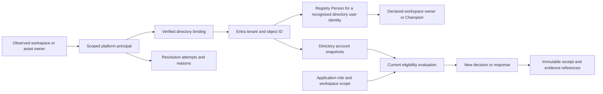

# Platform identity to Power Apps directory resolution

## V1 extract decision — 8 October 2026

The current delivery uses the [Excel extract and platform handoff](../../platform-data-collection/v1-extract/README.md). It uses exact normalized email matching after manual SQL staging. Retain native IDs separately. All unresolved identities and relationships go to Platform Manager. Alteryx collection uses MongoDB backend tables and read-only queries only.

Existing RunKey, ObservedAt, and manifest behavior remain unchanged. Classification, PRL, and risk repairs are deferred for V1. Existing product requirements remain. The plans below describe future implementation where they exceed this extract workflow. No live directory integration or application workflow repair has been implemented by this delivery.

**Proposed design accompanying the [application repair plan](github-review-and-repair-plan.md).** The implementation is not present in the current prototype.

## Identity model

A platform's user ID and a Microsoft Entra object ID are different identifiers unless the source contract explicitly proves otherwise. Keep both. Preserve the registry Person ID as a separate internal key.

The graph does not imply that technical ownership creates business accountability. A person can have several platform accounts. Each account retains its own scoped key and mapping history.

## What Microsoft interfaces establish

Office 365 Users **Get user profile (V2)** accepts a user principal name (UPN) or directory object ID. Request a small explicit field set. Tenant policy, guest restrictions, and Conditional Access can prevent a lookup. Search results are candidates, not authoritative identity bindings. [Office 365 Users connector](https://learn.microsoft.com/en-us/connectors/office365users/)

In Power Apps, `User().EntraObjectId` identifies the current user. `User().Email` returns the UPN, which need not equal the mailbox address. Treat the client value as UI context; validate the actual caller in the trusted command service. [Power Fx User function](https://learn.microsoft.com/en-us/power-platform/power-fx/reference/function-user)

Store `id`, `userPrincipalName`, `mail`, `accountEnabled`, and `userType` separately. The account flag and Member/Guest classification have different meanings. An enabled account is not evidence of application authority or current employment. [Graph user resource](https://learn.microsoft.com/en-us/graph/api/resources/user?view=graph-rest-1.0), [B2B user properties](https://learn.microsoft.com/en-us/entra/external-id/user-properties)

Service principals are distinct directory objects. They can represent applications or managed identities. Do not route them through a human owner/Champion picker. A user account used for automation also needs an approved identity classification; its object type alone does not establish that it represents a person. [Service principal resource](https://learn.microsoft.com/en-us/graph/api/resources/serviceprincipal?view=graph-rest-1.0)

## Resolution rules

1. Read the source instance, native scope, principal kind, identifier namespace, and native ID.
2. Reuse a verified binding when its source identity and directory tenant still agree.
3. Otherwise, try a documented Entra object ID or verified UPN in the correct tenant.
4. If only a login, email, or display name exists, collect candidates and validate an explicit crosswalk. Do not bind by display name or the first search result.
5. Record the attempt outcome and the separate account evidence. Preserve unmatched source principals.

Graph supports direct lookup by object ID or UPN. A missing object returns 404. This describes the lookup result in that tenant; it does not establish why the object is absent. [Get user](https://learn.microsoft.com/en-us/graph/api/user-get?view=graph-rest-1.0)

An existing verified binding survives a temporary lookup failure. Keep its previous successful observation and original timestamp. Do not present that historical observation as newly verified. A newly created account that reuses an old email address must not acquire the former account's approvals or ownership automatically.

## Separate state dimensions

These are proposed registry codes, not a replacement for vendor source values.

| Dimension | Values | Purpose |
|---|---|---|
| `ResolutionStatusCode` | NotAttempted, Resolved, NotFound, Ambiguous, LookupFailed, NotApplicable | Outcome of a lookup or mapping attempt. |
| `DirectoryAccountStateCode` | Enabled, Disabled, Deleted, Unknown, NotApplicable | Last positively observed directory state, with its evidence time. |
| `PrincipalTypeCode` | User, Group, ServicePrincipal, Unknown | Source/directory object category. |
| `DirectoryUserTypeCode` | Member, Guest, null | Preserve the directory's user classification. |
| `EvidenceStatusCode` | Current, Stale, Unavailable | Whether the required evidence is usable under the configured rule. |
| `EligibilityResultCode` | Eligible, Ineligible, UnableToVerify | Context-specific conclusion for an owner, Champion, responder, or approver. |

Use one shared evaluator. A resolved, enabled account can still be ineligible for a specific role. A known person with unresolved evidence can remain recorded in a request without receiving authority to approve it.

| Evidence or outcome | Record | Application treatment |
|---|---|---|
| Successful exact match; accountEnabled true | Resolved + Enabled | Check evidence age, human classification where required, assigned role, and record scope. |
| Successful exact match; accountEnabled false | Resolved + Disabled | Route current accountability for replacement; preserve historical actions. |
| Successful match; accountEnabled omitted | Resolved + Unknown | Identity is known; account eligibility is not established. |
| 404 for a valid lookup | NotFound | Keep native identity. Do not classify as Disabled or Deleted. |
| Multiple plausible matches | Ambiguous | Request identity mapping review; never choose the first match. |
| 401 or 403 | LookupFailed with authentication/access reason | Address integration access; do not make an inactivity finding. |
| 429, timeout, or transient server failure | LookupFailed with retry reason | Retry safely and preserve prior verified evidence without refreshing its age. |
| Positive deleted-item record or directory deletion event | Deleted account evidence | Preserve mapping/history; create present-accountability work as applicable. |
| Directory result is a group or service principal | Route by object type | Human accountability remains unassigned until a suitable person is selected. |

HTTP failures describe the request result, not employment or account status. Honor `Retry-After` for throttling. [Graph error semantics](https://learn.microsoft.com/en-us/graph/errors), [throttling guidance](https://learn.microsoft.com/en-us/graph/throttling)

Deletion requires positive evidence, such as a deleted-directory-item response or a deletion marker from a verified directory change feed. An absent deleted-item result is not proof of an enabled account. Preserve restoration and permanent-deletion events distinctly in source evidence. [Deleted item lookup](https://learn.microsoft.com/en-us/graph/api/directory-deleteditems-get?view=graph-rest-1.0), [user delta walkthrough](https://learn.microsoft.com/en-us/graph/delta-query-users)

## Minimum proposed data changes

Reuse `Person`, `Principal`, `DirectoryGroup`, and approval structures. Add the missing evidence/history structures. This is a migration plan, not executed SQL. All technical timestamps use UTC `datetime2(3)`; internal SQL IDs use `uniqueidentifier`.

| Table / grain | Fields to add or formalize | Purpose and constraints |
|---|---|---|
| `Principal` — one scoped source identity | `NativeScopeKey nvarchar(200)`, `IdentifierNamespace nvarchar(80)`, existing `NativePrincipalID nvarchar(200)`, `PrincipalTypeCode nvarchar(30)` | Unique source key: platform instance + native scope + namespace + native ID. Preserve unresolved principals. Namespace examples must distinguish repository, REST, and Entra identifiers. |
| `Person` — one recognized corporate user identity | Existing tenant/object ID unique key; add `UserPrincipalName nvarchar(320) NULL`, `Mail nvarchar(320) NULL`, `DirectoryUserTypeCode nvarchar(20) NULL`, `IdentityUseCode nvarchar(30)` | Keep mutable labels separate from immutable identity. IdentityUseCode distinguishes Human, Automation, and Unknown using approved evidence. Do not infer employment from these columns. Define migration from existing Email explicitly. |
| `PrincipalDirectoryBinding` — one verified mapping interval | `BindingID uniqueidentifier`, `PrincipalID uniqueidentifier`, `DirectoryTenantKey nvarchar(100)`, `DirectoryObjectID nvarchar(150)`, `DirectoryObjectTypeCode nvarchar(30)`, `MatchMethodCode nvarchar(40)`, `VerifiedAt datetime2(3)`, `EvidenceReference nvarchar(1000)`, `VerifiedByPersonID uniqueidentifier NULL`, `ResolverVersion nvarchar(50)`, `ValidFrom datetime2(3)`, `ValidTo datetime2(3) NULL` | At most one active binding per source principal; many principals can map to one directory user. A changed binding requires a new interval. A transient failure does not close the binding. |
| `DirectorySource` — one configured directory tenant | `DirectorySourceID uniqueidentifier`, `DirectoryTenantKey nvarchar(100)`, `EnvironmentCode nvarchar(30)`, `IsEnabled bit` | Establish tenant scope independent of analytics platforms. Store credential references in managed configuration, not in these tables. |
| `DirectoryRun` — one directory collection/checkpoint | `DirectoryRunID uniqueidentifier`, `DirectorySourceID uniqueidentifier`, `ExternalRunKey nvarchar(200)`, `CollectorVersion nvarchar(50)`, `StartedAt datetime2(3)`, `CompletedAt datetime2(3) NULL`, `RunStatusCode nvarchar(30)`, `CoverageStatusCode nvarchar(30)`, `ScopeDescription nvarchar(1000)` | Directory evidence can support several platforms. Migrate directory references currently pointing to platform ExtractRun. Keep scoped completeness and safe checkpoint references. |
| `DirectoryIdentitySnapshot` — one directory run × tenant/object | `SnapshotID uniqueidentifier`, `DirectoryRunID uniqueidentifier`, tenant/object keys, `DirectoryObjectTypeCode nvarchar(30)`, `AccountEnabled bit NULL`, `DirectoryAccountStateCode nvarchar(30)`, `DirectoryUserTypeCode nvarchar(20) NULL`, `ObservedAt datetime2(3)`, `EvidenceReference nvarchar(1000)` | Append successful observations and positive lifecycle events. Unique run + tenant + object. Group account state can be NotApplicable. Evaluation and approval evidence reference the exact snapshot. |
| `IdentityResolutionAttempt` — one principal, person, or unbound directory-target attempt | `AttemptID uniqueidentifier`, `TargetKindCode nvarchar(20)`, `PrincipalID uniqueidentifier NULL`, `PersonID uniqueidentifier NULL`, `LookupTenantKey nvarchar(100) NULL`, `LookupIdentifierNamespace nvarchar(80) NULL`, `LookupIdentifier nvarchar(320) NULL`, `DirectorySourceID uniqueidentifier NULL`, `AttemptedAt datetime2(3)`, `ResolutionStatusCode nvarchar(30)`, `FailureReasonCode nvarchar(50) NULL`, `CandidateCount int NULL`, `BindingID uniqueidentifier NULL`, `SnapshotID uniqueidentifier NULL`, `RetryAfterAt datetime2(3) NULL` | Exactly one target: Principal requires only PrincipalID; Person requires only PersonID; Unbound requires neither ID and an explicit tenant/namespace/key. This supports app users without a platform account. Candidate count is null when not established. Keep safe diagnostics, not tokens or whole responses. |
| Approval receipt / decision context | Add snapshot reference, binding reference where relevant, `RoleScopeReference`, `EligibilityPolicyVersion`, and authenticated recorder identity alongside existing actor/time/context | Preserve what authorized the decision at the time. Subsequent directory changes do not rewrite history. Record explicit revocation separately. |

Make existing `Principal.PersonID` and `Principal.DirectoryGroupID` derived current-binding projections, not separately writable mappings. Derive its displayed resolution status from the relevant latest attempt. Migrate and validate existing links into binding history before switching reads. Resolve matching Person or DirectoryGroup records through the binding's tenant/object key.

Expose LastAttemptAt and LastVerifiedAt through views over attempts and snapshots. A failed attempt must not update LastVerifiedAt. Keep the existing six-month history policy and active-evidence exceptions. Retain the identity index needed for future refreshes.

### Platform delivery additions

Add `principals.csv` at one scoped platform-principal per run. Include the existing common run/platform columns plus:

| Column | Staging type | Meaning |
|---|---|---|
| `NativePrincipalID` | text(200) | Exact platform identifier. |
| `IdentifierNamespace` | text(80) | Explicit source ID family, such as TableauRepositoryUserID. |
| `PrincipalTypeCode` | text(30) | User, Group, ServicePrincipal, or Unknown. |
| `DisplayName` | text(200), nullable | Source label; never a matching key. |
| `SourceLogin` | text(320), nullable | Original source login. Its syntax does not prove it is a UPN. |
| `SourceUPN` | text(320), nullable | Source-provided UPN when its meaning is verified. |
| `SourceMail` | text(320), nullable | Source email evidence, separate from UPN. |
| `DirectoryTenantKey` | text(100), nullable | Directory tenant only when supplied or verified. |
| `DirectoryObjectID` | text(150), nullable | Entra ID only when the source establishes that namespace. |
| `IdentityEvidenceCode` | text(40) | NativeOnly, SourceAsserted, or VerifiedCrosswalk. Define provenance for each adapter. |

Add principal-reference namespaces to owner/creator/modifier fields, or use a separate `object_principals.csv` relationship file with object key, role, and complete principal key. The proposed implementation should use the relationship file to keep role references uniform across platforms. Include its dataset coverage in the manifest. Technical roles never populate business-owner declarations automatically.

For Tableau, collect the installed repository/API user mapping before resolving integer owner references. For Power BI, add a dedicated, scoped principal collector and adapter; simply changing `getArtifactUsers` is not a complete implementation. For Alteryx, verify its installed user/API schema and identifier namespaces before writing a field-specific query.

## Power Apps and integration responsibilities

| Component | Responsibility |
|---|---|
| Power Apps people picker | Search users, present identity candidates, and store the selected tenant/object ID. Display resolution, account state, and checked-as-of details. |
| Office 365 Users connector | Perform permitted interactive profile lookup. Request only needed fields. Show specific failures rather than changing Person to Inactive. |
| Trusted directory integration | Collect account/lifecycle evidence, follow paging, handle retry, and persist snapshots/checkpoints in SQL Server. |
| Registry command service or trusted flow | Validate authenticated caller, application role, workspace scope, evidence freshness, transition, and record revision before committing a decision. Do not trust an actor ID supplied as an editable client parameter. |
| Registry views | Resolve technical users to current known people, preserve historical labels, compute coverage consistently, and expose unresolved work. |

Graph user delta collection supports initial and incremental synchronization. Follow every next link before accepting the final delta checkpoint. Treat omitted properties in incremental updates according to the API response semantics; do not erase stored values merely because a property was omitted. [User delta API](https://learn.microsoft.com/en-us/graph/api/user-delta?view=graph-rest-1.0)

Use an approved Graph-capable integration for delta and deleted-item routes. The Office 365 Users connector's HTTP action has limited supported routes; do not assume it provides an arbitrary directory API. Validate read permissions and selected-property visibility in the actual tenant. This plan does not request account modification privileges. [Office 365 Users connector](https://learn.microsoft.com/en-us/connectors/office365users/)

For bulk views, read cached, traceable directory evidence from SQL Server. Avoid a connector call for every gallery row. Define the freshness interval as configuration; the earlier operating proposals are not automatically approved by this review.

## Cohesive application behavior

- Keep five main sections. Put identity-resolution work under My work and detailed source diagnostics under Administration.
- Show a compact identity badge beside owners and Champions. Expand to platform ID, directory identity, status, reason, and observation time.
- Preserve existing unresolved owner/Champion request behavior without inventing an extra approval gate. Unknown identities remain explicitly unresolved.
- Require a verified eligible actor for an actual approval or response command. Preserve drafts during an integration outage.
- Show Missing assignment separately from Account disabled, Account deleted, and Unable to verify.
- Freeze reviewed business context and decision evidence. A later disabled account creates current accountability work rather than changing who performed historical actions.

## Acceptance scenarios

| Scenario | Required result |
|---|---|
| Same display name, different native IDs | Remain separate principals. |
| Same native integer, different Tableau sites | Remain separate source identities. |
| Numeric platform ID passed as a directory ID | Reject the namespace mismatch; keep unresolved source evidence. |
| Renamed UPN, unchanged Entra object ID | Preserve the Person and binding. |
| Recreated account with reused email | Require a new directory identity and explicit reassignment. |
| 403 or timeout after a prior enabled result | Record failed attempt; retain prior result with original age; no inactive finding. |
| NotFound from the wrong tenant or stale UPN | Remain unresolved until the binding is verified. |
| Disabled user still returns a profile | Record Resolved + Disabled. |
| Deleted account has positive deletion evidence | Preserve the historical Person and references; route current accountability. |
| Mixed disabled and unresolved Champions | Unable to verify full active coverage; do not conclude every Champion is inactive. |
| Directory run fails midway | Keep prior complete checkpoint; no absence-based deletions. |
| Approver becomes disabled after a completed decision | Decision remains historical fact; new approvals require current eligibility. |
| Enabled guest or automation identity | Apply explicit role/human eligibility policy; do not infer employee status. |
| Another user opens an annual-response URL | Command rejects save/submit unless that actor is authorized for the packet. |

The next implementation should add these cases to the shared domain tests and to the connector/service integration tests. Live tenant validation remains necessary before operational use.
