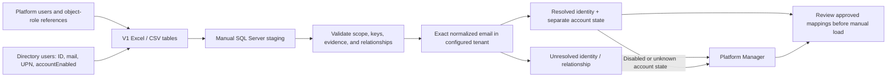

> **V1.1 update, 9 October 2026:** [Current baseline](v1.1-prototype-baseline.md), [operating review and repair status](v1.1-product-operating-review.md), [simplified foundation](v1.1-model-simplification.md), and [verification](v1.1-verification.md) take precedence where this earlier document differs. The frozen V1 release remains unchanged in its Git tag.

# Platform identity and directory matching

**V1 prototype:** `1.0.0-prototype.1` · 8 October 2026 · intended tag `v1.0.0-prototype.1`.

The [baseline](v1-prototype-baseline.md) and [V1 handoff](../../platform-data-collection/v1-extract/README.md) govern this release. V1 uses an empty Excel template and manual SQL Server staging. It does not add an Office 365 connector, live Graph resolver, importer, or app eligibility service.

The current workbook has 15 sheets: three guides, three platform output reference tabs, and nine import tables with 117 columns. Its [contract](../../platform-data-collection/v1-extract/workbook-contract.json) defines the exact headers and types. The 53-table / 602-column target registry and the future identity-history proposal below have separate purposes.

## V1 identity rules

A platform user ID and an Entra object ID are different identifiers unless the source proves the namespace. Retain both and preserve any registry Person ID separately. Email helps match evidence; it does not replace a durable ID.

1. Preserve the platform instance, native scope, ID namespace, native ID, principal type, and original source email.
2. Validate the platform and directory delivery scope, completeness, IDs, observation times, duplicates, and object references.
3. Match exact `lower(trim(SourceEmail))` to `lower(trim(Mail))` in the configured directory tenant.
4. Accept one distinct directory user only; keep identity resolution separate from AccountEnabled and role eligibility.
5. Send every unresolved case to Platform Manager before accepting a mapping or relationship.

Do not match by display name, inferred email, login, or the first search result. Do not strip plus suffixes or rewrite domains. UPN is not a mail fallback. A source-provided Graph ID is retained and checked for conflict; it does not bypass the V1 email rule.

The SQL query flags duplicate directory evidence. Remove only verified identical duplicate rows before rerunning. Never collapse conflicting mail or account-state evidence. Two distinct directory IDs sharing a normalized email are ambiguous.

Preserve prior bindings when reviewing a new delivery. A reused email that points to another directory user requires Platform Manager review before any replacement. The V1 query does not implement binding-history migration or automatically merge people.

## Current import tables and source evidence

The six existing inventory tables remain Workspaces, Assets, Workspace_Assets, Connections, Asset_Connections, and Asset_Dependencies. The three identity tables are:

| Table | Grain and key evidence | V1 purpose |
|---|---|---|
| Platform_Users | One scoped platform principal per delivery. Includes NativePrincipalID, IdentifierNamespace, PrincipalTypeCode, SourceEmail, SourceDirectoryObjectID, and DirectoryTenantKey. | Preserve source identities even when matching fails. Types are User, Group, App, or Unknown. |
| Directory_Users | One directory tenant and user ID per directory delivery. Includes DirectoryObjectID, Mail, UserPrincipalName, AccountEnabled, and ObservedAt. | Provide exported directory evidence. This table keeps its own RunKey and observation time. |
| Object_Users | One observed object-to-principal role reference. Includes object key, PrincipalRoleCode, raw source reference and namespace, resolved native principal key when known, and source reference status. | Keep technical ownership, modification, and access evidence separate from declared business accountability. |

Use the workbook and contract for every header and SQL type. The corresponding CSV files are `platform_users.csv`, `directory_users.csv`, and `object_users.csv`. Earlier proposals named `principals.csv` and `object_principals.csv`; those are not V1 delivery files.

| Platform | Current collection treatment |
|---|---|
| Tableau | Repository SQL joins site-scoped owner references through users and system users. Retain repository integers and LUIDs in their documented namespaces. Follow the [preflight and identity SQL](../../platform-data-collection/v1-extract/tableau-identity-extract.md). |
| Power BI/Fabric | Retain emailAddress, identifier, graphId, and principalType as separate evidence. Report createdBy and model configuredBy describe technical ownership, not declared business ownership. Artifact and workspace user lists describe access. Follow the [identity pseudocode](../../platform-data-collection/v1-extract/powerbi-identity-extract.md); the existing inventory adapter does not generate these identity tables automatically. |
| Alteryx | Use [MongoDB backend queries only](../../platform-data-collection/v1-extract/alteryx-backend-extract.md). Verify the installed 2025.2 schema. Original authorship is not proof of current ownership. Keep unverified owner joins unresolved and route Platform Manager. |

Keep existing RunKey, ObservedAt, and manifest behavior. V1 adds no RunDate and does not redesign extraction runs. Unknown or uncollected datasets do not establish an empty estate or absence of access.

## SQL results and review routing

The [staging script](../../platform-data-collection/v1-extract/sqlserver-staging.sql) creates nine tables. The [validation query](../../platform-data-collection/v1-extract/sqlserver-validate.sql) checks delivery quality. The [email query](../../platform-data-collection/v1-extract/sqlserver-email-match.sql) returns identity and relationship review rows; it does not update registry records.

| Evidence | ResolutionStatus | DirectoryAccountState | Required action |
|---|---|---|---|
| Unique exact match; AccountEnabled true | Resolved | Enabled | Retain the matched directory ID. Role and scope checks remain separate. |
| Unique exact match; AccountEnabled false | Resolved | Disabled | Keep identity and history. Platform Manager reviews current accountability. |
| Unique exact match; AccountEnabled missing | Resolved | Unknown | Platform Manager reviews account eligibility. Do not label the account disabled. |
| Missing or invalid email, no match, ambiguous match, duplicate/conflicting evidence, or missing required scope | Unresolved | Unknown | Preserve raw evidence and route Platform Manager. |
| Incomplete or failed directory collection | Unresolved | Unknown | Confirm coverage or collect again. Do not infer inactivity or deletion. |
| Group, App, or Unknown principal type | Unresolved for human matching | Unknown | Preserve the native principal. Route attempted human-accountability mapping to Platform Manager. |
| Missing principal or object reference, incompatible namespace, or missing inventory object | Unresolved relationship | Unknown | Preserve Object_Users evidence and route Platform Manager. |

“Resolved-disabled” is shorthand for Resolved plus Disabled, not a replacement SQL status code. “Unable to Verify” describes uncertain eligibility or control evidence. It must not turn a known disabled match into “not found,” or an unresolved match into “inactive.”

V1 does not determine employment, deletion, guest policy, automation use, or approval authority from email alone. An enabled user object may still be unsuitable for a human owner or Champion role. Every uncertain case remains reviewable.

## Microsoft identity semantics retained

Microsoft Graph exposes `id`, `mail`, `userPrincipalName`, and `accountEnabled` as separate user properties. AccountEnabled is account evidence, not employment or application authority. [Graph user resource](https://learn.microsoft.com/en-us/graph/api/resources/user?view=graph-rest-1.0)

Power Apps `User().Email` returns UPN, which can differ from the mailbox address. It must not be substituted for Graph Mail in V1 matching. `User().EntraObjectId` is separate identity context. [Power Fx User function](https://learn.microsoft.com/en-us/power-platform/power-fx/reference/function-user)

Office 365 Users Get user profile (V2) accepts a UPN or directory object ID. A platform ID is not a valid directory ID merely because both fields are called “ID.” Access policy can prevent lookup. [Office 365 Users connector](https://learn.microsoft.com/en-us/connectors/office365users/)

Graph can return 404, access errors, or throttling. Those responses do not prove inactivity or deletion. A future integration must retain failed-attempt evidence separately from a successful account observation. [Get user](https://learn.microsoft.com/en-us/graph/api/user-get?view=graph-rest-1.0), [Graph errors](https://learn.microsoft.com/en-us/graph/errors), [throttling](https://learn.microsoft.com/en-us/graph/throttling)

## Future identity-history proposal — not part of V1 staging

The following proposal is retained from the application review. It is not an executed migration and does not modify the frozen 53-table target model. Its additional history structures require a future schema revision. The V1 email-only rule remains authoritative for the current handoff; direct-ID or UPN resolution is not added as a fallback.
Reuse `Person`, `Principal`, `DirectoryGroup`, and approval structures. Add the missing evidence/history structures. This is a migration plan, not executed SQL. All technical timestamps use UTC `datetime2(3)`; internal SQL IDs use `uniqueidentifier`.

| Table / grain | Fields to add or formalize | Purpose and constraints |
|---|---|---|
| `Principal` — one scoped source identity | `NativeScopeKey nvarchar(200)`, `IdentifierNamespace nvarchar(80)`, existing `NativePrincipalID nvarchar(200)`, `PrincipalTypeCode nvarchar(30)` | Unique source key: platform instance + native scope + namespace + native ID. Preserve unresolved principals. Namespace examples must distinguish repository, REST, and Entra identifiers. |
| `Person` — one recognized corporate user identity | Existing tenant/object ID unique key; add `UserPrincipalName nvarchar(320) NULL`, `Mail nvarchar(320) NULL`, `DirectoryUserTypeCode nvarchar(20) NULL`, `IdentityUseCode nvarchar(30)` | Keep mutable labels separate from immutable identity. IdentityUseCode distinguishes Human, Automation, and Unknown using approved evidence. Do not infer employment from these columns. Define migration from existing Email explicitly. |
| `PrincipalDirectoryBinding` — one verified mapping interval | `BindingID uniqueidentifier`, `PrincipalID uniqueidentifier`, `DirectoryTenantKey nvarchar(100)`, `DirectoryObjectID nvarchar(150)`, `DirectoryObjectTypeCode nvarchar(30)`, `MatchMethodCode nvarchar(40)`, `VerifiedAt datetime2(3)`, `EvidenceReference nvarchar(1000)`, `VerifiedByPersonID uniqueidentifier NULL`, `ResolverVersion nvarchar(50)`, `ValidFrom datetime2(3)`, `ValidTo datetime2(3) NULL` | At most one active binding per source principal; many principals can map to one directory user. A changed binding requires a new interval. A transient failure does not close the binding. |
| `DirectorySource` — one configured directory tenant | `DirectorySourceID uniqueidentifier`, `DirectoryTenantKey nvarchar(100)`, `EnvironmentCode nvarchar(30)`, `IsEnabled bit` | Establish tenant scope independent of analytics platforms. Store credential references in managed configuration, not in these tables. |
| `DirectoryRun` — one directory collection/checkpoint | `DirectoryRunID uniqueidentifier`, `DirectorySourceID uniqueidentifier`, `ExternalRunKey nvarchar(200)`, `CollectorVersion nvarchar(50)`, `StartedAt datetime2(3)`, `CompletedAt datetime2(3) NULL`, `RunStatusCode nvarchar(30)`, `CoverageStatusCode nvarchar(30)`, `ScopeDescription nvarchar(1000)` | Directory evidence can support several platforms. Migrate directory references currently pointing to platform ExtractRun. Keep scoped completeness and safe checkpoint references. |
| `DirectoryIdentitySnapshot` — one directory run × tenant/object | `SnapshotID uniqueidentifier`, `DirectoryRunID uniqueidentifier`, tenant/object keys, `DirectoryObjectTypeCode nvarchar(30)`, `AccountEnabled bit NULL`, `DirectoryAccountStateCode nvarchar(30)`, `DirectoryUserTypeCode nvarchar(20) NULL`, `ObservedAt datetime2(3)`, `EvidenceReference nvarchar(1000)` | Append successful observations and positive lifecycle events. Unique run + tenant + object. Group account state can be NotApplicable. Evaluation and approval evidence reference the exact snapshot. |
| `IdentityResolutionAttempt` — one principal, person, or unbound directory-target attempt | `AttemptID uniqueidentifier`, `TargetKindCode nvarchar(20)`, `PrincipalID uniqueidentifier NULL`, `PersonID uniqueidentifier NULL`, `LookupTenantKey nvarchar(100) NULL`, `LookupIdentifierNamespace nvarchar(80) NULL`, `LookupIdentifier nvarchar(320) NULL`, `DirectorySourceID uniqueidentifier NULL`, `AttemptedAt datetime2(3)`, `ResolutionStatusCode nvarchar(30)`, `FailureReasonCode nvarchar(50) NULL`, `CandidateCount int NULL`, `BindingID uniqueidentifier NULL`, `SnapshotID uniqueidentifier NULL`, `RetryAfterAt datetime2(3) NULL` | Exactly one target: Principal requires only PrincipalID; Person requires only PersonID; Unbound requires neither ID and an explicit tenant/namespace/key. This supports app users without a platform account. Candidate count is null when not established. Keep safe diagnostics, not tokens or whole responses. |
| Approval receipt / decision context | Add snapshot reference, binding reference where relevant, `RoleScopeReference`, `EligibilityPolicyVersion`, and authenticated recorder identity alongside existing actor/time/context | Preserve what authorized the decision at the time. Subsequent directory changes do not rewrite history. Record explicit revocation separately. |

Make existing `Principal.PersonID` and `Principal.DirectoryGroupID` derived current-binding projections, not separately writable mappings. Derive its displayed resolution status from the relevant latest attempt. Migrate and validate existing links into binding history before switching reads. Resolve matching Person or DirectoryGroup records through the binding's tenant/object key.

Expose LastAttemptAt and LastVerifiedAt through views over attempts and snapshots. A failed attempt must not update LastVerifiedAt. Keep the existing six-month history policy and active-evidence exceptions. Retain the identity index needed for future refreshes.

## Future Power Apps responsibilities

The operational application will need a trusted service that validates the caller, role, workspace scope, evidence age, allowed transition, and record revision. Editable client actor IDs cannot authorize decisions. Current-account eligibility is checked for new actions; historical receipts retain decision-time evidence.

| Component | Future responsibility |
|---|---|
| People picker | Present candidates and save verified tenant/object identity. Show resolution, account state, and observation time separately. |
| Office 365 Users connector | Perform permitted interactive profile lookup and show lookup failures without changing a user to Inactive. |
| Directory integration | Collect scoped account evidence with paging, retry, and observation history. No live connector is included in V1. |
| Registry command service | Enforce actor, role, scope, workflow, exact evidence revision, and concurrency. Preserve eligible self-approval. |
| Registry views | Show current evidence and unresolved work without overwriting historical actions or business declarations. |

For future bulk views, read cached directory evidence from SQL Server instead of calling a connector for every row. Freshness schedules remain proposed. A later Graph delta integration must preserve paging and checkpoint semantics; that design is not a deployed V1 feature. [User delta API](https://learn.microsoft.com/en-us/graph/api/user-delta?view=graph-rest-1.0)

Service principals and groups are not directory users. A user account used for automation also needs separate evidence before it can serve human accountability. The source workbook preserves User, Group, App, and Unknown without inventing a person. [Service principal resource](https://learn.microsoft.com/en-us/graph/api/resources/serviceprincipal?view=graph-rest-1.0)

## Acceptance boundaries

| V1 scenario | Required handoff result |
|---|---|
| Same name, different native keys | Preserve separate principals. |
| Same integer, different platform/site scope | Preserve separate source identities. |
| UPN equals source email but Mail differs or is missing | No fallback match. Send to Platform Manager. |
| One mail match with AccountEnabled false | Resolved + Disabled; retain the binding and route current-accountability review. |
| Two directory user IDs share an email | Unresolved; never choose the first result. |
| Repeated identical directory rows | Flag for review; rerun only after verifying and removing identical duplicates. |
| Source Graph ID conflicts with the email match | Unresolved; retain both IDs and route Platform Manager. |
| Current Alteryx owner is not established by verified backend evidence | Preserve unknown current ownership; original author does not fill the gap. |
| Platform and directory extracts run at different times | Keep each RunKey and ObservedAt unchanged. |
| Raw object reference has no accepted principal or inventory object | Retain the relationship as unresolved. |

The [verification record](verification.md) identifies offline checks actually performed. No live platform, directory, SQL Server, or Power Apps execution is claimed.

Historical approval preservation, actor-bound responses, shared coverage evaluation, and safe assessment projection remain app repairs in the [backlog](github-review-and-repair-plan.md). Classification, PRL, and risk repairs are deferred for this prototype. Their requirements remain valid.
