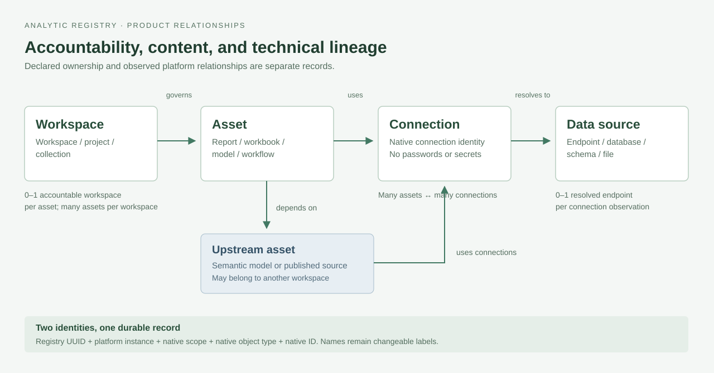
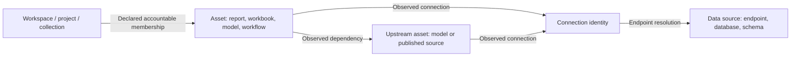
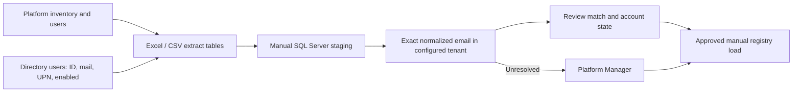
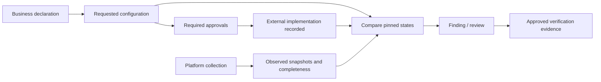

# Analytic Registry — business and product definition

**V1 prototype:** `1.0.0-prototype.1` · 8 October 2026 · intended tag `v1.0.0-prototype.1`.

The [baseline](v1-prototype-baseline.md) defines the frozen release. This document separates product requirements from implemented prototype behavior and future production design.

## Product purpose

Analytic Registry connects business accountability with technical evidence for Power BI/Fabric, Tableau, and Alteryx. It answers three questions:

1. What does the business intend to use and maintain?
2. What did administrators implement, and what does the platform report?
3. Who must act on a difference, missing evidence, or overdue review?

A workspace anchors business accountability. An asset is the content assessment unit. Connections and source endpoints have separate identities. A request or approval does not prove that a platform resource exists.

The React app simulates role decisions and saves mock records in browser storage. The separate V1 workbook supports manual collection and SQL staging. Neither connects the app to a live platform or directory.

## People and responsibility

| Participant | Responsibility |
|---|---|
| Business user | Requests, business metadata, directory group creation, and group membership maintenance. |
| Business Owner / Workspace Owner | One accountable person field for workspace purpose and declarations. |
| Champion | Coordinates reviews and annual assurance; Champion status adds no platform privilege. |
| Developer / asset reviewer | Records release context, readiness inputs, classifications, and review outcome. |
| Application Owner or Platform Owner | Approves Custom setup and annual attestations. |
| Platform administrator | Records external implementation, investigates differences, and verifies delivery. |
| Platform Manager, Platform Team, or Platform Owner | Approves the exact evidence used to close a review. |
| Platform Manager | Receives every unresolved V1 identity or relationship and reviews disabled-account accountability. |
| Platform and directory extraction teams | Supply scoped source IDs and evidence; preserve missing or unknown values. |

A technical owner, creator, modifier, or access-list member does not automatically become the business owner. An enabled directory account does not establish approval authority. Self-approval is allowed only when the person holds the required role and scope.

## Workspace, asset, and connection relationships

An asset has at most one current accountable workspace. An orphan can have none. Observed physical memberships can include several collections without creating several business owners.

Assets and connections have a many-to-many relationship. A connection can remain unassociated until evidence resolves its asset. One source endpoint can serve several platform connections. Missing lineage remains unresolved.

Power BI reports and semantic models are separate assets. A report can depend on a model in another workspace. Tableau workbooks form the first-pass report inventory; views remain optional child detail. Preserve dependency paths before deriving report-to-connection relationships.

The target model uses `ObservedAssetDependency` for intermediate dependencies and `ObservedAssetConnection` for direct observations. A derived relationship must retain its path and must not be presented as direct source evidence.

## Stable identity and manual refresh

| Identity | Purpose |
|---|---|
| Registry `ObjectID` / subtype UUID | Internal identity, kept separate from source identifiers. |
| Platform instance | Tenant or server boundary. |
| Native scope | Source uniqueness boundary, such as site. It is not a movable workspace when IDs survive moves. |
| Native object type | Distinguishes reports, models, workbooks, connections, and other object types. |
| Native object ID | Exact source identifier retained as text. |
| Display name | Changeable label; never an identity key. |

Match the complete native tuple during refresh. Renames update labels. Moves update membership. Neither should replace the registry ID. A new native ID represents a new identity unless an approved crosswalk proves continuity. Partial extracts cannot establish removal.

V1 teams populate the [15-sheet workbook](resources/platform-data-collection/v1-extract/analytic-registry-v1-extract.xlsx) and follow the [four-step handoff](resources/platform-data-collection/v1-extract/README.md). Nine import tables contain 117 columns. The three platform output tabs describe file layouts; they are not extra import tables.

Match `lower(trim(SourceEmail))` to directory `lower(trim(Mail))` within the configured tenant. Accept one distinct directory user only. Review duplicate or conflicting rows. Preserve native IDs, original emails, and directory IDs separately. UPN is not an email fallback.

A matching disabled user remains resolved-disabled. Missing, failed, ambiguous, or nonhuman-accountability matches go to Platform Manager. A failed lookup does not prove inactivity. Observed technical ownership never overwrites a business declaration.

Alteryx V1 uses MongoDB backend queries only. If the installed schema cannot verify current ownership, preserve it as unknown. Original authorship is not a substitute. Tableau joins and Power BI ownership fields also require the linked source instructions.

Keep the existing `RunKey`, `ObservedAt`, and manifest contract. Directory evidence retains its own run context. V1 adds no RunDate or automated importer.

## Five information layers

These are the target product boundaries. The local mock demonstrates a subset; the full history model is not deployed.

| Layer | Authority | Target records | Update rule |
|---|---|---|---|
| Business declaration | Accountable business user | WorkspaceBusinessVersion, AssetVersion | Preserve prior declarations when recording a new version. |
| Requested setup | Submitted request | WorkspaceRequest, requested ConfigurationVersion, groups, Champions | Keep submitted intent and approval context. |
| Implemented setup | Platform administrator | Implemented ConfigurationVersion, AdministrativeAction | Record external execution separately from the request. |
| Observed reality | Platform and directory evidence | ExtractRun, ExtractDataset, snapshots | Retain source, time, scope, and completeness. |
| Assessment and response | Evaluator and authorized reviewers | RuleEvaluation, Finding, review, approval, attestation | Preserve inputs, decision, and lifecycle. |

## Interface and workflows

Dashboard, Workspaces, Assets, Requests, and My work remain the five main sections. Administration stays in a menu. Annual reviews sit in My work. Business home shows four summary numbers; Administrator view adds estate reporting.

| Workflow | Guided topics | Product completion requirement |
|---|---|---|
| Workspace request | Workspace & people; Data & risk; Setup approach; Groups & access; Review & submit | Valid declarations and distinct group purposes; required approvals before delivery. |
| Asset assessment | Asset context; References; Readiness inputs; Classifications; Review decision | Retained assessment evidence; only an effective approved assessment establishes approved current values. |
| Administrative review | Understand issue; Decision & ownership; Evidence & approval | Eligible approval, valid verification, and explicit closure. |
| Annual review | Review workspace; Confirm details; Response & approval | Assigned Champion response plus Application Owner or Platform Owner approval. |
| External administration | Collect; Assess; Prepare; Execute; Verify | Approved external action followed by verification evidence. |

All processes remain below six steps. Workspace and Asset columns appear when relationships exist. Missing associations remain visible. Completion requirements are not a claim that every prototype edge case passes; known gaps appear below.

### Workspace requests

Create New captures intent before a native workspace exists. Register Existing selects discovered content. Update Existing preserves the implemented baseline while proposing changes.

Require PII Yes/No, EUCT Yes/No, and one highest applicable DMP tier. Tier 1 ranks above Tier 2 and Tier 3. Numeric maximum is not the ranking rule.

Standard has Champion, RW, R, and Data Sources groups. `_DS` creates and maintains workspace data connections through verified native capabilities. Groups inherit workspace accountability. Business users select existing groups or request new names. New names remain prerequisites, not resolved group identities.

Custom requires a reason and explicit alternative access context. Other requires an explanation. Custom approval does not waive control objectives. A missing entitlement baseline prevents a conclusive comparison.

Allow one to ten unique Champions. Block inactive assignments; warn when only one Champion is selected. Unverified request identities remain unresolved without an invented approval gate. Submitted corrections create linked drafts and new approval context.

### Asset assessment

The product requires assessment for the first production release and material changes to sources, credentials, access, processing, or audience. Presentation-only changes are exempt. Release enforcement remains future integration.

Approved PRL must be recorded manually with its approval evidence and retained inputs. No score should be calculated. The current prototype retains legacy illustrative PRL and classification fields. Their alignment, including consistent asset DMP ranking, is deferred for V1.

Previous-release and in-progress assessment guards exist. Backdated assessments for the same release and completed reviews with Changes required can still project current values. These are known defects, not approved production behavior.

### Reviews and annual assurance

The intended rule limits business responses to assigned work and reserves administrative actions for eligible roles. The prototype protects several review fields, but annual actor binding and draft access remain incomplete. Historical approval validity also depends incorrectly on current actor status in a known case.

Annual packets retain business and evidence context. Every response requires an eligible owner-role approval. Approved completion may retain linked follow-up. Completion does not mean every control passed. Evidence closure requires the exact approved evidence and updates only linked findings.

## Reconciliation and risk

| Situation | Required product result |
|---|---|
| Requested G2; implemented G1; observed G1 | Pending Implementation. |
| Usable observed permissions differ from the implemented baseline | Discrepancy. |
| A pending change and unrelated drift coexist | Preserve both results. |
| Required evidence is missing, stale, partial, future-dated, or unsupported | Unable to Verify. |
| Implemented and observed states agree with usable evidence | Aligned. |
| Usable evidence requires human interpretation | Flagged for Review. |
| Control does not apply | Not Applicable. |

The prototype demonstrates these states. A pending Champion change can still hide unrelated drift; that defect remains deferred. Dataset-level evidence and a production rule evaluator are not implemented.

Retain all 11 risk buckets: Orphan, Stale, Access Risk, Compliance Gap, Bypassed Gate, Credential Exposure, Performance Risk, Concentration Risk, Coverage / Bus-Factor, Privilege Sprawl, and Low Adoption.

The target finding lifecycle deduplicates repeated detections and counts affected objects separately. Mock findings do not prove that lifecycle is deployed. Missing credential evidence is not credential exposure. One owner alone is not proof of inadequate backup coverage.

## Power Apps and table design

Use related tables with focused read views. One large editable table would repeat workspace data for each asset, connection, group, and finding. The [53-table / 602-column dictionary](data-model.md) describes the target registry. The nine V1 staging tables receive extracts and do not replace that model.

Future transactional commands must check the authenticated caller, role, scope, workflow state, evidence revision, and concurrency. Production authentication, a live importer, and directory integration remain outside this frozen prototype.

The user confirmed six calendar months of historical metadata. Preserve current records, open-work evidence, active approval dependencies, and native mappings. Cleanup is future implementation. Proposed schedules and service targets remain unapproved where marked in the [decision register](decision-register.md).

The [requirements](requirements.md) and [repair backlog](github-review-and-repair-plan.md) record remaining work. Prototype acceptance does not certify live platform collection, control operation, or production readiness.
