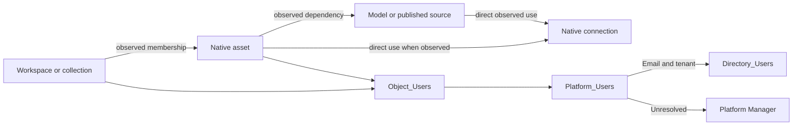

# Analytic Registry — V1 platform data collection

**Prototype release 1.0.0-prototype.1 — 8 October 2026. Intended Git tag: `v1.0.0-prototype.1`.**

[Download Excel workbook](https://github.com/dlpate2525/analytic-registry/raw/refs/tags/v1.0.0-prototype.1/platform-data-collection/v1-extract/analytic-registry-v1-extract.xlsx). Field contract 1.0 remains separate from this prototype release.

Open the [manual SQL handoff](v1-extract/README.md) for collection and staging instructions.

The workbook contains **15 sheets**, including **nine empty import tables with 117 columns in total**. Three platform output tabs contain 28 reference sections showing the exact file layouts: Tableau_Output, PowerBI_Output, and Alteryx_Output. The other three sheets provide instructions, source mappings, and column definitions. These are blank layouts, not extracted data or matching formulas.

This package is the locked V1 prototype baseline. The inventory field contract remains **1.0**; the prototype release number does not change that contract. Platform teams supply source IDs. The user reviews the delivery and loads SQL Server manually. No automated importer, live Power Apps connection, or directory integration is deployed.

## What to send

| File | Workbook import table | Grain |
|---|---|---|
| workspaces.csv | Workspaces | One observed workspace, Tableau project, or Alteryx collection |
| assets.csv | Assets | One native report, workbook, model, published source, or workflow |
| workspace_assets.csv | Workspace_Assets | One physical membership |
| connections.csv | Connections | One native connection and permitted endpoint fields |
| asset_connections.csv | Asset_Connections | One directly observed asset-to-connection link |
| asset_dependencies.csv | Asset_Dependencies | One consumer-to-provider asset relationship |
| platform_users.csv | Platform_Users | One scoped platform principal per extract |
| directory_users.csv | Directory_Users | One directory user per tenant/object ID and directory extract |
| object_users.csv | Object_Users | One technical-owner, creator, modifier, or access reference |
| Existing manifest and coverage evidence | Retained beside the workbook | Extraction scope, times, counts, omissions, and failures |

The output tabs distinguish files actually emitted from pseudocode, supplemental detail, and NotCollected datasets. They are reference tabs, not combined import tables. Tableau's current inventory SQL also writes views_optional.csv; retain it as supplemental evidence outside the nine staging tables.

## Four handoff steps

1. Confirm configured instance, native scope, directory tenant, and collection boundaries.
2. Run the applicable preflight and collector. Populate the matching Excel import tables without changing headers.
3. Load SQL staging manually. Validate the delivery and run the supplied email-match query.
4. Review exceptions with Platform Manager. Apply approved observations and mappings through the existing manual database process.

Keep the existing RunKey, ObservedAt, and manifest semantics. Directory evidence retains its own extract context. Nothing in this release adds RunDate.

## Platform instructions

| Platform | Current implementation |
|---|---|
| Tableau 2026.2 / PostgreSQL | [Preflight](tableau/preflight.sql), [inventory SQL](tableau/export.sql), and [identity SQL handoff](v1-extract/tableau-identity-extract.md). Queries require installed-server validation. |
| Power BI / Fabric | [API collection design](powerbi/collector-pseudocode.md) and implemented [offline inventory adapter](powerbi/normalize-scan.mjs). [Identity/directory extraction](v1-extract/powerbi-identity-extract.md) remains pseudocode. |
| Alteryx 2025.2 / MongoDB | [Backend-only handoff](v1-extract/alteryx-backend-extract.md) and [candidate query](v1-extract/alteryx-backend-extract.mongosh.js). No API collector is part of V1. |
| Shared definitions | [Workbook contract](v1-extract/workbook-contract.json), [inventory dictionary](data-contract.md), [identity rules](identity-and-refresh.md), and [source evidence](sources.md). |

Alteryx can provide five candidate datasets. Connections, asset connections, and dependencies are emitted with headers only and marked NotCollected. Current workflow ownership remains unresolved. Its preflight checks structure; it does not certify every schema-79 interpretation.

## Identity and matching

Match technical objects by platform instance, native scope, native type, and native ID. Registry UUIDs remain separate. Names, workspace movement, or email changes must not replace stable native identity.

For V1 people resolution, compare normalized Platform_Users.SourceEmail with Directory_Users.Mail within the configured tenant. Accept one distinct directory user ID. Do not silently fall back to UPN, login, or display name. Assign every unresolved identity or relationship to Platform Manager.

Tableau owner integers resolve through site users to user LUIDs and email. Power BI report createdById is technical-owner evidence, not original-creator evidence. Alteryx original authors and current technical owners remain separate. Technical evidence never assigns the approved Business Owner / Workspace Owner automatically.

A failed lookup does not mean inactive. A resolved disabled directory user stays resolved-disabled with current accountability sent for review.

## Relationship map



## Boundaries and validation

- Incomplete evidence cannot establish removal, zero usage, or a failed control.
- Business purpose, accountability, Champions, declarations, expected groups, and approvals stay in governed workflows.
- PRL, classification, and risk-correctness repairs remain deferred. The V1 lock does not mean those backlog items are complete.
- Retain six calendar months of historical metadata. Keep current records, active evidence dependencies, and native-ID mappings needed for refreshes.
- The Power BI inventory suite has **27 passing checks**, including technical-owner versus creator mapping.
- Tableau has dictionary/static checks; Alteryx has one passing MongoDB fixture test. Neither replaces installed-platform validation.
- No live platform, directory, SQL Server, or Power Apps integration was tested or deployed by this package.

## Suggested message to platform managers

> Please provide the first V1 metadata delivery using the Excel import tables and your platform's linked extract. Keep native IDs and source emails unchanged. Include the existing manifest, scope, counts, and coverage. Mark unsupported data NotCollected. Preserve unresolved references and route them to Platform Manager. Validate native IDs across two extracts. The registry load will be manual.

This is a draft message; it has not been sent.

## Maintain this release pack

Use Python 3 for the offline artifact checks. After changing pack files, rebuild the ZIP before rebuilding the app.

```sh
python build-bundle.py
python verify-delivery.py
```

The verifier checks workbook structure, blank import tables, exact headers, dictionary agreement, and every ZIP member against its source. It does not connect to a platform or database.
