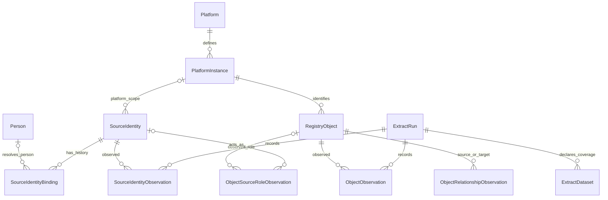

# V1.1 model simplification

**Status:** proposed data foundation, 9 October 2026. This document changes no database, workbook, collector, or runtime schema.

Use one Person record for each corporate directory identity. Keep its platform accounts in SourceIdentity. Give Power Apps simple, typed views over these records. Consolidate tables only when they describe the same row grain and share lifecycle rules.

The recommended foundation has **12 tables**. A conservative complete registry model has **45 tables**, reduced from the existing 53-table design. The foundation is sufficient for inventory, identity evidence, and monthly refresh. It does not replace the records required by live requests, approvals, assessments, and annual reviews.

## 1. What exists today

| Artifact | Verified scope | Important distinction |
|---|---|---|
| [schema.ts](https://github.com/dlpate2525/analytic-registry/blob/main/analytic-registry/src/data/schema.ts) | 53 logical table specifications | A design catalog, not executable database DDL. |
| [Column dictionary](column-dictionary.csv) | 602 column rows plus the header | Documents the logical design; it is not the populated registry. |
| [React runtime types](https://github.com/dlpate2525/analytic-registry/blob/main/analytic-registry/src/types/index.ts) | 18 required collection arrays; optional approvals and an evidence-policy map | A smaller browser model with nested values and prototype shortcuts. |
| [V1 extract contract](resources/platform-data-collection/v1-extract/README.md) | Nine staging datasets and 117 delivery columns | Raw platform and directory evidence, not nine authoritative application entities. |
| V1.1 lean extract proposal | Retain nine datasets; share delivery context and coverage | Publish its exact version and header contract separately. Do not rewrite the frozen V1 workbook in place. |

The current model already has one Person table. Its weaknesses are the identity links and repeated representations, not a need for another user table. `Principal` currently lacks native scope and identifier namespace in its uniqueness rule. `Person.IdentityStatusCode` mixes resolution and account-state concerns. Directory evidence also points to an ExtractRun modeled only for platform collection.

The runtime uses a Person status of Active, Inactive, or Unverified. It does not implement the complete SQL identity contract. Displaying the logical dictionary does not establish that the application enforces its keys or history rules.

## 2. How Kimball informs this decision

Kimball recommends defining exactly what one row represents before choosing its attributes. Apply that discipline to account observations, object observations, relationships, and monthly reporting. Do not join unrelated grains into one editable record. [Kimball: grain](https://www.kimballgroup.com/data-warehouse-business-intelligence-resources/kimball-techniques/dimensional-modeling-techniques/grain/)

Shared definitions and attributes let reports align results across business processes. One Person definition and one Platform vocabulary serve this purpose. This is a design inference for the registry; Kimball's guidance describes analytical dimensions. [Kimball: conformed dimensions](https://www.kimballgroup.com/data-warehouse-business-intelligence-resources/kimball-techniques/dimensional-modeling-techniques/conformed-dimension/)

Durable internal keys preserve identity when source identifiers change or require integration. Source-qualified natural keys remain necessary evidence. Therefore, retain PersonID, SourceIdentityID, and ObjectID independently from emails, names, and platform IDs. A new source ID needs an explicit continuity decision. [Kimball: durable keys](https://www.kimballgroup.com/2012/07/design-tip-147-durable-super-natural-keys/)

Bridge tables represent simultaneous multiple relationships. Effective dates prevent historical associations from changing when current memberships change. Use this principle for account bindings, workspace memberships, Champions, and other role relationships. [Kimball: multivalued dimensions and bridges](https://www.kimballgroup.com/data-warehouse-business-intelligence-resources/kimball-techniques/dimensional-modeling-techniques/multivalued-dimension-bridge-table/)

Use historical versions where the business needs an “as known then” answer. A changed email label does not require a new PersonID; a changed approved owner declaration requires a new business version. A reporting dimension may use a separate version key. [Kimball: Type 2 history](https://www.kimballgroup.com/2008/09/slowly-changing-dimensions-part-2/)

The Power App remains an operational application over related SQL tables. Add a dimensional reporting layer when required. A star schema should not replace command validation, relational constraints, approval receipts, or immutable evidence.

## 3. Twelve-table foundation

This is a revised model, not an executable subset copied from the current dictionary. Existing foreign keys and columns must migrate to the consolidated tables. Keep compatibility views during migration.

| Proposed table | One row represents | Current tables represented |
|---|---|---|
| Platform | One supported analytics platform | Platform |
| PlatformInstance | One configured platform instance and scope definition | PlatformInstance |
| Person | One corporate directory user identity | Person |
| SourceIdentity | One source-scoped user, group, app, or unknown principal | Principal and DirectoryGroup |
| SourceIdentityBinding | One accepted source-identity mapping interval | New; replaces mutable direct Person/group pointers |
| SourceIdentityObservation | One source identity in one extraction run | New; includes both platform and directory observations |
| RegistryObject | One durable workspace, asset, or connection | RegistryObject, Workspace, Asset, Connection |
| ObjectObservation | One registry object in one extraction run | ObservedWorkspace, ObservedAsset, ObservedConnection |
| ObjectRelationshipObservation | One directed, typed object relationship in one run | ObservedWorkspaceAsset, ObservedAssetConnection, ObservedAssetDependency, ObservedWorkspaceConnection |
| ObjectSourceRoleObservation | One observed object-to-source-identity role assignment in one run | ConfiguredAccessSnapshot plus the Object_Users delivery contract |
| ExtractRun | One source collection execution | ExtractRun, extended to distinguish platform and directory scope |
| ExtractDataset | One dataset and declared scope within a run | ExtractDataset |

These twelve tables represent **19 existing table specifications plus two new identity-history tables**. Consolidation removes nine duplicated table structures: three object subtypes, two object snapshots, three relationship snapshots, and one directory-group table. The old ConfiguredAccessSnapshot becomes the broader role-observation table.

Keep `vwWorkspace`, `vwAsset`, and `vwConnection` as typed views. `ObjectKindCode` controls each row's allowed fields and relationships. A source ID cannot move between kinds because a label changed. App forms keep familiar Workspace, Asset, and Connection names.

ObjectObservation uses typed columns. Common fields include name and native lifecycle. Connection-only fields include technology and extract mode. Applicability rules explain conditional blanks. Do not replace these columns with an unrestricted attribute/value table or an opaque JSON business record.

SourceIdentityObservation has the same grain for an analytics account and a directory account: one account observed during one source run. Source kind distinguishes their email and account-state semantics. This avoids a separate PlatformUsers entity for each product and a separate directory-person snapshot table.

Directory source identities use a directory tenant scope; they do not require a fake analytics platform. SourceIdentityBinding can map a verified source group to a canonical directory-group SourceIdentity. That target is mutually exclusive with PersonID. Groups and applications never become Person rows merely because they have an email.

## 4. Identity and relationship columns

The tables below define the changed foundation concepts. All purposes are shorter than 200 words. Unchanged Platform and PlatformInstance attributes retain their existing dictionary definitions. SQL types use `uniqueidentifier`, typed values, and UTC `datetime2(3)` timestamps. Raw extract timestamps retain their explicit source offsets in staging.

### Person

| Column | Type / nullability | Purpose |
|---|---|---|
| PersonID | uniqueidentifier, PK | Stable registry identity for one corporate directory user. |
| DirectoryTenantKey | nvarchar(200), required | Corporate directory boundary. |
| DirectoryObjectID | nvarchar(200), required | Exact directory user ID; unique with tenant. |
| DisplayName | nvarchar(200), nullable | Current verified display label; never an identity key. |
| Mail | nvarchar(320), nullable | Current verified directory Mail projection; never a primary key. |
| CreatedAt | datetime2(3), required | Time the registry first created this identity. |

Person is the current identity projection. SourceIdentityObservation preserves directory evidence and historical values. Role eligibility and account state are separate view fields. Person is unique by `(DirectoryTenantKey, DirectoryObjectID)`. Do not automatically merge different directory user IDs into one person because they share an email or name.

### SourceIdentity

| Column | Type / nullability | Purpose |
|---|---|---|
| SourceIdentityID | uniqueidentifier, PK | Stable identity for one source account or principal. |
| SourceKindCode | nvarchar(20), required | Platform or Directory; controls scope requirements. |
| PlatformInstanceID | uniqueidentifier, nullable FK | Required for a platform principal; null for directory-only identities. |
| DirectoryTenantKey | nvarchar(200), nullable | Required for a directory identity; platform matching tenant remains explicit evidence. |
| NativeScopeKey | nvarchar(200), required | Native uniqueness boundary, such as Tableau site or Entra tenant. |
| IdentifierNamespace | nvarchar(60), required | Meaning of the native ID, such as TableauUserLUID or EntraGroupObjectID. |
| NativePrincipalID | nvarchar(200), required | Unchanged source identifier stored as text. |
| PrincipalTypeCode | nvarchar(30), required | User, Group, App, or Unknown. |
| FirstSeenAt | datetime2(3), required | Earliest accepted observation of this source identity. |
| LastSeenAt | datetime2(3), required | Latest accepted observation; absence never overwrites it with a failed run. |

Use two filtered unique constraints. Platform identity is instance + native scope + namespace + native principal ID. Directory identity is tenant + namespace + native principal ID. Enforce the scope required by SourceKindCode. Do not treat one principal type's ID as another type's ID.

### SourceIdentityBinding

| Column | Type / nullability | Purpose |
|---|---|---|
| BindingID | uniqueidentifier, PK | One accepted mapping interval. |
| SourceIdentityID | uniqueidentifier, required FK | Source account being resolved. |
| PersonID | uniqueidentifier, nullable FK | Accepted corporate person for a human source account. |
| DirectoryGroupIdentityID | uniqueidentifier, nullable FK | Accepted directory-group SourceIdentity for a source group. |
| MatchMethodCode | nvarchar(40), required | ExactEmail or explicitly approved group/crosswalk method. |
| EvidenceRunID | uniqueidentifier, required FK | Source run used for the mapping decision. |
| DirectoryEvidenceRunID | uniqueidentifier, nullable FK | Independent directory run used for the mapping decision. |
| ValidFrom | datetime2(3), required | Start of accepted mapping validity. |
| ValidTo | datetime2(3), nullable | Exclusive end; null means the mapping remains current. |
| AcceptedByPersonID | uniqueidentifier, nullable FK | Person recording a manual mapping decision, when applicable. |
| DecisionReference | nvarchar(1000), required | Traceable rule receipt or manual evidence reference. |

Exactly one target is populated. Person targets require a human user; directory-group targets require verified Group identities. Allow at most one open binding per SourceIdentity. A failed refresh does not end the prior binding. Changed candidate directory IDs require review before replacement.

### SourceIdentityObservation

| Column | Type / nullability | Purpose |
|---|---|---|
| IdentityObservationID | uniqueidentifier, PK | Immutable account observation. |
| ExtractRunID | uniqueidentifier, required FK | Source execution that supplied this row. |
| SourceIdentityID | uniqueidentifier, required FK | Durable account identity. |
| DisplayName | nvarchar(200), nullable | Source account label at observation time. |
| EmailValue | nvarchar(320), nullable | Raw source email or raw directory Mail, identified by EmailFieldCode. |
| EmailFieldCode | nvarchar(30), required | SourceEmail for platform evidence; Mail for directory evidence. |
| MatchingDirectoryTenantKey | nvarchar(200), nullable | Configured directory tenant for platform-user matching. |
| SourceDirectoryObjectID | nvarchar(200), nullable | Directory ID explicitly supplied by a platform; retained for conflict checks. |
| SourceStatus | nvarchar(500), nullable | Raw source status or labeled account flags. |
| AccountEnabled | bit, nullable | Directory user account flag only; null means unknown or not applicable. |
| AccountValueStateCode | nvarchar(30), required | Observed, Unknown, NotCollected, or NotApplicable for AccountEnabled. |
| ObservedAt | datetime2(3), required | Accepted observation time, normalized from the explicit source offset. |

Unique key: `(ExtractRunID, SourceIdentityID)`. SourceKindCode and EmailFieldCode distinguish the two meanings of EmailValue. Read views expose familiar SourceEmail and Mail names. V1.1 need not import SourceLogin or UPN to perform the agreed match. The frozen V1 artifacts still retain their original columns.

### Object and role associations

| Column / table | Type / nullability | Purpose |
|---|---|---|
| ObjectID / RegistryObject | uniqueidentifier, PK | Durable registry workspace, asset, or connection ID. |
| ObjectKindCode / RegistryObject | nvarchar(20), required | Workspace, Asset, or Connection; enforces typed views and constraints. |
| PlatformInstanceID / RegistryObject | uniqueidentifier, required FK | Platform boundary for the object. |
| NativeScopeKey / RegistryObject | nvarchar(200), required | Stable source namespace; not a movable workspace label. |
| NativeObjectType / RegistryObject | nvarchar(50), required | Native object class, such as Project, Workbook, Report, or Dataset. |
| NativeObjectID / RegistryObject | nvarchar(200), nullable | Exact source ID; absent only before approved provisioning or binding. |
| RegistrationStatusCode / RegistryObject | nvarchar(30), required | Discovered, Registered, or the agreed registry lifecycle value. |
| AssetTypeCode / RegistryObject | nvarchar(50), nullable | Asset classification; applicable only when ObjectKindCode is Asset. |
| ObjectRelationshipObservationID | uniqueidentifier, PK | One observed directed edge. |
| ExtractRunID / relationship | uniqueidentifier, required FK | Source execution that supplied this edge. |
| FromObjectID / relationship | uniqueidentifier, required FK | Source end of the typed relationship. |
| ToObjectID / relationship | uniqueidentifier, required FK | Target end of the typed relationship. |
| RelationshipCode / relationship | nvarchar(40), required | PhysicalMembership, UsesConnection, DependsOn, or DirectWorkspaceConnection. |
| NativeRelationshipCode / relationship | nvarchar(60), nullable | Original platform association vocabulary. |
| EvidenceStatusCode / relationship | nvarchar(30), required | Observed or the permitted evidence state; never inferred from a missing row. |
| ObjectRoleObservationID | uniqueidentifier, PK | One observed object/principal role reference. |
| ExtractRunID / role | uniqueidentifier, required FK | Source execution that supplied the role reference. |
| ObjectID / role | uniqueidentifier, nullable FK | Resolved object; null when the raw reference remains unresolved. |
| SourceIdentityID / role | uniqueidentifier, nullable FK | Resolved source account; null when the native reference is unresolved. |
| NativeObjectType / role | nvarchar(50), required | Retained native object namespace, including unresolved references. |
| NativeObjectID / role | nvarchar(200), required | Retained source object ID. |
| SourcePrincipalReference / role | nvarchar(200), nullable | Original source user, group, or application reference. |
| SourceReferenceNamespace / role | nvarchar(60), nullable | Meaning of the original principal reference. |
| PrincipalRoleCode / role | nvarchar(40), required | TechnicalOwner, CreatedBy, ModifiedBy, or Access. |
| NativeRole / role | nvarchar(100), nullable | Source permission value for an Access relationship. |
| ResolutionStatusCode / role | nvarchar(30), required | Resolved or Unresolved, independent of account state. |

RegistryObject retains the unique source tuple `(PlatformInstanceID, NativeScopeKey, NativeObjectType, NativeObjectID)`. ObjectObservation is unique by run and ObjectID. Relationship observations are unique by run, source object, target object, relationship code, and any required native discriminator.

For physical membership, source is workspace and target is asset. For UsesConnection, source is asset and target is connection. For DependsOn, source is consuming asset and target is upstream asset. Subtype constraints reject invalid combinations. Unresolved relationship endpoints remain in staging/review rather than inventing objects.

ObjectSourceRoleObservation is authoritative for observed technical ownership, authorship, modification, and access. Remove their duplicate canonical scalar columns from ObjectObservation. Business ownership remains a workspace declaration. A source role never writes that declaration.

## 5. Applicability, nulls, and values

There are three separate questions: does this field apply, did the collection cover it, and what value was observed? One SQL NULL cannot answer all three.

Publish a versioned field-applicability matrix alongside the lean workbook. Its grain is platform + native object type + field + collector-contract version. Record Applicability, ValueRule, NullMeaning, and MappingReference. This is contract metadata, not another editable Person or asset table.

| State | Meaning | Stored value |
|---|---|---|
| Observed | Applicable fact was returned and validated. | Typed value, including false or zero when those were observed. |
| Unknown | Applicable fact could not be established. | NULL with an explicit reason. |
| NotCollected | The delivery did not collect that dataset or field. | NULL; never infer absence. |
| NotSupported | The selected collector/version cannot supply the applicable fact. | NULL with capability context. |
| NotApplicable | This concept does not apply to this object type. | NULL in operational storage; show Not applicable. |
| Failed | An attempted collection failed. | Preserve prior evidence and record the failed attempt. |

Use typed state columns for critical nullable facts, such as AccountEnabled and extraction mode. Use dataset coverage plus the field matrix for uniform collector omissions. Add per-row exception metadata only when a field can vary within one dataset. Do not put “N/A” into a numeric, date, bit, or foreign-key column.

Kimball recommends descriptive Unknown and Not Applicable values in analytical dimension presentation. Apply these labels in reporting views, while preserving typed operational NULLs and their evidence states. This separation is an engineering adaptation. [Kimball: null attributes](https://www.kimballgroup.com/data-warehouse-business-intelligence-resources/kimball-techniques/dimensional-modeling-techniques/null-dimension-attribute/)

| Field or relationship | Power BI / Fabric | Tableau | Alteryx backend V1.1 treatment |
|---|---|---|---|
| Native asset ID | Required report/model source ID. | Required workbook/published-source LUID. | Required verified workflow/app ID from the backend mapping. |
| Native repository integer | Supplementary diagnostic; not the core identity. | Supplementary join evidence, separate from LUID. | Supplementary backend identifier where different from the agreed native key. |
| TechnicalOwner role | Use supported owner semantics from the source mapping. | Use verified scoped repository owner joins. | Applicable, but unresolved where current ownership cannot be verified. Never substitute original author. |
| CreatedBy role | Populate only documented creator evidence; the report owner field is insufficient. | Populate only verified creator evidence. | Keep documented authorship distinct from current ownership. |
| AccountEnabled | Directory evidence only. Platform role/status is not this flag. | Same rule. | Same rule. |
| Capacity reference | Conditional source fact; supplementary to the lean contract. | NotApplicable to the Power BI capacity concept. | NotApplicable to that same concept. |
| HasExtract | The Tableau extract flag is NotApplicable; do not translate model mode by assumption. | Observed boolean when collected; false differs from unknown. | NotApplicable to this Tableau-specific flag. Connection inventory itself remains NotCollected. |
| Connection and dependency rows | Preserve direct and upstream edges separately. | Preserve verified asset/source relationships. | Current connection coverage remains NotCollected until backend joins are verified. |
| Business Owner, Champions, PII, EUCT, highest DMP, approved PRL | App-owned declarations and decisions. | Same rule. | Same rule. |

This matrix summarizes the existing collection pack, not new live platform validation. The full V1.1 matrix must cover every retained delivery column. An empty Alteryx connection sheet is NotCollected, not evidence of zero connections. Moving optional fields out of the lean workbook does not change their underlying applicability.

## 6. Monthly refresh and stable keys

Monthly refresh changes collection cadence; it does not change identity. Keep the existing RunKey and ObservedAt concepts. Run_Context may remove repeated delivery metadata from each worksheet, but every loaded row must resolve unambiguously to its source context. Directory context remains independent from platform context.

1. Register the delivery, contract version, source scope, content hash, and dataset coverage.
2. Validate source keys and resolve existing ObjectID and SourceIdentityID records.
3. Append account, object, role, and relationship observations for the accepted run.
4. Resolve email candidates against the selected directory run; route exceptions to Platform Manager.
5. Commit the receipt and refresh current views without replacing business declarations or historical decisions.

For person matching, compare exact `lower(trim(SourceEmail))` with `lower(trim(Mail))` in the configured tenant. Require one distinct directory user. Do not use UPN, display name, or a guessed email as a fallback. Retain IDs and raw emails. Resolved / Disabled is different from Unresolved / Unknown.

Replaying the same delivery with the same content produces no duplicate observations. The same RunKey with different content is a conflict. A correction needs explicit correction handling; row order must not choose the winner.

An unchanged object keeps ObjectID every month. A rename updates the observed label. A moved asset updates observed membership. A missing object in a partial run remains unknown. A complete comparable inventory can create a missing-object review; it does not automatically delete or retire the object.

Keep six calendar months of eligible observation and decision history. Preserve current records, active approval dependencies, open-work evidence, and the identity mapping index. Current views must not silently select stale values from unrelated runs. Show the selected run and its coverage.

For reporting, add a monthly snapshot view or mart at month × object × defined reporting scope. Use an explicit selection rule and availability state. A month with no successful collection must not become zero assets. Kimball's periodic snapshot technique supports period-grain reporting; a raw monthly extract remains observation evidence. [Kimball: periodic snapshots](https://www.kimballgroup.com/data-warehouse-business-intelligence-resources/kimball-techniques/dimensional-modeling-techniques/periodic-snapshot-fact-table/)

## 7. Complete model: 45 tables, with required workflow modules

The complete proposal is **12 foundation tables plus 33 retained tables**. The arithmetic is `53 − 3 object subtypes − 2 object snapshots − 3 relationship snapshots − 1 DirectoryGroup − 1 effective-access projection + 2 identity-history tables = 45`.

| Retained module | Existing tables retained | Count | Why retain them |
|---|---|---:|---|
| Business and requested setup | BusinessLine; WorkspaceBusinessVersion; WorkspaceRequest; ConfigurationVersion; ChampionAssignment; GroupSpecification; ApprovedAccessException; WorkspaceAsset; AssetVersion; DeclaredAssetConnection | 10 | Preserve declarations, requested/implemented versions, accountable membership, and group purposes. These are required when the workflows become operational. |
| Assessment and source endpoint | AssetAssessment; DataSource | 2 | Retain manual PRL approval and classification evidence. Canonical endpoint sharing can wait until verified cross-platform resolution is needed. |
| Membership and effective access | GroupMembershipSnapshot; EffectiveAccessPath | 2 | Preserve account membership and grant-path evidence. Derive distinct effective access in a view; never count each path as a different person. |
| Detection and evidence | RiskBucket; DetectionRuleIdentity; DetectionRule; DetectionCoverage; RuleEvaluation; ConfigurationComparisonItem; Finding; FindingEvaluation; EvidenceItem | 9 | Preserve all eleven buckets, rule versions, evidence coverage, stable findings, and repeated detections. Automated evaluation may be phased later. |
| Reviews and annual assurance | AdministrativeReview; ReviewFinding; AdministrativeAction; Attestation; AttestationRecipient; AttestationQuestion; AttestationAnswer | 7 | Preserve case lifecycle, exact linked findings, external actions, selected Champions, and versioned annual responses. |
| Authorization and audit | PlatformRoleAssignment; ApprovalRecord; ActivityEvent | 3 | Preserve scoped roles, decision receipts, and immutable audit events. These are mandatory before live operational decisions. |

The current EffectiveAccessSnapshot becomes a distinct read view over verified EffectiveAccessPath records. Move its run, person, object, capability, and evidence columns onto the path record before removing its table. Preserve multiple paths while returning one effective capability row per defined grain.

Do not merge requests, reviews, and annual responses merely because each has a Status field. They have different target revisions, completion conditions, and retention dependencies. Likewise, requested configuration, implemented configuration, and observed configuration remain distinct states even when views display them together.

A smaller foundation does not cancel the five-section application or its confirmed workflows. Show the foundation as the V1.1 default model, with clear links to the required workflow modules. Mark deferred automation separately from required data structures.

## 8. Migration and acceptance

1. Freeze the old dictionary and V1 workbook under their existing release identifiers.
2. Publish the lean V1.1 header contract, complete applicability matrix, and old-to-new column mapping.
3. Create the new tables and compatibility views without changing existing IDs.
4. Migrate source identities, observations, roles, and typed edges; quarantine conflicting keys and invalid subtype relationships.
5. Update app queries and commands after reconciliation checks pass; retain the old read path during review.

Preserve PersonID, ObjectID, request IDs, approval IDs, and finding IDs. Do not regenerate IDs from row numbers, names, emails, or the refresh month. Historical Person/group links need explicit mapping evidence before they become binding intervals.

GroupSpecification must reference a verified directory-group SourceIdentity after DirectoryGroup consolidation. Existing/New rules and `_DS` semantics remain unchanged. WorkspaceBusinessVersion and AssetVersion reference RegistryObject with enforced kind constraints. Keep their submitted history intact.

Acceptance must prove:

- One person with accounts on three platforms appears once in Person and three times in platform SourceIdentity.
- Two accounts on the same platform remain separate SourceIdentity records, even when they resolve to the same person.
- Equal source IDs in different instances, scopes, or namespaces do not collide.
- A disabled directory user remains resolved; a failed lookup does not make someone inactive.
- Duplicate or conflicting email evidence goes to Platform Manager; it never chooses the first candidate.
- Rename, move, repeat delivery, missing partial extract, and changed source ID preserve the required identity behavior.
- Object-role bridge rows preserve all owners, creators, modifiers, and access references without overwriting business ownership.
- Workspace, asset, and connection counts use distinct ObjectID at the requested grain.
- Oracle with HasExtract true remains Oracle technology plus extract mode, not a new source technology.
- Tier 1 remains highest; PRL remains manually approved; approval, implementation, verification, and closure stay separate.

No full database migration is implemented by this proposal. The default model, workbook, collectors, and app adapters must use the same accepted V1.1 contract before Canvas generation resumes.
