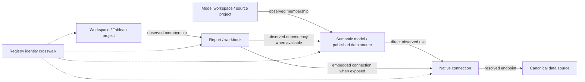

# Analytic Registry — first platform data collection

**Current V1 delivery:** use the [Excel workbook and manual SQL handoff](v1-extract/README.md). It adds email matching, a single Platform Manager exception owner, and Alteryx backend queries. The inventory contract below remains in use.

Prepared 7 October 2026. Contract version 1.0.

Give each platform team this folder. Ask for an observed inventory using stable native IDs and the shared column names below. The team should not generate the application's internal UUIDs or fill business declarations.

**Identity is the first requirement:** match an object using `(PlatformInstanceKey, NativeScopeKey, NativeObjectType, NativeObjectID)`. Registry ingestion assigns one durable internal `ObjectID` to that tuple. Names are labels. A rename updates the latest observation; it does not create a new asset.

## What to send

| File | One row represents | Main target |
|---|---|---|
| `workspaces.csv` | One observed workspace or Tableau project | `RegistryObject`, `Workspace`, `ObservedWorkspace` |
| `assets.csv` | One report, workbook, or semantic/published model | `RegistryObject`, `Asset`, `ObservedAsset` |
| `workspace_assets.csv` | One physical workspace-to-asset membership | `ObservedWorkspaceAsset` |
| `connections.csv` | One native connection and its allowed endpoint fields | `RegistryObject`, `Connection`, `ObservedConnection`; optionally `DataSource` |
| `asset_connections.csv` | One directly observed asset-to-connection link | `ObservedAssetConnection` |
| `asset_dependencies.csv` | One consumer asset-to-provider asset relationship | Proposed `ObservedAssetDependency` |
| `manifest.json` | One run and its dataset coverage | `ExtractRun`, `ExtractDataset` |

Tableau additionally exports `views_optional.csv`. Keep that at view grain. Do not add view rows to a workbook count. The basic repository queries do not prove workbook-to-published-source lineage; mark the dependency dataset `NotCollected` unless separately collected.

## Use the platform handoff

1. Confirm the instance key, environment, exact scope, and expected native object IDs with the registry team.
2. Run the platform preflight or scan against the agreed scope.
3. Export the shared files without changing native ID values.
4. Return the files, run manifest, row counts, and unresolved evidence notes through the approved internal channel.
5. Compare two successive runs to verify stable IDs before scheduling refreshes.

- **Tableau 2026.2 / PostgreSQL:** [team instructions](tableau/README.md), [schema preflight](tableau/preflight.sql), [asset and connection export queries](tableau/export.sql).
- **Power BI / Fabric:** [API collection pseudocode](powerbi/collector-pseudocode.md), [offline JSON-to-CSV adapter](powerbi/normalize-scan.mjs), [fictional sample output](samples/normalized-powerbi/normalized.json).
- **Alteryx 2025.2 / MongoDB:** [version-specific guidance](alteryx-guidance.md). It is not part of the two report collectors.
- **Shared contract:** [all delivery columns and types](data-contract.md), [identity and refresh rules](identity-and-refresh.md), [verified sources](sources.md).

## Relationship map

These are physical observations. They do not assign an accountable workspace or change the business owner. One report can use multiple connections through its model. A model can serve reports in other workspaces. Preserve both relationships.

## Important boundaries

- Tableau uses a workbook as the initial report asset. Native views remain optional child detail. Power BI uses one report per report ID and a separate asset for each semantic model.
- Native Tableau LUIDs are the durable export keys. Repository integers are retained for traceability and local joins. Do not silently switch namespaces after an upgrade.
- Power BI object scope is the tenant, not the movable workspace. The API version is `v1.0`; do not assign the unverified product version `2026.2`.
- A connection's technology and extract mode are different fields. For example, an Oracle source can feed an extract. Keep `TechnologyCode` and nullable `HasExtract` separate.
- Missing fields stay null or explicitly unknown. A partial extract cannot establish removal, zero usage, or a failed control.
- Business owner, purpose, Champions, PII/EUCT declarations, DMP tier, expected groups, and approvals stay in the app's business workflows.
- The current app is a prototype. This pack maps to its proposed relational schema. It does not add a production importer or write records into browser storage.

## Verification performed

The offline adapter has 26 passing checks. They cover ID stability, cross-workspace dependencies, duplicate handling, missing evidence, coverage, source allowlisting, and CSV quoting. The Tableau SQL was checked against the published 2026.2 dictionary and static safety checks. It has not run against your repository. The platform team must confirm installed columns and `projects_contents.content_type` values before execution. Primary evidence and limitations are in [sources.md](sources.md).

## Suggested message to the teams

> Please provide the first observed inventory for Analytic Registry using the attached column contract. Preserve your native object IDs. Include workspaces/projects, report assets, physical memberships, connections, and observed lineage. Return the run manifest and identify incomplete or uncollected datasets. Do not infer business ownership, PII, EUCT, DMP tier, or expected access. Please validate stable keys across two extracts and send one small sample before the full agreed scope.

The message is a draft. Nothing has been sent.
