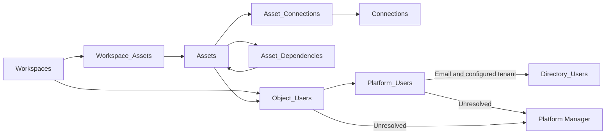

# V1 platform data handoff

Use the [Excel template](analytic-registry-v1-extract.xlsx) to collect platform metadata, review identity exceptions, and prepare a manual SQL Server load. The template is empty. It contains no extracted platform or directory records and performs no matching calculations.

## V1 precedence — 8 October 2026

This handoff records the user's selected V1 process: email matching after manual staging, all unresolved cases assigned to Platform Manager, and manual SQL Server loading. Alteryx collection uses backend MongoDB queries only. This handoff takes precedence over broader future implementation proposals for this delivery.

The earlier application review and identity-resolution documents remain a future backlog. This handoff does not implement those repairs. Classification, PRL, and risk repairs are deferred. Existing product fields and requirements remain. Automated ingestion and live Power Apps integration remain future implementation. Application behavior has not changed.

Keep the existing `RunKey`, `ObservedAt`, and manifest format. Do not add `RunDate`, redefine a run, or replace source IDs with registry IDs.

## Four handoff steps

1. **Prepare the agreed scope.** Use Guide and Source_Map to select the platform instructions and verified field joins. Confirm the instance, native scope, directory tenant, and available datasets. Read Column_Dictionary before populating tables.
2. **Collect and populate.** Run the existing inventory collector and the applicable identity supplement through the team's approved connection. Populate the workbook tables without changing their headers. Keep source IDs and email values as Text. Retain blank values and unresolved references.
3. **Stage and reconcile manually.** Load the workbook's populated tables into SQL staging through the approved manual process. Validate keys, types, lengths, row counts, and coverage. Match emails using the rule below. Assign every unresolved case to Platform Manager.
4. **Review and load the registry.** Review the staged match results and manager decisions. Load approved mappings and observations manually. Retain unresolved inventory without inventing people or relationships. Keep the original delivery, existing manifest, and load evidence together.

## Workbook contents

| Sheet/table | Purpose |
|---|---|
| Guide | Explains the four steps, matching rule, and boundaries. |
| Source_Map | Maps vendor fields and joins to workbook columns and existing delivery-contract references. |
| Column_Dictionary | Defines each workbook table's row grain, columns, types, and purpose. |
| Workspaces | One observed native workspace, Tableau project, or supported Alteryx collection. |
| Assets | One observed native report, semantic model, workbook, published source, or supported workflow. |
| Workspace_Assets | Physical memberships between existing workspace and asset keys. |
| Connections | Observed connections and permitted endpoint metadata. |
| Asset_Connections | Directly observed asset-to-connection associations. |
| Asset_Dependencies | Observed consumer-to-provider asset relationships. |
| Platform_Users | Platform principal identifiers, types, source email, and account evidence when available. |
| Directory_Users | Directory tenant, user ID, mail, UPN, enabled state, and supporting observation context. |
| Object_Users | Technical owner, modifier, or access relationships between native objects and principals. |
| Tableau_Output | Exact CSV layouts from the PostgreSQL queries, with optional views and separate directory evidence labeled. |
| PowerBI_Output | Exact inventory adapter layouts and separate identity/directory pseudocode formats. |
| Alteryx_Output | Backend MongoDB output layouts, including header-only and uncollected datasets. |

The workbook has 15 sheets: three guides, nine empty data tables, and three platform output reference tabs. Each platform tab groups exact column headers by output file and identifies the destination import sheet. It also labels implemented, planned, supplemental, and uncollected output. These tabs show blank layouts, not source records. Load data into the nine import sheets rather than importing a whole platform reference tab.

The six inventory tables retain the existing [delivery contract](../data-contract.md) and exact header names. Source_Map documents the additional identity tables. The workbook contains no formulas. Normalization and matching occur only after manual SQL staging. Do not paste calculated matches over raw source identifiers or email values.

Keep the existing manifest with the delivery. Directory_Users retains its own directory extract's RunKey and ObservedAt. Do not overwrite those with the platform extract's values. A workbook row count does not prove complete platform coverage. Retain the collector's omitted scope and failure notes. Treat optional or uncollected datasets as such; an empty sheet is not proof of no assets, no access, or no connections.

## Platform references

| Platform | Existing inventory collection | Identity supplement and source mapping |
|---|---|---|
| Tableau 2026.2 / PostgreSQL | [Instructions](../tableau/README.md), [preflight](../tableau/preflight.sql), [inventory SQL](../tableau/export.sql) | [Identity SQL](tableau-identity-export.sql), [Tableau field joins](tableau-identity-extract.md) |
| Power BI / Fabric | [Collection instructions](../powerbi/collector-pseudocode.md), [offline inventory adapter](../powerbi/normalize-scan.mjs) | [Identity extraction pseudocode](powerbi-identity-extract.md) |
| Alteryx 2025.2 / MongoDB | Backend collection only; the earlier API option is superseded for V1. | [Backend extraction instructions](alteryx-backend-extract.md), [MongoDB query template](alteryx-backend-extract.mongosh.js) |

Use Source_Map to connect each source field to a workbook column. Do not assume that a similarly named vendor field has the same meaning across platforms. Read the query's required preflight before execution.

Tableau technical ownership resolves through site-scoped repository user references and the system-user email. Preserve the repository integer and user LUID in separate namespaces. Power BI report `createdBy` is documented as technical owner evidence, despite its name; it must not silently become an immutable creator or the registry business owner. Semantic-model `configuredBy` also describes technical ownership. Power BI access lists describe permissions, not business accountability. The linked source notes provide the official references.

The Alteryx MongoDB mapping remains subject to the installed 2025.2 schema. The available public references do not establish every schema-79 field. Run the provided backend schema checks before exporting. If a required field or current-owner join cannot be verified, preserve the available inventory and send the unresolved case to Platform Manager. Do not substitute an original author for a current owner, guess a field, or export whole credential-bearing documents.

The source mappings were checked against vendor documentation. Local validation checks workbook headers, query projections, and the Power BI collector regression. They have not been executed against your live Tableau, Power BI/Fabric, Alteryx, directory, or SQL Server environment. The existing Power BI adapter remains an inventory adapter; the identity pseudocode does not claim its new tables are already implemented there.

## Email matching after manual staging

Use this V1 rule in SQL staging, not an Excel formula:

```text
source key = lower(trim(platform SourceEmail))
directory key = lower(trim(directory mail))
match within the configured directory tenant
accept exactly one distinct directory user ID
preserve all platform IDs and original email values
```

The supplied query flags duplicate directory rows for review. Remove only verified identical duplicates before rerunning. Never collapse conflicting status or email evidence. Two distinct user IDs with the same normalized email are ambiguous. Use exact equality only. Do not remove plus suffixes, rewrite domains, match display names, or choose the first search result.

`userPrincipalName` is a separate sign-in identifier. It is not an automatic replacement for `mail`. Keep both fields. Power Apps `User().Email` returns UPN, so it must not be assumed to contain the SMTP address used by this matching rule. [Microsoft User function](https://learn.microsoft.com/en-us/power-platform/power-fx/reference/function-user)

Preserve nonhuman principals such as groups, applications, and service identities. Their presence in an access list does not make them eligible for a human owner or Champion role. Retain missing-email rows and their object references. Do not manufacture an email from an ID, login, or display name.

| Evidence | Result and action |
|---|---|
| One exact tenant-local user match; enabled flag true | Resolved and enabled. Retain directory ID; evaluate app role eligibility separately. |
| One exact tenant-local user match; enabled flag false | Resolved but disabled. Keep the binding and history; Platform Manager reviews current accountability. |
| No match, multiple matches, missing/invalid email, unknown principal type, or conflicting ID evidence | Unresolved. Preserve the source row and assign Platform Manager. |
| Lookup failed, directory collection incomplete, or enabled state missing | Unable to verify. Retain known evidence without inventing a disabled state; assign Platform Manager. |
| Nonhuman principal | Preserve its type and native identity. Route any attempted human-accountability mapping to Platform Manager. |

A successful email match and enabled account do not establish employment, approval authority, or workspace scope. A lookup failure does not establish inactivity or deletion. If later email evidence points to a different directory user, Platform Manager reviews that conflict before replacing an existing binding.

## Requirements retained

- Platform IDs remain separate from registry IDs and survive email/name changes.
- Technical observations do not overwrite the declared Business Owner / Workspace Owner, Champions, purpose, classifications, or expected access.
- Unknown values remain unknown. Partial evidence does not prove removal or a failed risk control.
- Group purposes, approval roles, eligible self-approval, and the six-month history decision remain unchanged.
- No platform write, credential export, automated remediation, or message to a platform team is performed by this handoff.

For the existing object identity rules, see [identity and refresh](../identity-and-refresh.md). For earlier collection references, see [verified sources](../sources.md).

## SQL Server files

Run [sqlserver-staging.sql](sqlserver-staging.sql) in your intended database to create nine separate staging tables. Load each populated Excel table into its same-named table under `RegistryExtractV1`. Do not map an Excel column into the generated `StageRowID`.

Run [sqlserver-validate.sql](sqlserver-validate.sql) to inspect required fields, duplicate object keys, and missing relationships. It returns review rows and never changes the source or registry. Set the existing platform and directory delivery keys in [sqlserver-email-match.sql](sqlserver-email-match.sql), then confirm complete directory coverage before accepting its results. Both identity result sets include `ResolutionStatus`, `DirectoryAccountState`, `ReviewOwner`, and `ReviewReason`.

Native ID strings stay case-sensitive in staging. The email join alone trims outer spaces and lowercases values. Reject overlong fields; do not truncate keys. Empty template rows are not data. Convert CSV ISO timestamps explicitly into UTC Excel date values, or load CSV timestamps directly into `datetimeoffset`. If your Excel importer supplies a date without an offset, assign UTC explicitly. Do not use the workstation's local timezone.

The staging SQL does not apply records to the production schema. Review the results and use the approved manual database process. A successful identity match does not grant app permissions or overwrite a declared business owner.

The header-only [CSV files](csv-headers) provide an alternative to Excel for large extracts. Their columns match the workbook. The [column dictionary](column-dictionary.csv) provides the same import definitions in a flat file.

## Relationship summary



Platform_Users and Object_Users preserve native references even when directory matching fails. Alteryx collection memberships remain physical associations. They do not create multiple accountable business workspaces.
